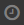

# Посмотреть историю изменений страницы

После сохранения страницы {{ wiki-name }} ее копия помещается в историю изменений. С помощью истории вы всегда можете просмотреть предыдущие версии страницы, сравнить их друг с другом или восстановить любую из них.

Чтобы просмотреть историю изменений страницы {{ wiki-name }}:

1. Откройте страницу {{ wiki-name }}.

1. В правом верхнем углу страницы {{ wiki-name }} нажмите  **Действия** и выберите  **История изменений**.

## Как просмотреть старую версию страницы {#show-old-page}

Нажмите на запись в истории изменений. В основном окне отобразится выбранная версия с пометкой **Это старая версия страницы**.

## Как сравнить две версии страницы {#compare-pages}

Отметьте те версии страницы {{ wiki-name }}, которые хотите сравнить. В основном окне отобразятся различающиеся фрагменты.

## Как вернуться к старой версии страницы {#return-to-old}

1. Нажмите на запись в истории событий. В основном окне отобразится выбранная версия с пометкой **Это старая версия страницы**.

1. Выберите **{{ ui-key.beta-wiki.blocks_common_desktop.blocks_b-events-log.edit_version }}**.

1. Вы можете отредактировать эту версию или сохранить ее без изменений — она будет записана как последняя версия страницы.

## Как просмотреть историю изменений динамической таблицы {#grid}

Для [динамических таблиц](pages-types.md#grid) история изменений доступна в режиме редактирования:

1. Откройте динамическую таблицу и нажмите кнопку  **Действия**.

1. Нажмите кнопку **История изменений**.

1. На панели слева нажмите значок .

1. Нажмите на запись в истории событий. Выбранная версия таблицы отобразится с пометкой **Это старая версия**.

1. Чтобы сравнить две версии таблицы, отметьте их на панели слева.

1. Чтобы восстановить выбранную версию таблицы, вверху страницы нажмите **{{ ui-key.beta-wiki.blocks_common_desktop.blocks_b-events-log.return_this_version }}**.
