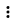

# Разрешить отслеживающие куки

Если документ из Office 365 не отображается на странице в {{ wiki-name }}, возможно, в вашем браузере заблокированы межсайтовые куки (трекеры), которые используются для отслеживания действий пользователя на сторонних сайтах.

{{ wiki-name }} использует межсайтовые куки, чтобы получить доступ к облачным документам на портале Office 365. Чтобы просматривать облачные документы на вики-страницах, отключите запрет на отслеживающие куки.

## Что такое отслеживающие куки (трекеры)? {#what-is-tracking}

Трекеры (сторонние cookies или third-party cookies) — это небольшие фрагменты данных, которые сохраняются на вашем компьютере, когда вы открываете сайт. Куки хранят информацию о пользователе и его действиях (например, местоположение, тип устройства или его IP-адрес) и передают ее на сайт.

Использование трекеров может быть добросовестным (например, для сбора статистики) и недобросовестным (например, сбор и передача личных данных пользователей). В большинстве современных браузеров есть опция, позволяющая заблокировать недобросовестные трекеры. 

Чтобы документы из Office 365 отображались корректно, попробуйте отключить блокировку трекеров.

## Как отключить блокировку отслеживающих куки {#off-tracking}

### Safari {#safari}

[Полная версия](https://support.apple.com/ru-ru/guide/safari/sfri40732/mac):

1. В настройках браузера выберите раздел **Конфиденциальность**.

1. Отключите параметр **Предотвращать перекрестное отслеживание**.

[Мобильная версия](https://support.apple.com/ru-ru/guide/iphone/iphb01fc3c85/ios):

1. Откройте **Настройки** → **Safari**.

1. В разделе **Конфиденциальность и безопасность** отключите параметр **Запрет перекрестного отслеживания**.

### Mozilla Firefox {#firefox}

[Полная версия](https://support.mozilla.org/ru/kb/uluchshennaya-zashita-ot-otslezhivaniya-v-firefox-#w_kak-uznat-chto-blokiruetsia-na-saite_2):

На странице с документом в {{ wiki-name }} нажмите кнопку  и отключите параметр **Улучшенная защита от отслеживания на этом сайте**.

[Мобильная версия](https://support.mozilla.org/ru/kb/zashita-ot-otslezhivaniya-v-firefox-dlya-android#w_izmenenie-urovnia-zashchity):

В настройках браузера отключите параметр **Улучшенная защита от отслеживания**.

### Google Chrome {#chrome}

[Полная версия](https://support.google.com/chrome/answer/2790761?co=GENIE.Platform%3DDesktop&hl=ru&oco=1):

1. В настройках браузера выберите раздел **Конфиденциальность и безопасность**, затем нажмите **Файлы cookie и другие данные сайтов** или перейдите по ссылке `chrome://settings/cookies`.

1. Отключите параметр **Отправлять запрет на отслеживание для исходящего трафика**.

[Мобильная версия (Android)](https://support.google.com/chrome/answer/2790761?co=GENIE.Platform%3DAndroid&hl=ru&oco=1):
1. В настройках браузера выберите раздел **Конфиденциальность и безопасность** → **Запрет отслеживания**.

1. Установите переключатель в положение **ВЫКЛ**.

### Яндекс&#160;Браузер {#ya}

[Полная версия](https://yandex.ru/support/browser/personal-data-protection/ytp.html#blocking-by-settings):

* Разблокировать конкретный трекер: 

   1. Нажмите значок  в Умной строке.

   1. Справа от трекера **sharepoint.com** и **yastatic.net** нажмите  → **Разблокировать**.

* Разрешить трекеры для всех сайтов:

   1. В настройках браузера выберите раздел **Сайты** → **Расширенные настройки сайтов**.
   
   1. В блоке «Cookie-файлы» выберите вариант блокировки **Ограничить сторонние cookie** — использование трекеров будет разрешено только сайтам, которые вы посещали.

[Мобильная версия](https://yandex.ru/support/browser-mobile-android-phone/privacy/ytp.html#unblocking):

1. Нажмите значок  в Умной строке.

1. В блоке «Блокировка отслеживаний» нажмите ссылку «Сайт не работает?».

1. В открывшемся окне нажмите кнопку **Разрешить файлы cookie**.

1. Обновите страницу.
