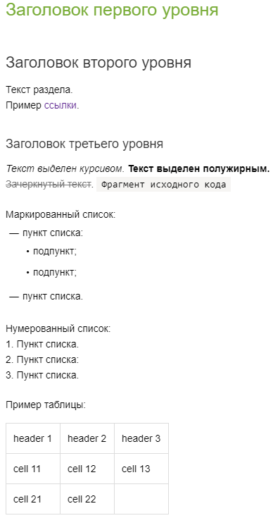

# Создать первую страницу

Попробуйте возможности {{ wiki-name }}, создав свою первую вики-страницу. Страница будет создана в вашем личном разделе, так что не бойтесь экспериментировать.



Чтобы узнать о базовых возможностях {{ wiki-name }}, вы можете также [пройти курс на Мёбиусе](https://moe.yandex-team.ru/courses/my/course/904).



## Создать вики-страницу {#create}

Чтобы создать вики-страницу в личном разделе:

1. [Перейдите на {{ wiki-name }}]({{ link-wiki }}) и на панели слева нажмите  **Создать страницу**.

1. Выберите тип **Страница**. 

1. В поле **Название** введите заголовок страницы.

1. Поле с адресом заполняется автоматически. Не редактируйте его, если это ваша первая попытка создания вики-страницы.

1. Выберите **Личный раздел**. 

1. Нажмите кнопку **Создать**.

1. В левую часть рабочей области вики-страницы скопируйте этот пример или придумайте свой:

    ```
    # Заголовок первого уровня
    ## Заголовок второго уровня
    Текст раздела.
    Пример [ссылки]({{ link-yandex }}).
    ### Заголовок третьего уровня
    *Текст выделен курсивом.* **Текст выделен полужирным.**
    ~~Зачеркнутый текст~~. `Фрагмент исходного кода`
    Маркированный список:
    * пункт списка;
      * подпункт;
      * подпункт.
    * пункт списка.

   Нумерованный список:
    1. Пункт списка.
    2. Пункт списка:
    3. Пункт списка.

    Пример таблицы:

    |header 1|header 2|header 3|
    |---|---|---|
    |cell 11|cell 12|cell 13|
    |cell 21|cell 22||
      ```

    

    

    

1. Нажмите кнопку **Сохранить**. 

Список всех ваших страниц доступен на верхней панели {{ wiki-name }} в меню  **Структура раздела**.

## Настроить доступ {#access}

Чтобы настроить доступ к вашей странице:

1. Перейдите на страницу.

1. Вверху страницы нажмите кнопку, на которой указан режим доступа к странице (по умолчанию **Доступно всем сотрудникам**).

1. Укажите, кто сможет просматривать страницу:

    - **Как у родительской страницы** — уровень доступа наследуется от родительской страницы.

    - **Всем сотрудникам** — все сотрудники вашей организации.

    - **Только авторам** — только [авторы](page-management/edit-owner.md) могут просматривать и редактировать страницу.

    - **Некоторым сотрудникам** — укажите логины пользователей, которым вы хотите открыть доступ для просмотра и редактирования.

    

    Не рекомендуется изменять настройки доступа для [ главной страницы {{ wiki-name }}]({{ link-homepage }}).
    По умолчанию автором главной страницы {{ wiki-name }} является служебный аккаунт. Если для этой страницы выбран тип доступа «Только у авторов страницы», доступ для других пользователей будет заблокирован. Чтобы снять блокировку, перейдите по ссылке [ {{ link-homepage-access }} ]({{ link-homepage-access }}) и измените параметры доступа.

    

1. Нажмите кнопку **Сохранить**


