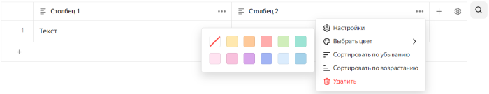

# История изменений в {{ wiki-full-name }} в апреле 2023

* [Состояние блока "Структура раздела" сохраняется при переходах между страницами](#open-content)
* [Доступ к страницам и разделам бывших сотрудников](#deleting-pages-of-former-employees)
* [Автоматическая настройка ширины динамической таблицы](#auto-table-size)
* [Выбор цвета для строк и столбцов](#table-coloring)

## Состояние блока "Структура раздела" сохраняется при переходах между страницами {#open-content}

Если вы работаете с блоком [Структура раздела](../cluster-overview.md#toc), то при переходе между страницами содержимое не будет обновляться: свернутые и развернутые подразделы будут сохранять свое состояние.

## Доступ к страницам и разделам бывших сотрудников {#deleting-pages-of-former-employees}

Теперь у [администраторов организаций](../../organization/security/index.md#service-roles) есть доступ к страницам и разделам бывших сотрудников, даже если это страницы с ограниченным доступом. Администратор сможет назначить нового автора, чтобы он управлял доступом и следил за актуальностью страницы, или [удалить](../delete-page.md) эту страницу.

## Автоматическая настройка ширины динамической таблицы {#auto-table-size}

Ширина динамической таблицы автоматически подстраивается под размер экрана пользователя и масштабирование окна браузера. 

## Выбор цвета для строк и столбцов {#table-coloring}

В динамических таблицах появилась возможность выбирать цвета для строк и столбцов.

