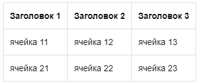

# Форматирование CSV-данных



Чтобы отобразить в виде таблицы данные в формате CSV, используйте разметку:

```csv
%%(csv delimiter=; head=1)
Заголовок 1;Заголовок 2;Заголовок 3
ячейка 11;ячейка 12;ячейка 13
ячейка 21;ячейка 22;ячейка 23
%%
```







Параметры разметки:

* `delimiter` — разделитель полей в CSV-записи таблицы;

* `head` — если равно 1, первая строка таблицы будет выделена как заголовок.



В таблице формата CSV нельзя использовать [элементы оформления текста](formatting.md).



#### См. также

* [Вставить диаграммы и блок-схемы](diagram.md)

* [Вставить формулы](formulas.md) 