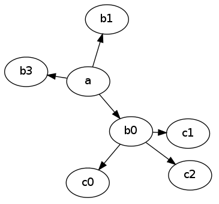
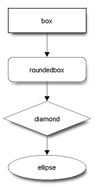
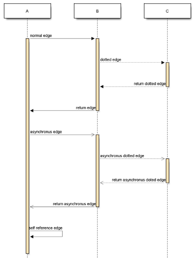

# Диаграммы и блок-схемы

Чтобы добавить на страницу диаграмму, схему или граф, можно использовать один из поддерживаемых языков текстовой разметки.

## Graphviz (DOT) {#graphviz}

[Graphviz]({{ link-about-graphviz }}) лучше всего подходит для оформления графов и деревьев.

Пример разметки:

```
%%(graphviz neato)
 digraph A { 
 a -> b0
 a -> b3
 xb [label="hi",width=.1,style=invis]
 a -> xb [style=invis]
 a -> b1
 {rank=same b0 -> xb -> b1 [style=invis]}
 b0 -> c0
 xc [label="bye",width=.1,style=invis]
 b0 -> xc [style=invis]
 b0 -> c1
 {rank=same c0 -> xc -> c1 [style=invis]}
 b0 -> c2
 }
 %% 
```


   



 
Настроить внешний вид графа можно с помощью необязательных параметров:

* `dot`, `neato`, `circo`, `twopi`, `fdp` — имя утилиты, с помощью которой
 строится граф. По умолчанию используется `dot`.

* `width` — максимальная ширина графа в пикселях.

* `height` — максимальная высота графа в пикселях.

## Blockdiag {#blockdiag}

[Blockdiag](http://blockdiag.com/en/) предназначен для построения блок-схем.

Пример разметки:

```
%%(blockdiag)
{
orientation = portrait
   box [shape = "box"];
   roundedbox [shape = "roundedbox"];
   diamond [shape = "diamond"];
   ellipse [shape = "ellipse"];
   box -> roundedbox -> diamond -> ellipse;
}
%%
```







Настроить внешний вид диаграммы можно с помощью необязательных параметров:

* `width` — максимальная ширина блок-схемы в пикселях.
 
* `height` — максимальная высота блок-схемы в пикселях.

## Seqdiag {#seqdiag}

[Seqdiag](http://blockdiag.com/en/seqdiag/) предназначен для построения [диаграмм последовательностей]({{ link-about-diagram }}).

Пример разметки:

```
%%(seqdiag)
{
   // normal edge and doted edge
   A -> B [label = "normal edge"];
   B --> C [label = "dotted edge"];
 
   B <-- C [label = "return dotted edge"];
   A <- B [label = "return edge"];
 
   // asynchronus edge
   A ->> B [label = "asynchronus edge"];
   B -->> C [label = "asynchronus dotted edge"];
 
   B <<-- C [label = "return asynchronus doted edge"];
   A <<- B [label = "return asynchronus edge"];
 
   // self referenced edge
   A -> A [label = "self reference edge"];
}
%%
```







Настроить внешний вид диаграммы можно с помощью необязательных параметров:
* `width` — максимальная ширина диаграммы в пикселях.

* `height` — максимальная высота диаграммы в пикселях.