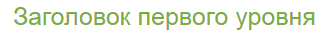
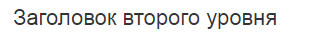
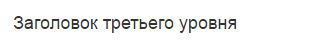
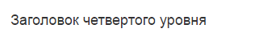
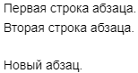
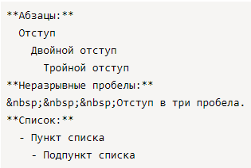
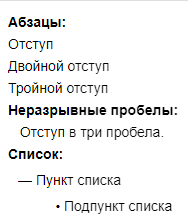
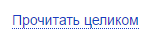

# Структура страницы

## Разделы и заголовки {#sections-and-titles}

Чтобы разбить страницу на разделы, добавьте заголовки. Чтобы оформить заголовок, вставьте перед текстом заголовка 1–6 символов `#` и пробел. Количество символов `#` соответствует уровню заголовка.

Для оформления заголовков первого и второго уровня можно использовать другой стиль разметки:

* Для заголовка первого уровня — в следующую после заголовка строку вставьте любое количество знаков `=`.

* Для заголовка второго уровня — в следующую после заголовка строку вставьте любое количество дефисов `-`.

Разметка | Результат
--- | ---
`# Заголовок первого уровня` | 
`Заголовок первого уровня`<br>`======` | 
`## Заголовок второго уровня` | 
`Заголовок второго уровня`<br>`--------------` | 
`### Заголовок третьего уровня` | 
`#### Заголовок четвертого уровня` | 
`##### Заголовок пятого уровня` | 
`###### Заголовок шестого уровня` | 

### Получить ссылку на раздел {#section-link}

1. Наведите указатель на заголовок раздела и нажмите символ **§**, который появится справа от заголовка. 

1. Скопируйте адрес раздела из адресной строки браузера. 

Подробнее читайте в разделе [{#T}](../actions/anchor.md).

## Абзацы {#section_paragraphs}

Чтобы начать новый абзац, отделите его от предыдущего текста пустой строкой:

```
Первая строка абзаца.
Вторая строка абзаца.

Новый абзац.
```









Чтобы получить несколько пустых строк между блоками текста, в начало каждой пустой строки вставьте обратный слэш `\`.



## Отступы {#section_spacing}

- Отступы из пробелов в начале строки используются для оформления [списков](lists.md) второго и третьего уровней.

- Если добавить пробелы в начало абзаца, они будут проигнорированы. Абзац отобразится без отступа. 

- Чтобы сделать отступ для абзаца, вставьте несколько неразрывных пробелов с помощью кода `&nbsp;`.


Разметка | Результат
--- | ---
 | 


## Горизонтальная линия {#section_rulers}

- Чтобы вставить горизонтальную линию между частями текста, в пустую строку вставьте подряд 3 или более дефиса `-`, <q>звездочки</q>`*` или подчеркивания `_`.

- Если вы используете дефисы, добавьте перед линией пустую строку. Иначе предыдущая строка превратится в заголовок.

Разметка | Результат
--- | ---
`---` | 
`****` | 
`___` | 

## Текст под катом {#section-cut}

Чтобы скрыть часть текста страницы под катом:

1. В строке перед текстом вставьте символы `<{` и заголовок ката.

1. С новой строки введите текст, который будет скрыт под катом.

1. После текста вставьте символы `}>`. 

Разметка | Результат
--- | ---
`<{ Прочитать целиком`<br>`Этот текст можно увидеть,`<br>`нажав ссылку "прочитать целиком".`<br>`}>` | 