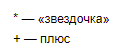
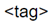
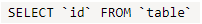
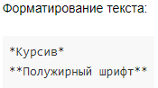

# Экранирование символов



* Чтобы отобразить на странице символы, которые используются для разметки текста, экранируйте эти символы с помощью обратной косой черты (обратного слеша) `\` или тильды `~`:
 
    ```
    \* — «звездочка»
    ~+ — плюс
    ```

    

    

    

* Чтобы экранировать все символы в определенном фрагменте текста, заключите этот фрагмент в двойные кавычки `""`:

    ```
    ""<tag>""
    ```

    

    

    
    
* Если нужно отобразить обратный апостроф внутри фрагмента исходного кода, окружите фрагмент кода с двух сторон двойными обратными апострофами ` `` `:

    ```
    ``SELECT `id` FROM `table` ``
    ``` 

    

    

    

* Внутри блока исходного кода все символы разметки экранируются автоматически: 

    ```
        Форматирование текста: 
        
        ```
        *Курсив*
        **Полужирный шрифт**
        ```
    
    ```
    

    

    

* Любой текст в угловых скобках `<...>` воспринимается как [HTML-тег](html-code.md) и не отображается на странице в явном виде. Если нужно отобразить такой текст, экранируйте его, форматируйте как фрагмент кода либо замените открывающую скобку `<` кодом `&lt;`:

    ```
    &lt;tag>
    ```

    

    

    