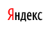

# Изображения и файлы



## Вставить изображение {#add-image}

Чтобы добавить на страницу изображение, используйте разметку:

```

```



Если вы вставите в текст страницы ссылку на изображение без элементов разметки, на странице отобразится изображение без альтернативного текста.



Разметка | Результат
--- | ---
`` | 

### Задать размер изображения {#img-size}

Задайте размер изображения на странице в пикселях:

```
<ширина>x<высота>:<ссылка на рисунок>
```



Изображение масштабируется пропорционально, поэтому значение высоты можно задать приблизительно. Например, рисунок с такой разметкой будет отображаться правильно: `300x0:<ссылка на рисунок>`.



Разметка | Результат
--- | ---
`60x20:{{ yandex-logo-link }}` | 

### Вставить ссылку на скачивание изображения {#download-link}

Используйте разметку ссылки:

```
[текст ссылки](адрес изображения)
```

Разметка | Результат
--- | ---
`[Логотип Яндекса]({{ yandex-logo-link }})` | [Логотип Яндекса]({{ yandex-logo-link }})

### Сделать изображение ссылкой {#img-link}

Вы можете сделать изображение ссылкой, чтобы при нажатии на изображение открывалась страница или файл. Для этого в элемент разметки ссылки вместо текста [вставьте изображение](#add-image):

```
[](адрес ссылки)
```

Разметка | Результат
--- | ---
`[]({{ link-yandex }})` | []({{ link-yandex }})

## Вставить видео {#video}

Чтобы добавить на страницу видео, используйте [динамический блок `not_var{{iframe}}`](../actions/iframe.md). Он позволяет вставлять видео из внешних источников, таких как Vimeo или Youtube.

## Вставить ссылку на файл {#file-ref}

Разместите ссылку на файл в тексте страницы одним из способов:

Разметка | Результат
--- | ---
`http://адрес-файла` | [http://адрес-файла](http://адрес-файла)
`[текст ссылки](http://адрес-файла)` | [текст ссылки](http://адрес-файла)