# Оформление текста

## Выделение текста {#inline}



- Новый редактор

    
    
    Выделение работает правильно, только если символы разметки вплотную прилегают к тексту.
    
    

    Разметка | Результат
    --- | ---
    `**Полужирный текст**` | 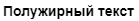
    `*Курсив*` | 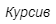
    `++Подчеркнутый текст++` | 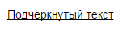
    `~~Зачеркнутый текст~~` | 
    `##Моноширинный текст##` | 
    `==Выделенный текст==` | 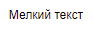
    Верхний индекс: `E=mc^2^` | 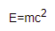
    `==Выделенный текст==` | 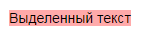
    `{red}(Красный текст)` | 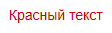
    `{blue}(Синий текст)` Поддерживаются цвета:<ul><li>`red`/`крас`/`красный`;</li><li>`green`/  `зел`/`зеленый`;</li><li>`blue`/`син`/`синий`;</li><li>`grey`/`gray`/`сер` /`серый`;</li><li>`yellow`/`жел`/`желтый`;</li><li>`cyan`/`голуб`/`голубой`;</li><li>`orang`/`оранж`/`оранжевый`;</li><li>`violet`/`фиолет`/`фиолетовый`.</li></ul> | 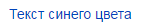

- Старый редактор

    
    
    Выделение работает правильно, только если символы разметки вплотную прилегают к тексту.
    
    

    Разметка | Результат
    --- | ---
    `**Полужирный текст**` | 
    `*Курсив*` | 
    `_Курсив_` | 
    `//Курсив//` | 
    `__Подчеркнутый текст__` | 
    `~~Зачеркнутый текст~~` | 
    `--Зачеркнутый текст--` | 
    `##Моноширинный текст##` | 
    `++Мелкий текст++` | 
    Верхний индекс: `E=mc^^2^^` | 
    Нижний индекс: `Hvv2vvO` | 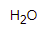
    `??Выделенный текст??` | 
    `!!Красный текст!!` | 
    `!!(син)Текст синего цвета!!` Поддерживаются цвета:<ul><li>`red`/`крас`/`красный`;</li><li>`green`/  `зел`/`зеленый`;</li><li>`blue`/`син`/`синий`;</li><li>`grey`/`gray`/`сер` /`серый`;</li><li>`yellow`/`жел`/`желтый`;</li><li>`cyan`/`голуб`/`голубой`;</li><li>`orang`/`оранж`/`оранжевый`;</li><li>`violet`/`фиолет`/`фиолетовый`.</li></ul> | 



## Сочетание элементов оформления {#sec_combine}
    
К одному фрагменту текста можно применить сразу несколько элементов оформления:
    
Разметка | Результат
--- | ---
`_**Полужирный курсив**_` | 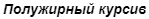
`*!!Красный курсив!!*` | 

Элементы оформления текста можно использовать совместно с другими элементами разметки:

Разметка | Результат
--- | ---
`**[Полужирная ссылка](http://example.com)**` | 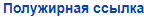
`>Цитата с *курсивом*` | 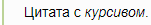
    
## Прочая разметка {#other-formatting}
    
Элемент | Разметка | Результат
--- | --- | ---
Перевод строки | `первая строка---вторая строка` | 
Всплывающая подсказка |`(?Термин Определение термина?)` | 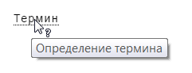
Всплывающая подсказка (термин с пробелами)|`(?Термин с пробелами==Определение термина?)` | 
Цветовой код (длинный) | `#ff0000` | 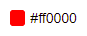
Цветовой код (короткий) | `#F00` | 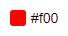
Скрытый комментарий | `%%(comments) Скрытый текст%% ` | 