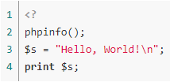
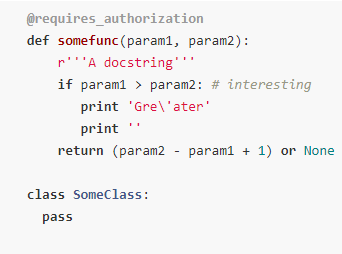
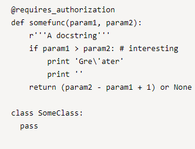
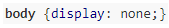
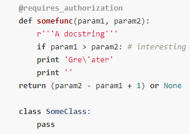
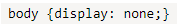

# Подсветка синтаксиса в коде

На страницах {{ wiki-name }} можно оформить исходный код с подсветкой синтаксиса. Для этого используйте разметку: 

```
%%(<обозначение языка> nomark nohighlight)
программный код
%%
```

Параметр | Описание
----- | -----
Обозначение языка | [Язык программирования](#formatters-name) для подсветки синтаксиса
`nomark` | Необязательный параметр, отключает нумерацию строк
`nohighlight` | Необязательный параметр, отключает нумерацию строк и подсветку синтаксиса



Для форматирования исходного кода в {{ wiki-name }} используется открытая библиотека [highlight.js](https://highlightjs.org/).

Тему оформления кода можно выбрать на [странице личных настроек](https://wiki.yandex-team.ru/_settings/) {{ wiki-name }}.



По умолчанию для отображения кода с подсветкой синтаксиса на {{ wiki-name }} используется шрифт, который в браузере установлен как <q>моноширинный</q>. Вы можете изменить этот шрифт в настройках браузера. 

## Поддерживаемые языки программирования {#formatters-name}

 

Язык программирования | Обозначение 
----- | ----- 
1C | 1с, 1c
ActionScript | actionscript
Apache | apache
Applescript | applescript
Bash | bash, sh
C# | c#, csharp, c-sharp
C++ | c, cpp, c++
Closure | closure
CMake | cmake
Coffeescript | coffeescript
CSP | csp
Css | css
D | d
Delphi | delphi
Diff | diff
DOS | .bat bat, dos
Django | django
Dockerfile | dockerfile
Erlang | erlang
Erlang-repl | erlang-repl
Go | go
Haskell | haskell
HTTP | http
Ini | ini
json | json
Java | java
Javascript | js, javascript
Lisp | lisp
Matlab | matlab
Nginx | nginx
ObjectiveC | objc, objectivec, obj-c, objective-c
PHP | php
Perl | perl
Python | py, python
Python | profile profile, profiler, python-profile, python-profiler
R | r
Ruby | ruby
Rust | rust
Scala | scala
Smalltalk | smalltalk
SQL | mysql, sql
Swift | swift
TeX | tex
VBScript | vbscript
XML | xml
YAML | yaml, yml
YQL | yql




## Примеры оформления исходного кода {#examples}   

#### Стандартное оформление {#examples-standart}  

```
%%(php)
<?
phpinfo();
$s = "Hello, World!\n";
print $s;
%% 
```


   




#### Без нумерации строк {#examples-without-line-numbering}

   ```
   %%(python nomark)
   @requires_authorization
   def somefunc(param1, param2):
       r'''A docstring'''
       if param1 > param2: # interesting
          print 'Gre\'ater'
          print ''
       return (param2 - param1 + 1) or None

   class SomeClass:
     pass
   %%
   ```
   
   
   

   

#### Без подсветки синтаксиса {#examples-without-highlighting}

   ```
   %%(code nohighlight)
   @requires_authorization
   def somefunc(param1, param2):
       r'''A docstring'''
       if param1 > param2: # interesting
           print 'Gre\'ater'
           print ''
       return (param2 - param1 + 1) or None

   class SomeClass:
     pass
   %%
   ```
   
   
   

      

#### Однострочный код {#examples-one-string}

  Программный код, записанный в одну строку, после форматирования останется однострочным.

   ```
   %%(css)body {display: none;}%%
   ```
   
   
   

      



#### Блок кода в стиле Markdown {#examples-markdown-style}

```
    ```python
        @requires_authorization
        def somefunc(param1, param2):
            r'''A docstring'''
            if param1 > param2: # interesting
            print 'Gre\'ater'
            print ''
        return (param2 - param1 + 1) or None

        class SomeClass:
            pass
    ```
```    
  
   
   
   

      

#### Строка кода в стиле Markdown {#examples-markdown-style-string}

   ``` `body {display: none;}` ```

   
   
   

      

#### Оформление комментария {#examples-comment}

  Чтобы добавить в программный код комментарий, который не будет отображаться на странице {{ wiki-name }}, используйте синтаксис:

  `%%(comments) Текст комментария, который не отображается на странице {{ wiki-name }}%%`

