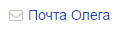
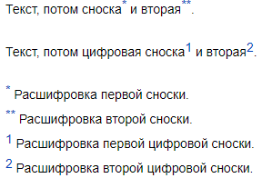

# Ссылки

Для оформления ссылок используйте разметку:

```
[текст ссылки](адрес)
```

Например:

Разметка | Результат
--- | ---
`[Яндекс]({{ link-yandex }})` | [Яндекс]({{ link-yandex }})

Если вы вставите в текст страницы адрес без элементов разметки, он будет преобразован в ссылку:

Разметка | Результат
--- | ---
`{{ link-yandex }}` | [{{ link-yandex }}]({{ link-yandex }})

## Ссылки на страницы {{ wiki-name }} {#wiki-ref}

Чтобы ссылаться на страницы {{ wiki-name }}, вместо полного адреса страницы или раздела вы можете указывать относительный адрес.

### Ссылка на страницу {#page-link}

- Укажите адрес относительно главной страницы {{ wiki-name }}. Перед адресом добавьте символ `/`.
    
    Куда ведет ссылка | Разметка
    --- | ---
    `{{ wiki-host-name }}/users/{{ username-oleg }}/notes` | `[{{ oleg-notes-title }}](/users/{{ username-oleg }}/notes)`

- Укажите адрес относительно родителя той страницы, на которой вы размещаете ссылку. Не добавляйте перед адресом символ `/`.

    Адреса страниц | Разметка
    --- | ---
    Откуда ссылка: `{{ wiki-host-name }}/users/{{ username-oleg }}/newpage`<br/><br/>Куда ведет ссылка: `{{ wiki-host-name }}/users/{{ username-oleg }}/notes` | `[{{ oleg-notes-title }}](notes)`
    Откуда ссылка: `{{ wiki-host-name }}/users/{{ username-oleg }}/notes/note1`<br/><br/>Куда ведет ссылка: `{{ wiki-host-name }}/users/{{ username-oleg }}/newpage` | `[Новая страница](../newpage)`

### Ссылка на раздел {#section-link}

Для каждого заголовка на странице автоматически создается *якорь* — идентификатор раздела. Якоря используются для прямых ссылок на разделы страницы.

Якорь формируется из названия раздела. Например, разделу `Мой раздел` будет назначен якорь `{{ example-anchor }}`.

Чтобы вставить ссылку на раздел, добавьте якорь к адресу страницы через символ `#`:

```
[текст ссылки](/адрес-страницы/#{{ example-anchor }})
```

Чтобы узнать значение якоря раздела:

1. Наведите указатель на заголовок раздела и нажмите символ **§**, который появится справа от заголовка. 

1. Скопируйте адрес раздела из адресной строки браузера.

Якорь будет указан в конце адреса после символа `#`.

### Ссылка на произвольное место страницы {#place-link}

В любом месте страницы вы можете создать якорь — идентификатор, который можно использовать для прямой ссылки на это место. Чтобы задать якорь, используйте [динамический блок `not_var{{anchor}}`](../actions/anchor.md):

```
{{anchor name="my-anchor"}}
```

Чтобы вставить ссылку на такой якорь, добавьте его к адресу страницы через символ `#`:

```
[текст ссылки](http://адрес-страницы/#my-anchor)
```

## Ссылки на изображения {#ref-to-image}

Если вы вставите в текст ссылку на изображение без элементов разметки, на странице отобразится само изображение.

Чтобы вставить ссылку на изображение, используйте разметку ссылки:

```
[текст ссылки](адрес изображения)
```

Разметка | Результат
--- | ---
 `[Логотип Яндекса]({{ yandex-logo-link }})` | [Логотип Яндекса]({{ yandex-logo-link }})

## Сделать изображение ссылкой {#image-as-ref}

Вы можете сделать изображение ссылкой, чтобы при нажатии на изображение открывалась страница или файл. Для этого в элемент разметки ссылки вместо текста [вставьте изображение](files.md#add-image):

```
[](адрес ссылки)
```

Разметка | Результат
--- | ---
`[]({{ link-yandex }})` | []({{ link-yandex }})

## Ссылки на почтовые адреса {#mail-ref}

Чтобы добавить ссылку на почтовый адрес:

- Заключите почтовый адрес в угловые скобки `< >`.

- Используйте разметку ссылки, перед почтовым адресом добавьте `mailto:`.

`[текст ссылки](mailto:почтовый-адрес)`

Разметка | Результат
--- | ---
`<mail@example.com>` | 
`{{ example-link-mail }}` | 

## Сноски {#footnotes}

Сноска — это примечание к тексту, которое обычно расположено внизу страницы. Чтобы добавить на страницу сноску:

1. После слов, к которым относится примечание, вставьте двойные квадратные скобки, <q>звездочку</q> и знак сноски. В качестве знака сноски можно использовать цифры и другие символы либо только <q>звездочки</q>.

1. Перед текстом примечания добавьте двойные квадратные скобки, символ `#` и такой же знак сноски. 

Например:

```
Текст, потом сноска[[*]] и вторая[[**]].

Текст, потом цифровая сноска[[*1]] и вторая[[*2]].

[[#*]] Расшифровка первой сноски.
[[#**]] Расшифровка второй сноски.
[[#1]] Расшифровка первой цифровой сноски.
[[#2]] Расшифровка второй цифровой сноски.
```





