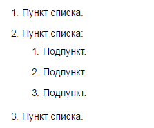
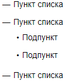
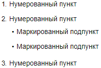

# Списки

## Нумерованный список {#section_numbered}

- Перед каждым пунктом списка добавьте номер с точкой и пробелом.

- Чтобы оформить пункт списка второго уровня, добавьте в начало строки три пробела.

- Отделите список от последующего текста пустой строкой.



Нумерация списка начнется с номера, который вы поставите перед первым пунктом. Порядок цифр в разметке не влияет на нумерацию готового списка. Но работать с исходным текстом удобнее, если элементы списка пронумерованы по порядку.



Разметка:

```
1. Пункт списка
2. Пункт списка
   1. Подпункт
   2. Подпункт
   3. Подпункт
3. Пункт списка
```







## Маркированный список {#section_bullet}

- Перед каждым пунктом маркированного списка вставьте символ маркера. В качестве маркера вы можете использовать символы `-`, `*` или `+`.
-  Чтобы оформить пункт списка второго уровня, добавьте в начало строки два пробела.
- Отделите список от последующего текста пустой строкой.

Разметка:

```
* Пункт списка
* Пункт списка
  * Подпункт
  * Подпункт
* Пункт списка
```







## Комбинированный список {#section_combined}

В нумерованном списке вы можете использовать вложенный маркированный список и наоборот:

```
1. Нумерованный пункт
2. Нумерованный пункт
   * Маркированный подпункт
   * Маркированный подпункт
1. Нумерованный пункт
```







## Блочные элементы внутри списка {#section_elem-incl}

Чтобы [каты](document-strucuture.md#section-cut), [цитаты](quoting.md), [блоки кода](source.md), [таблицы](grids.md) и другие элементы внутри списка отображались корректно, сделайте перед ними отступ слева из 4 пробелов относительно маркера списка:

```
1. пункт 1
    <[Цитата со списком
    1. текст
    1. текст
    1. текст
    ]>
1. пункт 2
```





## Список дел {#section_check}

Список дел (чек-лист) — это нумерованный или маркированный список, в котором вы можете отмечать выполненные пункты. Чтобы оформить список дел, в каждом пункте добавьте после номера или маркера пробел и символы:

- `[]` — для пункта без отметки;

- `[x]` — для пункта с отметкой.



- Нумерованный список

    ```
    1. [x] Отмеченный пункт
    2. [] Неотмеченный пункт
    3. [] Неотмеченный пункт
    ```
    
    

    
    
    

- Маркированный список

    ```
    + Пункт списка
      - [x] Отмеченный пункт
      - [] Неотмеченный пункт
    ```

    

    

    

