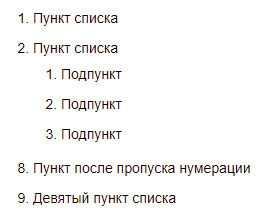
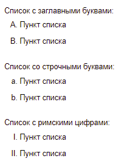
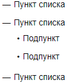
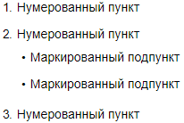
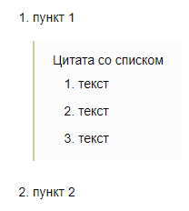
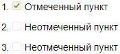
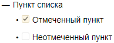

# Списки

## Нумерованный список {#section_numbered}



- Новый редактор
    
    

    Чтобы оформить нумерованный список, используйте цифры с символом `.` или `)`. Нумерация выполняется динамически при сборке, поэтому порядок цифр не важен.

    Разметка:
    ```     
    1. Первый пункт.
    1. Второй пункт.
    1. Третий пункт.
    ```

    
    
    1. Первый пункт.
    2. Второй пункт.
    3. Третий пункт.
   
    

- Старый редактор
    
    ### Список с цифрами {#section_numbered_numbers}
    
    - Перед каждым пунктом списка добавьте номер с точкой и пробелом.
    
        
    
        Нумерация списка начнется с номера, который вы поставите перед первым пунктом. Порядок цифр в разметке не влияет на нумерацию готового списка. Но работать   с   исходным текстом удобнее, если элементы списка пронумерованы по порядку.
    
        
    
    - Чтобы оформить пункт списка второго уровня, добавьте в начало строки три пробела.
    
    - Чтобы пропустить шаги нумерации, поставьте после номера с точкой символ `#` и номер, с которого нумерация продолжится.
    
    - Отделите список от последующего текста пустой строкой.
    
    Разметка:
    
    ```
    1. Пункт списка
    2. Пункт списка
       1. Подпункт
       2. Подпункт
       3. Подпункт
    3.#8 Пункт после пропуска нумерации
    4. Девятый пункт списка
    ```
    
    
    
    
    
    
    
    ### Список с буквами {#section_numbered_letters}
    
    - Список с буквами создается аналогично [списку с цифрами](#section_numbered_numbers), но вместо номеров в нем используются буквы латинского алфавита.
    
    - Чтобы создать список с римскими цифрами, перед каждым пунктом списка добавьте букву `I` или `i` с точкой и пробелом.
    
    - Пропуск шагов нумерации с помощью символа `#` в списке с буквами не поддерживается.
    
    Разметка:
    
    ```
    Список с заглавными буквами:
    A. Пункт списка
    B. Пункт списка
    
    Список со строчными буквами:
    a. Пункт списка
    b. Пункт списка
    
    Список с римскими цифрами:
    I. Пункт списка
    I. Пункт списка
    ```
    
    
    
    
    
    



## Маркированный список {#section_bullet}



- Новый редактор

    

    - Перед каждым пунктом маркированного списка вставьте символ маркера `*`.
    - Чтобы оформить пункт списка второго уровня, добавьте в начало строки два пробела.
    - Отделите список от последующего текста пустой строкой.
    
    Разметка:
    
    ```
    * Пункт списка
    * Пункт списка
      * Подпункт
      * Подпункт
    * Пункт списка
    ```
    
    
    
    
    
    

- Старый редактор
    
    - Перед каждым пунктом маркированного списка вставьте символ маркера. В качестве маркера вы можете использовать символы `-`, `*` или `+`.
    - Чтобы оформить пункт списка второго уровня, добавьте в начало строки два пробела.
    - Отделите список от последующего текста пустой строкой.
    
    Разметка:
    
    ```
    * Пункт списка
    * Пункт списка
      * Подпункт
      * Подпункт
    * Пункт списка
    ```
    
    
    
    
    
    



## Комбинированный список {#section_combined}



- Новый редактор

    

    В нумерованном списке вы можете использовать вложенный маркированный список и наоборот:
    
    ```
    1. Нумерованный пункт
    1. Нумерованный пункт
       * Маркированный подпункт
       * Маркированный подпункт
    1. Нумерованный пункт
    ```
    
    
    
    
    
    

- Старый редактор
    
    В нумерованном списке вы можете использовать вложенный маркированный список и наоборот:
    
    ```
    1. Нумерованный пункт
    2. Нумерованный пункт
       * Маркированный подпункт
       * Маркированный подпункт
    1. Нумерованный пункт
    ```
    
    
    
    
    
    



## Блочные элементы внутри списка {#section_elem-incl}



- Новый редактор

    

- Старый редактор
    
    Чтобы [каты](document-structure.md#section-cut), [цитаты](quoting.md), [блоки кода](source.md), [таблицы](grids.md) и другие элементы внутри списка   отображались   корректно, сделайте перед ними отступ слева из 4 пробелов относительно маркера списка:
    
    ```
    1. пункт 1
        <[Цитата со списком
        1. текст
        1. текст
        1. текст
        ]>
    1. пункт 2
    ```
    
    
    
    
    



## Список дел {#section_check}



- Новый редактор

    Работа со списком дел/задач описана в [инструкции](../wysiwyg/embed-content.md#tickets-list) к работе с [визуальным редактором](../pages-types.md#new-editor).

- Старый редактор

    Список дел (чек-лист) — это нумерованный или маркированный список, в котором вы можете отмечать выполненные пункты. Чтобы оформить список дел, в каждом пункте добавьте после номера или маркера пробел и символы:

    - `[]` — для пункта без отметки;

    - `[x]` — для пункта с отметкой.

    

    - Нумерованный список

      ```
      1. [x] Отмеченный пункт
      2. [] Неотмеченный пункт
      3. [] Неотмеченный пункт
      ```
        
      

      
        
      

    - Маркированный список

      ```
      + Пункт списка
      - [x] Отмеченный пункт
      - [] Неотмеченный пункт
      ```

      

      

      

        

