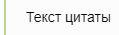
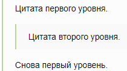
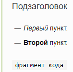

# Цитирование

## Цитирование абзаца {#paragraph}

* Чтобы процитировать абзац текста, в начале абзаца вставьте символ `>`.

* Чтобы оформить вложенную цитату, в начале абзаца вставьте символы `>>`.

* Отделяйте цитату от последующего текста пустой строкой.

* Внутри цитаты используйте другие элементы форматирования текста, например заголовки, списки или полужирный шрифт.

Примеры разметки:
 
* ```
  >Текст цитаты
  ```
  
    

    

    

* ```
    >Цитата первого уровня.
    >>Цитата второго уровня.
    >
    >Снова первый уровень.
  ```

    

    

    

* ```
    >#### Подзаголовок
    >* *Первый* пункт.
    >* **Второй** пункт.
    >
    >`фрагмент кода`
  ```

    

    

    

## Цитирование длинного текста {#long-text}



- Новый редактор

    

    Например:

    * ```
      > Подзаголовок
      >
      > * *Первый* пункт.
      > * **Второй** пункт.
      >
      > фрагмент кода
      ```  

        

        

        

- Старый редактор      
    
    * Чтобы процитировать длинный фрагмент текста, заключите цитату между символами `<[` и `]>`.
    
    * Этот формат цитирования также поддерживает вложенные цитаты и другие элементы разметки.
    
    Примеры разметки:

    * ```
      <[Цитата первого уровня. 
      >Цитата второго уровня
    
      Снова первый уровень.]>
      ``` 
        
        
    
        
    
        
    
    * ```
      <[#### Подзаголовок
      * *Первый* пункт.
      * **Второй** пункт.
    
      `фрагмент кода`]>
      ```

        
    
        
    
        

