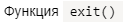
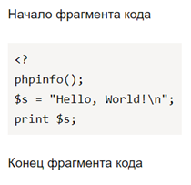

# Оформление исходного кода



- Старый редактор
    
    * Чтобы выделить в тексте фрагмент исходного кода, например название функции, окружите его с двух сторон обратными апострофами ``` ` ```.

    * Чтобы оформить несколько строк исходного кода, вставьте три обратных апострофа ` ``` ` в строке перед блоком кода и в строке после блока кода. 

    Пример:

    * ```text
        Функция `exit()` 
      ```

        

        

        

    * ```text
            Начало фрагмента кода
            ```
            <?
            phpinfo();
            $s = "Hello, World!\n";
            print $s;
            ```
            Конец фрагмента кода

      ```

        

        

        

    #### См. также

    [{#T}](highlight.md)


