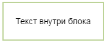

# Выделение блоков текста

Вы можете выделить часть страницы в отдельный блок:

```
%%(wacko wrapper=box)
Текст внутри блока
%%
```







Для такого блока вы можете настроить положение на странице, ширину блока, цвет, тип и толщину рамки. Основной текст страницы будет обтекать этот блок. По умолчанию блок находится в правой части страницы.

 ## Параметры настройки блока

* **align**

    Выравнивание блока на странице. Может принимать значения:
      * `right` — по правому краю;
      * `left` — по левому краю.
    
    ```
    align=right
    ```

* **width**

    Ширина блока в пикселях. 
    ```
    width=100
    ```

* **border**
    
    Параметры границы блока: ширина в пикселях, тип линии, цвет линии. 
    
    Доступные типы линий:
    - `solid` — сплошная линия;
    - `dashed` — пунктирная линия.
    
    Доступные цвета:
    - `red`— красный;
    - `green`— зеленый;
    - `blue`— синий;
    - `grey`— серый;
    - `yellow`— желтый.

    ```
    border="5px dashed red"
    ```

## Пример
```
%%(wacko wrapper=box align=left width=170 border="5px dashed red")
Текст внутри блока
%%
Этот текст будет обтекать блок. Этот текст будет обтекать блок.
```




