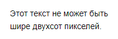
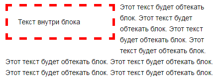
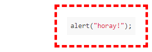
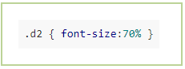

# Границы, ширина и выравнивание блоков



Для [блоков текста со специальным форматированием](../formatter.md) можно добавить рамки, настроить ширину блока и его положение относительно краев страницы. Для этого добавьте в разметку блока дополнительные параметры.

## Готовые шаблоны оформления {#wrapper}

Используйте параметр `wrapper`, чтобы применить один из шаблонов оформления блока. Основной текст страницы будет обтекать этот блок.

Параметр | Описание
---|---
`box` | Блок в зеленой рамке, расположенный по правому краю страницы. 
`shade` | Блок в зеленой рамке, расположенный по левому краю страницы.
`text` | Блок без рамки с выравниванием текста по правому краю страницы. Выравнивание текста можно настроить с помощью [параметра `align`](#align).
`page` | Блок без рамки, расположенный по левому краю страницы.



При использовании параметра `wrapper` вы можете добавить другие параметры, чтобы настроить [положение](#align) на странице, [ширину](#width) блока, цвет, тип и толщину [границы](#border). 



Пример:

```
%%(wacko wrapper=box)
Текст внутри блока
%%
```


## Настроить выравнивание {#align}

Используйте параметр `align`, чтобы настроить положение блока на странице.

В сочетании с параметром `wrapper=text` параметр `align` позволяет настроить выравнивание текста внутри блока.

Параметр | Описание
---|---
`right` | По правому краю страницы.
`left` | По левому краю страницы.
`center` | По центру. Это значение действует только в сочетании с параметром `wrapper=text`.
    
Пример:

```
%%(css align=right)
.d { font-size:70% }
%%
```

## Настроить ширину блока {#width}

Используйте параметр `width`, чтобы настроить ширину блока в пикселях.

Пример:

```
%%(css wrapper=box width=400)
.d { font-size:70% }
%%
```


## Настроить границу блока {#border}

Используйте параметр `border`, чтобы настроить границу вокруг блока.
    
```
border="<толщина_в_пикселях> <тип_линии> <цвет_линии>"
```
Параметр | Описание
---|---
**Типы линий**|
`solid` | Сплошная линия.
`dashed` | Пунктирная линия.
**Цвета** |
`red` | Красный.
`green` | Зеленый.
`blue` | Синий.
`grey` | Серый.
`yellow` | Желтый.

Пример:

```
%%(math wrapper=shade border="2px dashed red") X^{a+b}_{i-j} %%
```

## Примеры {#example}
 
Разметка  | Результат
 --- | --- 
```%%(wacko wrapper=text align=center) текст по центру %%``` | 
```%%(wacko wrapper=page width=200)```<br/>```Этот текст не может быть шире двухсот пикселей.```<br/>```%%``` | 
```%%(wacko wrapper=box align=left width=170 border="5px dashed red")```<br/>```Текст внутри блока```<br/>```%%```<br/>```Этот текст будет обтекать блок. Этот текст будет обтекать блок.``` | 
```%%(javascript nomark wrapper=box border="5px dashed red")```<br/>```alert("horay!");```<br/>```%%``` | 
```%%(css wrapper=shade)```<br/>```.d2 { font-size:70% }```<br/>```%%``` | 