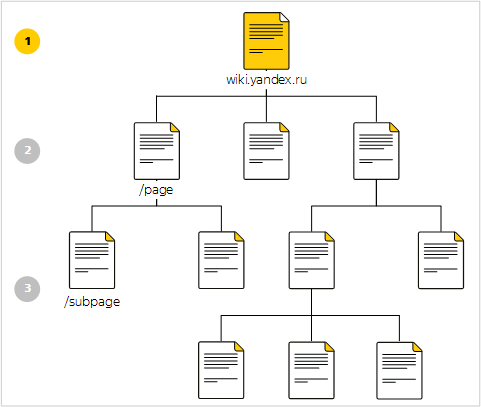

# Структура {{ wiki-full-name }}

## Дерево страниц {#structure}

Страницы {{ wiki-name }} организованы в виде дерева:

1. **{{ wiki-host-name }}** — главная страница {{ wiki-name }}. Обычно на главную страницу выносятся ссылки на основные разделы, важные ссылки или новости.

1. **{{ wiki-host-name }}/page** — страницы верхнего уровня. Обычно это страницы, которые относятся к большой общей теме. Например, страницы подразделения, команды или проекта.

    

    Главная страница не считается родительской для страниц верхнего уровня.

    

1. **{{ wiki-host-name }}/page/subpage/...** — страницы второго и следующих уровней.

У каждой страницы есть один или несколько _авторов_ — пользователи, которые управляют доступом к странице. Имена авторов страницы отображаются под ее заголовком.

## Разделы {#clusters}

Страницы {{ wiki-name }} образуют _разделы_:

Раздел — это страница со всеми своими потомками. Обычно страницы одного раздела объединены общей тематикой.

Чтобы [просмотреть или изменить структуру раздела](cluster-overview.md#subpages), на верхней панели нажмите значок .

## Личный раздел {#personal_cluster}

У каждого пользователя {{ wiki-name }} есть _Личный раздел_ (`{{ wiki-username }}`). В своем разделе вы можете хранить личную информацию, планы, черновики и т. д. 

Чтобы перейти в личный раздел, на левой панели {{ wiki-name }} нажмите  **{{ ui-key.beta-wiki.blocks_common_desktop.blocks_b-head.my_page }}**.

По умолчанию страницы личного раздела доступны всем пользователям.

Как и для других страниц, для которых являетесь автором, вы можете [изменить](page-management/access-setup.md) настройки доступа для страниц вашего личного раздела.