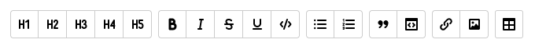

# Работа в новом редакторе

Визуальный редактор работает только на страницах, созданных [в новом редакторе](pages-types.md#wysiwyg). 

Страницы, созданные в новом редакторе, нельзя конвертировать в страницу старого редактора и на них не работает вики-разметка и [динамические блоки](actions.md).

## Редактировать страницу {#edit-page}

Чтобы отредактировать страницу, [созданную](wysiwyg-create.md) в новом редакторе:

1. Откройте страницу, созданную в новом редакторе, и в правом верхнем углу нажмите кнопку **Редактировать**.

1. Внесите изменения на странице. Для форматирования текста, оформления списков, вставки таблиц и рисунков используйте кнопки на панели инструментов:

    

1. Чтобы отменить или повторить действие, используйте кнопки  (**Ctrl** + **Z** или **⌘** + **Z** для Mac OS) и  (**Ctrl** + **Shift** + **Z** или **⌘** + **Shift** + **Z** для Mac OS).

1. Чтобы использовать [разметку {{ yfm }}]({{ yfm-link }}) для оформления текста, справа от панели инструментов нажмите  и выберите режим **Разметка Markdown**.

1. Чтобы отключить панель инструментов, справа от нее нажмите  и выключите опцию **Панель инструментов**. Если панель инструментов отключена, вызывать команды можно с помощью символа `/` или кнопкой «+».

## Форматирование текста {#format-wysiwyg}

Чтобы форматировать текст, используйте кнопки на панели инструментов или сочетания клавиш:

Форматирование | Кнопка на панели | Сочетание клавиш Windows | Сочетание клавиш Mac OS
--- | --- | --- | ---
Заголовок |   | **Ctrl** + **Alt** + **1**—**6** | **⌘** + **⌥** + **1**—**6**
Полужирный текст |  | **Ctrl** + **B** | **⌘** + **B**
Курсив |  | **Ctrl** + **I** | **⌘** + **I**
Подчеркнутый текст |  | **Ctrl** + **U** | **⌘** + **U**
Зачеркнутый текст |  | **Ctrl** + **Shift** + **S** | **⌘** + **Shift** + **S**
Цветной текст |   | — | —

## Списки {#lists-wysiwyg}

Чтобы добавить список, выберите один или несколько абзацев и используйте кнопки на панели инструментов или сочетания клавиш:

Список | Кнопка на панели | Сочетание клавиш Windows | Сочетание клавиш Mac OS
--- | --- | --- | ---
Маркированный список |  | **Ctrl** + **Shift** + **L** | **⌘** + **Shift** + **L**
Нумерованный список |  | **Ctrl** + **Shift** + **M** | **⌘** + **Shift** + **M**
Уменьшить отступ |  | **Shift** + **⇥** | **Shift** + **⇥**
Увеличить отступ |  | **⇥** | **⇥**
Контрольный список (чекбокс) |  | — | —

## Блочное форматирование {#block-wysiwyg}

Чтобы добавить цитату, примечание, кат, особым образом оформленный блок или секцию блоков, выберите один или несколько абзацев и используйте кнопки на панели инструментов или сочетания клавиш:

Блок | Кнопка на панели | Сочетание клавиш Windows | Сочетание клавиш Mac OS
--- | --- | --- | ---
Примечание |  | **Ctrl** + **Alt** + **8** | **⌘** + **⌥** + **8**
Кат |  | **Ctrl** + **Alt** + **7** | **⌘** + **⌥** + **7**
Цитата |  | **Ctrl** + **>** | **⌘** + **>**
Блок оформления |  | — | —
Секция |  | — | —

Для блока **Примечание** можно выбрать его тип: <q>Примечание</q>, <q>Совет</q>, <q>Важно</q>, <q>Внимание</q>.

Чтобы настроить визуальное отображение для **Блока оформления**, в правом верхнем углу блока нажмите значок  и установите параметры. 

В блоке **Секция** можно выбрать: 
* количество и расположение ячеек;
  *  **Две ячейки**;
  *  **Большая справа**;
  *  **Большая слева**;
  *  **Три ячейки**.
* расположение всей секции:
  *  **Вся секция по левому краю**;
  *  **Вся секция по центру**;
  *  **Вся секция по правому краю**.

Чтобы добавить разделитель между абзацами, в режиме **Редактор** вызовите список команд с помощью символа `/` и выберите  **Разделитель**.

## Оформление кода {#src-wysiwyg}

Чтобы добавить блок кода, выберите строку или абзац и используйте кнопки на панели инструментов или сочетания клавиш:

Блок | Кнопка на панели | Сочетание клавиш Windows | Сочетание клавиш Mac OS
--- | --- | --- | ---
Блок кода |  | **Ctrl** + **Alt** + **E** | **⌘** + **⌥** + **E**
Строка кода в тексте|  | **Ctrl** + **E** | **⌘** + **E**

## Формулы {#equation}

Чтобы добавить формулу, на панели инструментов нажмите  и выберите вариант оформления:

 * **Формула в тексте** — формула будет размещена на странице в тексте;

 * **Блок с формулой** — формула будет размещена в отдельном блоке.

Для создания формул используйте библиотеку [Katex](https://katex.org/), поддерживающую формат TeX/LaTeX.

## Ссылки {#links-wysiwyg}

Чтобы добавить ссылку:

1. Выделите фрагмент текста или нажмите на ту область, куда нужно добавить ссылку.

1. На панели инструментов нажмите .

1. Укажите адрес прямой или [относительной](static-markup/links.md#wiki-ref) ссылки. Если вы не выбрали фрагмент текста, введите текст, который будет отображаться как ссылка.

1. Нажмите **Сохранить**.

Чтобы изменить или удалить ссылку:

1. Нажмите на ссылку.

1. Внесите изменения и нажмите **Сохранить**.

## Встроенный контент {#content-wysiwyg}

### Вставить изображение из буфера обмена {#clipboard}

1. Скопируйте изображение в буфер обмена:

    - скопируйте рисунок из графического редактора или сделайте снимок экрана;

    - скопируйте рисунок с веб-страницы;

    - скопируйте файл с изображением из файлового менеджера на вашем компьютере.

1. Откройте страницу и нажмите кнопку **Редактировать**.

1. Вставьте в текст страницы изображение из буфера обмена. 

Изображение будет автоматически загружено на {{ wiki-name }} и появится в [списке прикрепленных файлов](attach-file.md).

### Вставить изображение по ссылке {#image}

1. Загрузите изображение на [страницу](add-image.md) или на файловый хостинг.

1. Скопируйте адрес изображения.

1. На панели инструментов нажмите :

    * В поле **Ссылка** вставьте адрес изображения.

    * Добавьте **Подпись к рисунку**. Подпись будет отображаться при наведении указателя на изображение.

    * Введите **Альтернативный текст**. Текст будет отображаться, если не удастся загрузить изображение.

    * Укажите размер изображения.

1. Нажмите **Сохранить**.

### Файлы {#file}

Чтобы вставить на страницу файл:

1. На панели инструментов нажмите . 

1. Выберите способ загрузки файла:

   * Чтобы загрузить файл по ссылке, нажмите на вкладку **Добавить по ссылке**. Затем введите адрес расположения файла и укажите название, которое будет отображаться в тексте. Сохраните изменения.

   * Чтобы прикрепить файл с устройства, нажмите на вкладку **Загрузить с устройства** и загрузите один или несколько файлов.

### Объекты и медиафайлы {#iframe}

Чтобы вставить на страницу объект или медиафайл из внешнего источника, используйте встраиваемый блок iFrame:

1. Скопируйте ссылку на ресурс, который будет отображаться в фрейме.

1. На панели инструментов нажмите :

    * В поле **Ссылка** вставьте адрес ресурса.

    * Укажите размер фрейма.

1. Нажмите **Сохранить**.

## Таблицы {#tables-wysiwyg}

Чтобы добавить таблицу, на панели инструментов нажмите  и заполните ячейки. Текст в ячейках таблицы можно форматировать.

Чтобы редактировать таблицу, выберите ячейку и используйте динамические кнопки.

## Диаграммы {#chart}

Вы можете разместить на странице диаграммы, которые поддерживает [библиотека PlantUML](https://plantuml.com/).

Чтобы вставить диаграмму, в режиме **Редактор** вызовите список команд с помощью символа `/` и выберите  **Диаграмма**.

Чтобы редактировать диаграмму, в правом верхнем углу блока с диаграммой нажмите на кнопку **Редактировать** и внесите изменения в синтаксис, используя язык разметки бибилиотеки PlantUML. Сохраните изменения. 

## Пользователи {#user}

Чтобы создать на странице ссылку на пользователя организации, в режиме **Редактор** нажмите символ `@` или вызовите список команд с помощью символа `/` и выберите  **Пользователь**. Начните вводить имя или логин пользователя.

## Инклюд {#include}

Вы можете разместить на странице контент из другой страницы Wysiwyg: 

1. В режиме **Редактор** вызовите список команд с помощью символа `/` и выберите  **Инклюд**.

1. Укажите адрес страницы, которую хотите вставить.

1. Если необходимо, включите опцию, которая позволит показывать ошибку о страницах, к которым у пользователя нет доступа.

#### См. также

* [{#T}](wysiwyg-create.md)
