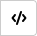
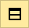
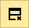
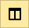
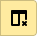

# Визуальный редактор (Wysiwyg)

В визуальном редакторе можно форматировать текст страницы без использования [языка разметки](static-markup.md), как в привычных текстовых редакторах, например Microsoft Word или Google Docs.

В визуальном редакторе вы сразу видите, как будет выглядеть страница после публикации. Для форматирования текста, оформления списков, вставки таблиц и рисунков используйте кнопки на панели инструментов:



Визуальный редактор работает только на страницах Wysiwyg, которые доступны во внутренней {{wiki-name}} Яндекса. Визуальный редактор находится на стадии бета-версии, поэтому может работать нестабильно. Страницы Wysiwyg имеют ограничения:

* На них не работает вики-разметка и [динамические блоки (экшны)](actions.md).

* Их нельзя конвертировать в обычную вики-страницу с разметкой.

* Их нельзя найти через [поиск интранета](search.md).



## Создать страницу в визуальном редакторе {#create-page-wysiwyg}

Чтобы создать страницу в визуальном редакторе Wysiwyg:

1. На верхней панели {{ wiki-name }} нажмите кнопку **Создать**.

1. Выберите **Wysiwyg**.

1. Задайте название и адрес страницы так же, как при [обычном создании страницы](create-page.md).

1. Нажмите кнопку **Создать**. Новая страница откроется в визуальном редакторе.

## Форматирование текста {#format-wysiwyg}

Чтобы форматировать текст, используйте кнопки на панели инструментов или сочетания клавиш:

Форматирование | Кнопка на панели | Сочетание клавиш
--- | --- | ---
Заголовок |  | —
Полужирный текст |  | **Ctrl** + **B**
Курсив |  | **Ctrl** + **I**
Зачеркнутый текст |  | **Ctrl** + **Shift** + **S**
Подчеркнутый текст |  | **Ctrl** + **U**
Строка кода |  | —

## Списки {#lists-wysiwyg}

Чтобы добавить список, выберите один или несколько абзацев и используйте кнопки на панели инструментов:

Список | Кнопка на панели
--- | ---
Маркированный список | 
Нумерованный список | 

Чтобы оформить вложенный пункт списка, выберите абзац и нажмите клавишу табуляции в начале строки.

## Цитаты и блоки кода {#src-wysiwyg}

Чтобы добавить цитату или блок кода, выберите один или несколько абзацев и используйте кнопки на панели инструментов:
Блок | Кнопка на панели
--- | --- 
Цитата | 
Блок кода | 

## Ссылки {#links-wysiwyg}

Чтобы добавить ссылку:

1. Выделите фрагмент текста или нажмите на ту область, куда нужно добавить ссылку.

1. На панели инструментов нажмите .

1. Укажите адрес прямой или [относительной](static-markup/links.md#wiki-ref) ссылки и нажмите **ОК**.

Чтобы изменить или удалить ссылку:

1. Нажмите на ссылку.

1. На панели инструментов нажмите .

1. Внесите изменения и нажмите **ОК**.

## Изображения {#pictures-wysiwyg}



В визуальном редакторе нельзя загрузить изображение на страницу. Вы можете добавить рисунок, скопировав его адрес с другой вики-страницы. Чтобы пользователь увидел такое изображение на вашей странице, он должен иметь доступ к вики-странице с оригиналом.



Чтобы вставить изображение:

1. Загрузите изображение на [вики-страницу](add-image.md) или на файловый хостинг, например, [Jing](https://jing.yandex-team.ru/). В визуальном редакторе нельзя изменять размер изображения, поэтому подготовьте его заранее.

1. Скопируйте адрес изображения.

1. На панели инструментов нажмите .

1. Вставьте адрес рисунка и нажмите **ОК**.

1. Чтобы удалить рисунок, используйте клавиши _Backspace_ или _Del_.

## Таблицы {#tables-wysiwyg}

Чтобы добавить таблицу, на панели инструментов нажмите  и заполните ячейки. Текст в ячейках таблицы можно форматировать.

Чтобы редактировать таблицу, выберите ячейку и используйте кнопки на панели инструментов:
Действие | Кнопка на панели
--- | ---
Удалить таблицу | 
Вставить строку снизу | 
Удалить строку | 
Вставить столбец справа | 
Удалить столбец | 
