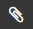

# Встроенный контент




## Изображение из буфера обмена {#clipboard}



- Новый редактор  
  
    1. Скопируйте изображение в буфер обмена:
  
       - скопируйте рисунок из графического редактора или сделайте снимок экрана;
  
       - скопируйте рисунок с веб-страницы;
  
       - скопируйте файл с изображением из файлового менеджера на вашем компьютере.
  
    1. Откройте страницу и нажмите кнопку **{{ ui-key.beta-wiki.blocks_common_desktop.blocks_w-comment.edit }}**.
  
    1. Вставьте в текст страницы изображение из буфера обмена.
  
    Изображение будет автоматически загружено на {{ wiki-name }} и появится в [списке прикрепленных файлов](../attach-file.md).

- Старый редактор

    Вставить изображение на страницу можно из [буфера обмена](#clipboard), по ссылке с внешнего ресурса или из загруженных на {{ wiki-name }} файлов. Дополнительные параметры вставки изображений описаны в разделе [{#T}](../static-markup/files.md).

    ### Вставить изображение, которое уже загружено на {{ wiki-name }} {#attach}

    1. Откройте страницу и в правом верхнем углу нажмите  **Действия**, затем выберите  **Ресурсы страницы**.

    1. Чтобы загрузить изображение на страницу, нажмите кнопку **{{ ui-key.beta-wiki.blocks_common_desktop.blocks_w-attachments.upload-btn-text }}** и откройте нужный файл или файлы.

    1. Чтобы скопировать ссылку на изображение, наведите курсор на файл и нажмите значок  **Скопировать код для вставки**.

    1. В правом верхнем углу страницы нажмите кнопку **{{ ui-key.beta-wiki.blocks_common_desktop.blocks_w-comment.edit }}**.

    
    
    В режиме редактирования список всех загруженных файлов доступен на панели слева на вкладке .
    
    

    1. Вставьте ссылку на страницу. Например:

        ```
        200x0:/users/login/.files/image.png
        ```


    Для вставки файла или изображения из буфера обмена:

    1. Скопируйте изображение в буфер обмена:

       - скопируйте рисунок из графического редактора или сделайте снимок экрана;

       - скопируйте рисунок с веб-страницы;

       - скопируйте файл с изображением из файлового менеджера на вашем компьютере.

    

    Копируйте изображения по одному. {{ wiki-name }} не поддерживает вставку нескольких изображений одновременно.

    

    1. Откройте страницу и нажмите кнопку **{{ ui-key.beta-wiki.blocks_common_desktop.blocks_w-comment.edit }}**.

    1. Вставьте в текст страницы изображение из буфера обмена. 

    Изображение будет автоматически загружено на {{ wiki-name }}, а ссылка на изображение появится в тексте страницы. Также оно будет доступно в списке прикрепленных файлов. Чтобы увидеть список прикрепленных файлов в меню  **Действия** нажмите  **Ресурсы страницы**.


  
## Изображение по ссылке {#image}



- Новый редактор  
  
    1. Загрузите изображение на страницу или на файловый хостинг.
  
    1. Скопируйте адрес изображения.
  
    1. На панели инструментов нажмите :
  
       - В поле **Ссылка** вставьте адрес изображения.
  
       - Добавьте **Подпись к рисунку**. Подпись будет отображаться при наведении указателя на изображение.
  
       - Введите **Альтернативный текст**. Текст будет отображаться, если не удастся загрузить изображение.
  
       - Укажите размер изображения.
  
    1. Нажмите **{{ ui-key.beta-wiki.blocks_common_desktop.blocks_b-editor-struct.page_save }}**.

- Старый редактор

    Если изображение размещено на веб-ресурсе:

    1. Откройте страницу и нажмите кнопку **{{ ui-key.beta-wiki.blocks_common_desktop.blocks_w-comment.edit }}**.

    1. Скопируйте ссылку на изображение.

    1. Вставьте ссылку на страницу с помощью разметки:
    
        ```
        
        ```

    Например:

    Разметка | Результат
    --- | ---
    `` | 

    

    Если вы вставите в текст страницы ссылку на изображение без элементов разметки, на странице отобразится изображение без альтернативного текста.

    



## Файл {#file}



- Новый редактор  
  
    Чтобы вставить на страницу файл:
  
    1. На панели инструментов нажмите .
  
    1. Выберите способ загрузки файла:
  
       - Чтобы загрузить файл по ссылке, нажмите на вкладку **Добавить по ссылке**. Затем введите адрес расположения файла и укажите название, которое будет   отображаться в тексте. Сохраните изменения.
  
       - Чтобы прикрепить файл с устройства, нажмите на вкладку **Загрузить с устройства** и загрузите один или несколько файлов.

- Старый редактор

    Чтобы вставить на страницу файл:
  
    1. На панели инструментов нажмите .
  
    1. На панели слева нажмите кнопку **{{ ui-key.beta-wiki.blocks_common_desktop.blocks_w-attachments.upload-btn-text }}** и откройте нужный файл или файлы.


  
## Объект iFrame или медиафайл {#iframe}



- Новый редактор  
  
    Чтобы вставить на страницу объект или медиафайл из внешнего источника, используйте встраиваемый блок iFrame:
  
    1. Скопируйте ссылку на ресурс, который будет отображаться в фрейме.
  
    1. На панели инструментов нажмите :
  
       - В поле **Ссылка** вставьте адрес ресурса.
  
       - Укажите размер фрейма.
  
    1. Нажмите **{{ ui-key.beta-wiki.blocks_common_desktop.blocks_b-editor-struct.page_save }}**.

- Старый редактор

    

    Данная функция для этого типа редактора подробно описана в разделе [Объекты из внешних источников](../actions/iframe#iframe-call). 
    
    


  
## Диаграмма {#chart}



- Новый редактор  
  
    Вы можете разместить на странице диаграммы, которые поддерживает [библиотека PlantUML](https://plantuml.com/).
  
    Чтобы вставить диаграмму, в режиме **Редактор** вызовите список команд с помощью символа `/` и выберите    **Диаграмма**.
  
    Чтобы редактировать диаграмму, в правом верхнем углу блока с диаграммой нажмите на кнопку **{{ ui-key.beta-wiki.blocks_common_desktop.blocks_w-comment.edit }}** и внесите изменения в синтаксис, используя язык разметки бибилиотеки PlantUML. Сохраните изменения.

- Старый редактор

    

    Данная функция для этого типа редактора подробно описана в разделе [Объекты из внешних источников](../static-markup/diagram.md). 
    
    


  
## Инклюд {#include}



- Новый редактор  
  
    Вы можете разместить на странице контент из другой страницы Wysiwyg:
  
    1. В режиме **Редактор** вызовите список команд с помощью символа `/` и выберите  **Инклюд**.
  
    1. Укажите адрес страницы, которую хотите вставить.
  
    1. Если необходимо, включите опцию, которая позволит показывать ошибку о страницах, к которым у пользователя нет доступа.

- Старый редактор

    

    Данная функция не поддерживается в этом типе редактора. 
    
    


  
## Draw.io {#draw-io}



- Новый редактор  
  
    Чтобы добавить на страницу рисунок, созданный в редакторе [Draw.io](http://draw.io/), нажмите `/` и во всплывающем окне выберите  **Draw.io**.
  
    Чтобы изменить размеры рисунка, в его правом верхнем углу нажмите  → **Настройки** и установите новую ширину и   высоту в пикселях.
  
    Чтобы отредактировать уже созданный рисунок, в его правом верхнем углу нажмите  → **Редактировать**.
  
    ### Редактирование рисунка {#edit-draw-io}
  
    В Draw.io вы можете добавлять, удалять и изменять элементы, а также рисовать от руки.
  
    Чтобы добавить элемент, выберите его на панели слева. Он появится посередине холста, после чего вы можете его перемещать, редактировать и поворачивать.
  
    Между несколькими фигурами можно установить связь в виде стрелки. Чтобы сделать это:
  
    1. Нажмите на фигуру, от которой хотите протянуть стрелку.
    1. Вокруг фигуры появятся четыре голубые стрелки. Зажмите одну из них и протяните до фигуры, с которой хотите установить связь.
  
    Теперь, если вы передвинете любую из связанных фигур, связывающие стрелки также будут перемещаться.
  
    С помощью голубых стрелок вокруг фигуры также можно создать новую фигуру. Чтобы сделать это, кликните на одну из таких стрелок и выберите фигуру, которую   хотите создать. Новая фигура будет связана с той, на стрелку которой вы нажимали.
  
    Вы также можете перейти в режим рисования. Для этого нажмите на панели слева кнопку . Теперь вы можете   зажимать левую кнопку мыши, чтобы рисовать на холсте от руки. Чтобы выйти из режима рисования, снова нажмите кнопку .
  
    
  
    Находясь в режиме рисования, вы не можете редактировать фигуры.
  
    

- Старый редактор

    

    Данная функция не поддерживается в этом типе редактора. 
    
    


  
## Список задач {#tickets-list}



- Новый редактор  
  
    Чтобы добавить на страницу список задач из {{ tracker-name }}:
  
    1. Нажмите `/`.
    1. Во всплывающем окне выберите  **Список задач**.
    1. В поле **Ссылка** вставьте ссылку на фильтр задач в {{ tracker-name }}, по которому хотите их отобразить.
    1. Нажмите **Сохранить**.
  
    Чтобы отредактировать список задач, в его правом верхнем углу нажмите  → **Редактировать**.

- Старый редактор

    

    Данная функция не поддерживается в этом типе редактора. 
    
    


  
## Mermaid {#mermaid}



- Новый редактор  
  
    Вы можете разместить на странице диаграмму, созданную с помощью [Mermaid](http://mermaid.js.org/). Для этого нажмите `/`и во всплывающем окне выберите  **Mermaid**.
  
    Чтобы редактировать диаграмму, используйте [синтаксис Mermaid](http://mermaid.js.org/config/Tutorials.html).

- Старый редактор

    

    Данная функция не поддерживается в этом типе редактора. 
    
    


