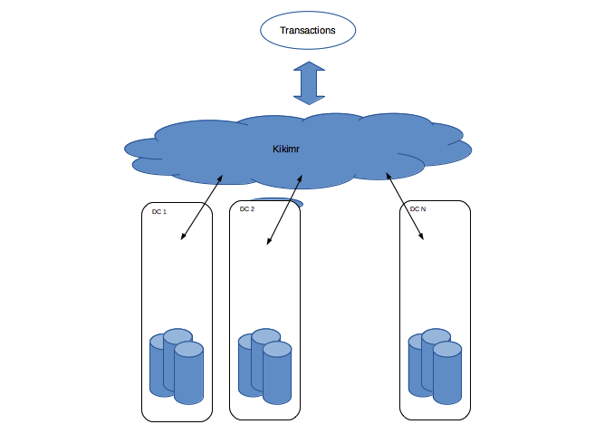
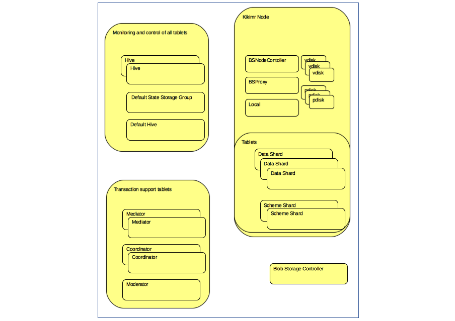
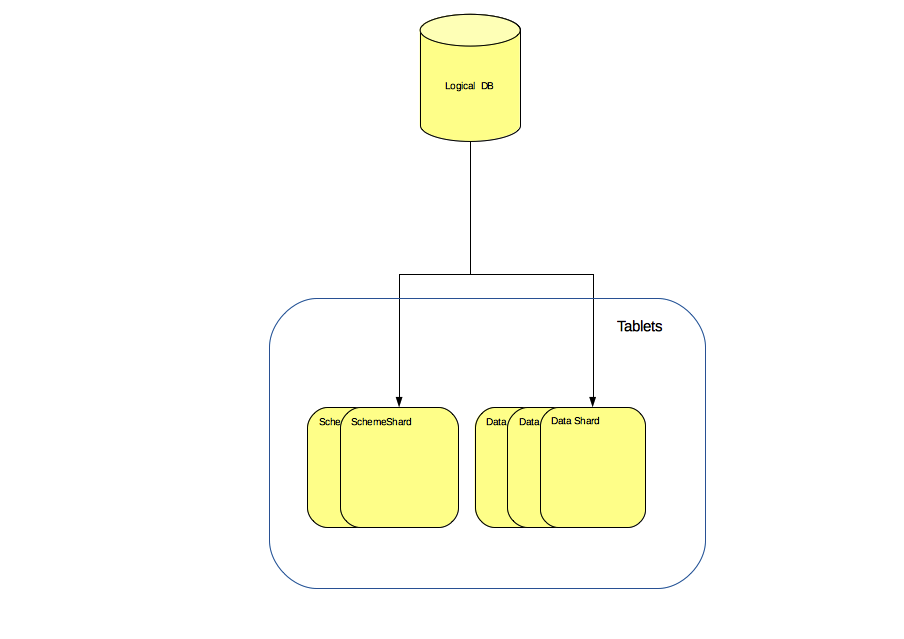
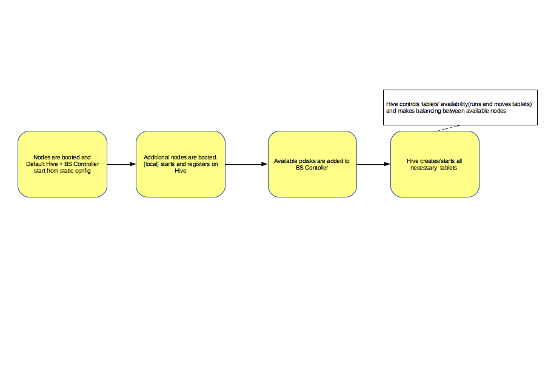
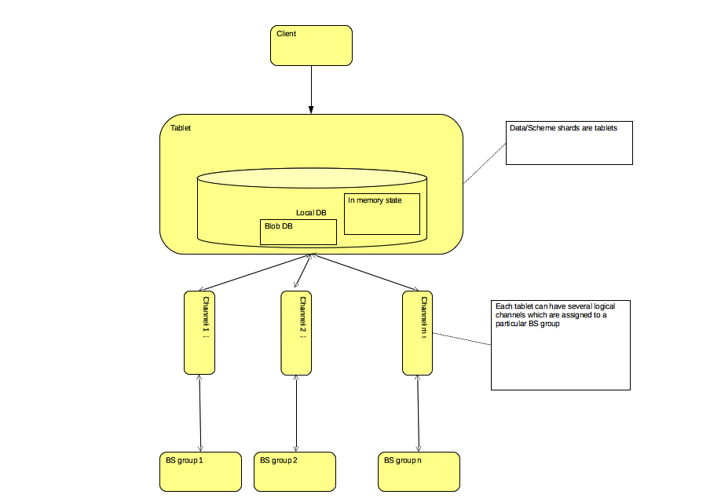
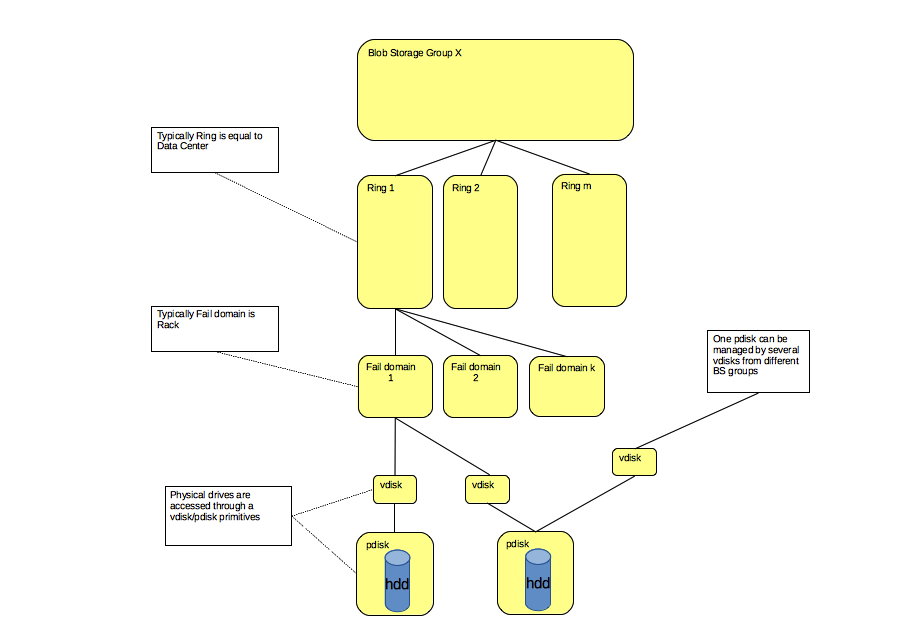
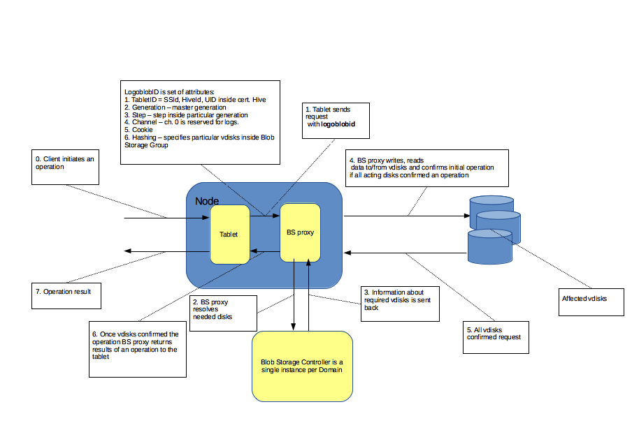
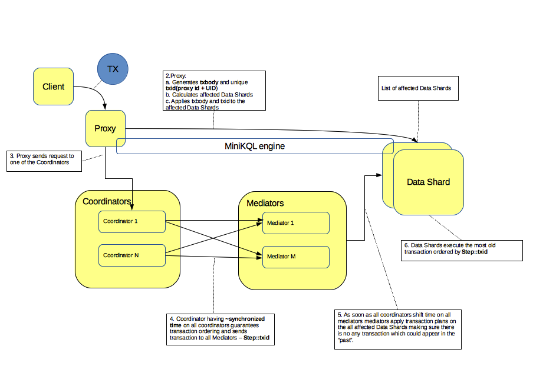

## Обзор YDB

**YDB** — это система хранения и обработки данных. Система может быть использована как:

  * Framework для создания инфраструктурных компонент, например, базы данных мониторинга, очередей сообщений и т.п.;
  * Распределенная отказоустойчивая база данных с ACID транзакциями.

 **YDB** представляет собой распределенное отказоустойчивое strict consistent хранилище, в том числе распределенное между датацентрами, которое может использоваться в инсталляциях, состоящих как из нескольких машин, так и из тысяч вычислительных узлов. Отличительной особенностью **YDB** является встроенная возможность эффективно выполнять [транзакционные операции](https://cloud.yandex.ru/docs/ydb/oss/public/develop/concepts/transactions) c уровнем изоляции  serializable как над отдельными объектами (single-row transactions) так и над группами распределенных объектов хранилища (cross-row/cross-table transactions).

           (Рис. 1 Мультидатацентровое хранилище YDB)
  **YDB** позволяет строить кластера с общим объемом хранилища в сотни петабайт данных, используя  [эффективные схемы хранения](erasure.md), а также предоставляет встроенные механизмы отказоустойчивости на всех уровнях, позволяющие выдерживать сбои как на отдельном жестком диске, так и отказ целого датацентра. При добавлении или удалении новых узлов в процессе эксплуатации, данные автоматически перераспределяются без существенного негативного эффекта для текущих операций.

## Основные характеристики YDB

  * представляет собой [табличную базу данных](../concepts/datamodel.md);
  * реализует эффективное выполнение меж-объектных транзакций (cross-row/cross-table transactions);
  * реализует согласованность в режиме strict-consistency with serializable isolation;
  * предоставляет универсальный язык взаимодействия с платформой YQL;
  * реализует принцип исполнения кода программ на серверах кластера избегая ненужной пересылки данных клиенту;
  * реализует эффективное [избыточное хранение данных](erasure.md);
  * обеспечивает возможность cross-DC хранения данных с контролем выхода из строя отдельных DC без потери доступности по данным, имеющим междатацентровые реплики, а также обеспечивает поддержку выполнения cross-DC транзакций;
  * предоставляет набор SDK для работы с базой на ЯП С++, Java, Python, Go, Node.js;
  * является multi tenant системой, которая позволяет пользователям заводить изолированные базы данных в одном кластере;
  * поддерживает возможность запуска в serverless режиме c оплатой за потребление, то есть за совершенные операции и хранимые данные;
  * имеет архитектуру, в который слой вычислений отделен от слоя хранения данных;
  * реализует контроль доступа пользователей к данных, ACL до уровня конкретных таблиц;
  * поддерживает аналитические запросы на снепшоте таблиц;
  * поддерживает автоматический split/merge шардов данных по размеру данных и нагрузке на шарды.

## Принципы и идеи, на которых построена платформа YDB
#### Actor Model
Системы, подобные **YDB**, сложны для написания, отладки и тестирования – очень много компонентов и связей между ними. Поэтому в **YDB** принято решение разрабатывать систему в рамках [Actor model](http://en.wikipedia.org/wiki/Actor_model). Акторы удобны по следующим причинам:

  * естественным образом параллелятся;
  * предоставляют единый механизм взаимодействия между (локальными и удаленными) компонентами на основе сообщений;
  * дают высокую производительность;
  * удобны в написании (видишь компонент целиком);
  * удобны в тестировании, позволяют легко собирать промежуточные схемы для разработки и тестирования.

Таким образом базовым строительным элементом, на котором строятся все компоненты верхнего уровня, является актор. Акторы находятся в так называемой Actor System, в рамках которой они взаимодействуют, обмениваясь сообщениями.

#### Replicated State Machine
Основная сложность разработки любой распределенной системы состоит в борьбе со сбоями. RSM (replicated state machine) – это способ реализовать устойчивый к сбоям программный компонент, который исключает спецэффекты для пользователей такие, как, например, чтение старой версии данных после успешной записи. Это способ локализовать борьбу со сбоями в одном компоненте, который можно написать, отладить и использовать как основной строительный материал в распределенной системе.

В процессе разработки **YDB** было решено использовать RSM гораздо более массово, чем RSM применялся в тот момент времени (для лидера метаданных, менеджера блокировок и т.п.). RSM в **YDB** отвечает за маленький кусочек системы, и за каждый кусочек системы, требующий надёжности, отвечает RSM.

Для минимизации оверхеда от повсеместного применения RSM и обеспечения эксплуатационных свойств (эластичность, балансировка) выбрана модель RSM over Shared Log (например, [Tango](http://www.cs.cornell.edu/~taozou/sosp13/tangososp.pdf), [CORFU](https://www.usenix.org/system/files/conference/nsdi12/nsdi12-final30.pdf)).

Реализация RSM в **YDB** опирается на контракт распределенного хранилища лога (aka BlobStorage):

* операции надежной блокировки записи лога всех кандидатов, кроме успешно проапгрейдившегося до активного лидера;
* надежное хранение закомиченных блобов лога;
* гарантии детерминированного обнаружения инцидентов потери сохраненного блоба в случае невосстановимых сбоев.

Такая реализация RSM является базовым строительным блоком **YDB** и называется **[Таблеткой](tablets.md)**.

В качестве вспомогательных механизмов используются:
 * **[State-storage](tablet_state_storage.md)** - (волатильно) хранит информацию о текущем лидере - используется для discovery и как хинт в процессе восстановления;
 * **[Hive](tablet_hive.md)** - one RSM to rule them all - служебная RSM, управляющая перезапуском управляемых таблеток, позволяет минимизировать конфликты и осведомлённо балансировать нагрузку по ресурсам кластера.

Благодаря управляемому и детерминированному характеру рождения кандидатов из алгоритма консенсуса полностью исключён фактор времени (в форме лиз или в форме пингов).

#### Транзакции

В дизайн **YDB** изначально заложена возможность выполнения транзакций между сущностями системы, обеспечивая serializable isolation. Так как система распределенная, то транзакции зачастую являются распределенными. В качестве базового механизма выбран механизм детерминированного выполнения транзакций [Calvin](http://cs.yale.edu/homes/thomson/publications/calvin-sigmod12.pdf) с некоторыми модификациями. Детерминированные транзакции имеют некоторое преимущество по сравнению с [Two Phase Commit](http://en.wikipedia.org/wiki/Two-phase_commit_protocol), а именно позволяют выполнять определенный класс транзакций с высоким рейтом из-за отсутствия блокировок. Такой подход несколько сужает диапазон допустимых сценариев, но он в **YDB**расширен через механизм optimistic locking. Можно показать, что в худшем случае выбранная модель работает не хуже двухфазного коммита, а на некотором (при заранее известном наборе затронутых ключей) множестве транзакций - качественно превосходит, обеспечивая очень высокий transaction rate.

**YDB** предоставляет уровень изоляции [Serializable isolation](http://en.wikipedia.org/wiki/Isolation_%28database_systems%29#Serializable) и обеспечивает глобальную упорядоченность (сериализацию) транзакций. Основными компонентами, обеспечивающими упорядоченность и изолированность, являются
 * **[Coordinator](tablet_coordinator.md)**
 * **[Mediator](tablet_mediator.md)**
 * **[TxProxy](tablet_txproxy.md)**
 * **[Datashard](tablet_datashard.md)**

 Более детально выполнение транзакций описано в соответствующем [разделе](tx_processing.md).

## Общая схема и основные понятия
Все основные термины, понятия и определения описаны в разделе [Glossary](glossary.md). Для того, чтобы читателю было проще ориентироваться, ниже представлено краткое описание основных сущностей.

                  (Рис.2 Набор компонент YDB)

 * **[Tablet](glossary.md#tablet)** - высокодоступная сущность, отвечающая за сегмент данных, состояние которой полностью описывается упорядоченным логом команд. Таблетка состоит из пользовательского актора, экзекьютера и общетаблеточной части. Таблетки подразделяются на системные/служебные (например, Hive, Coordinator, etc) и не системные (например, Data Shard);
 * **[Hive](glossary.md#hive)** - таблетка, распределяющая не системные таблетки по нодам и управляющая их жизнью;
 * **[BlobStorage](glossary.md#blobstorage)** - распределенное отказоустойчивое хранилище независимых иммутабельных объектов с адресацией по ключу, состоит из набора [BlobStorage групп](glossary.md#blobstoragegroup);
 * **[PDisk](glossary.md#pdisk)** - актор, управляющий физическим диском;
 * **[VDisk](glossary.md#vdisk)** - актор, который представляет собой локальную key-value базу независимых иммутабельных объектов, входит в одну из [BlobStorage групп](glossary.md#blobstoragegroup), взаимодействует с PDisk’ом для хранения данных локально и с другими VDisk'ами для синхронизации и репликации данных;
 * **[Local](glossary.md#local)** - актор, который регистрируется в Hive и получает команды на запуск таблеток;
 * **[DSProxy](glossary.md#blobstorageproxy)** - актор, играет роль интерфейса к операциям с BlobStorage, взаимодействует с VDisk'ами;
 * **[Warden (BSNodeController)](glossary.md#blobstoragenodewarden)** - актор, запускает акторы DSProxy, VDisk и PDisk;
 * **[TxProxy](glossary.md#txproxy)** - таблетка - точка входа для детерминированных транзакций;
 * **[Coordinator](glossary.md#coordinator)** - таблетка, управляющая транзакциями и обеспечивающая глобальную упорядоченность, выбирается хешированием для конкретного TxProxy;
 * **[Mediator](glossary.md#mediator)** - таблетка-посредник для отправки запланированных через Coordinator транзакций на DataShard;
 * **[BlobStorage Controller](glossary.md#blobstoragecontroller)** - таблетка, хранящая информацию обо всех BlobStorage-группах (включая все VDiskи и PDiskи);
 * **[SchemeShard](glossary.md#schemeshard)** - таблетка, хранящая схему базы даных;
 * **[DataShard](glossary.md#datashard)** - таблетка, хранящая партицию таблицы базы данных.

## Интерфейс взаимодействия

### Модель данных
Глобальная схема в **YDB** представляет собой стандартный примитив именованной таблицы с типизированными колонками. Таблица всегда имеет одну или несколько колонок, составляющих ключ. Строки в таблице отсортированы по ключу и уникальны по ключу (т.е. для одного ключа может быть не больше одной строки). Для удобства управления и навигации таблицы размещены в древовидной структуре (аналогия с файловой системой, где директории задаются путями, а файлы - таблицами). В одной директории могут быть несколько поддиректорий и несколько таблиц. Имена у директорий и таблиц внутри одной директории уникальны.

Кроме таблиц YDB позволяет создавать партицированные очереди (аналог Topiс-ов в Kafka) и примитивы для распределенной координации -- Coordination Service.

Более подробно про [модель данных](../concepts/datamodel.md)

                   (Рис. 3 Строение базы данных)

Информация о глобальной схеме хранится в собранных в дерево специализированных таблетках, которые называются **[Scheme Shards](tablet_schemeshard.md)**. Каждый узел глобальной схемы управляется конкретным SchemeShard'ом. Непосредственно данные таблиц хранятся отдельно от схемы в шардированном виде в DataShard'ах.

**[Data Shard](tablet_datashard.md)** - это таблетка, которая хранит часть данных глобальной таблицы (или просто таблицы) хранилища. Содержит в своей памяти индекс, соответствующий этой части таблицы (в зависимости от настроек - в диапазоне от полного in-memory представления индекса до минимального указания, где его в принципе искать) и использует лог таблетки (из **[BlobStorage](tablet_blobstorage_overview.md)**) в качестве стабильной внешней памяти (адресуя конкретные элементы как [log-entry:shift:size]).

Для адресации конкретного шарда необходимо пройти по дереву схемы до узла с таблицей и по искомому ключу - выбрать соответствующий Data Shard.

### API
Пользователь взаимодействует с системой посредством вызовов gRPC. Запросы формулируются на языке запросов YQL (Yandex Query Language).

## Детали внутреннего устройства YDB
### Процесс загрузки YDB

                (Рис. 4 Процесс загрузки YDB)

В общих чертах процесс загрузки YDB выглядит следующим образом:
* акторы Warden запускают PDisk-и, VDisk-и и DS-Proxy статической группы на своих нодах;
* таблетки Blob Storage Controller и Default Hive запускаются и загружают состояние из статической группы;
* акторы Warden регистрируются в Blob Storage Controller, получают перечень динамически сконфигурированных PDisk-ов и VDisk-ов своих нод и запускают их;
* акторы local регистрируются в Hive;
* Hive запускает на нодах создаваемые таблетки при помощи local-ов этих нод;
* акторы Warden по первому требованию от таблеток запускают DS-Proxy динамически сконфигурированных груп.
### Внутренняя структура таблетки

                (Рис. 5 Таблетка)

Таблетка состоит из двух основных компонент: **Executor** и **User-specific**.
**Executor** — общая базовая часть всех таблеток, обеспечивающая возможность работы с локальной базой данных (ее In Memory и Blob DB состояния).
**User-specifiс** часть определяется типом конкретной таблетки и реализует бизнес-логику таблетки этого типа.

С каждой таблеткой может быть связано несколько каналов, являющихся логическим мостом между бизнес-логикой таблетки и Blob Storage. Основной характеристикой канала является метод хранения данных (репликация или вид erasure кодирования)
### Внутренняя структура Blob Storage

                    (Рис. 6 Blob Storage группа)

Таблетка [BlobStorage Controller](tablet_blobstorage_controller.md) управляет динамической конфигурацией распределенного хранилища [BlobStorage](tablet_blobstorage_overview.md) и контролирует все динамические BlobStorage группы в [домене](domains.md). Каждая BlobStorage группа состоит из множества VDisk-ов, объединенных в fail domains (например, к одному fail domain относятся VDisk-и из одной стойки с серверами), fail domains в свою очередь обьединены в Кольца (например, к одному кольцу относятся fail-domain-ы одного датацентра). Таким образом, группа состоит из Колец, каждое кольцо состоит и набора fail domains, каждый fail domain содержит множество VDisk'ов.
С другой стороны, VDisk-и связаны с акторами PDisk, каждый из которых управляюет одним конкретным блочным устройством и позволяет нескольким VDisk'ам (как правило принадлежащим разным Группам) оперировать одним физическим диском.
### Обработка операции ввода/вывода

               (Рис. 7 Операция ввода/вывода)

На Рис.7 представлен процесс обработки клиентских операций чтения/записи. Локальный актор [BSProxy](tablet_dsproxy.md) вместе с таблеткой [BlobStorage Controller](tablet_blobstorage_controller.md) обеспечивают гарантированную обработку клиентских операций: определение нужной BlobStorage группы, определение требуемых VDisk'ов и выполнение операции на все требуемые VDisk'и.
В зависимости от профиля канала BSProxy выполняет:  репликацию либо erasure coding данных и запись на хендофф диски в случае сбоя.

### Выполнение транзакций в YDB

              (Рис. 8 Выполнение транзакций в YDB)

#### [Transaction Proxy (TxProxy)](tablet_txproxy.md)

  •  Принимает транзакцию от пользователя по протоколоу MsgBus и назначает ей txid.
  •  Определяет read/write set транзакции.
  •  Находит отвечающие за транзакцию таблетки и отправляет на них тело транзакции.
  •  После получения подтверждения со всех таблеток TxProxy отправляет транзакцию, а именно read/write set и txid, на Coordinator

#### [Coordinator](tablet_coordinator.md)

  •  Получает транзакции с подключенных TxProxy и назначает им Step, который примерно соответствует текущему времени в миллисекундах.
  •  При наступлении момента, когда данным Coordinator'ом не может быть запланировано ни одной транзакции со временем раньше текущего, Coordinator фиксирует Step в своей базе и рассылает планы на медиаторы и также сдвигает время на всех медиаторах домена.

#### [Mediator](tablet_mediator.md)

  •  Получает батч транзакций c шагом (step) со всех coordinator-ов домена
  •  Зафиксировав момент времени, с которого получение обновлений невозможно - распределяет транзакции по таблеткам, которые он обслуживает. После фиксации транзакции не могут быть дропнуты.
  •  "Пропихивает" транзакции на таблетки, таблетка считает возможным продвинуть время до момента про которое "уверена" о невозможности получения новых транзакций от transaction mediator’a.

#### Local/Tablet
Таблетка может приступить к выполнению транзакций для текущего момента времени - когда Mediator, обслуживающией эту таблетку, прислал набор запланированных транзакций (возможно пустой). Все транзакции выполняются строго последовательно в порядке Step::txid.

_**Важно**_
Стоит отметить что в YDB можно выполнять не все транзакции, а только те, для которых заранее известен read/write set. Процесс исполнения транзакций таблетками реализован таким способом, что таблетки в процессе выполнения очередной транзакции определяют read set и произведя чтение рассылают результаты на все таблетки участвующие в транзакции. До тех пор пока таблетка выполняющая write операцию не получит необходимые объекты с read set'а текущей транзакции операция находиться в режиме ожидания. В этот момент могут исполняться только транзакции "из будущего", read/write set которых не пересекается с write set'ом текущей транзакции.

## Как достигается высокая производительность и надежность в YDB

Высокая производительность и надежность транзакций в **YDB** достигается за счет следующих подходов:

1. На уровене таблетки и BlobStorage:

  1.1. Используется bulk выполнение операций записи/чтения различных транзакций на уровне PDisk, что минимизирует нагрузку по IOPS на физические носители информации.
  1.2. Применяются асинхронные standby фолловеры для лидеров таблеток, обеспечивающие близкое к нулю время переключения и готовность нового лидера принимать транзакции в случае сбоя текущего лидера таблетки.

2. На уровне исполнения транзакций:

  2.1. Несколько жертвуя временем отклика исполнения отдельной транзакции(latency) достигается общий высокий throughput по количеству транзакций в единицу времени без ослабления уровня согласованности, который в **YDB** соответствует strict consistency.
  2.2. За счет перевода RSM с уровня глобального лидера всего кластера, как это принято, например, в YAMR и YT, на уровень таблеток, ответственных за ограниченный объем данных, достигается высокая производительность всего кластера и минимизируется вероятность глобального сбоя всего кластера в случае выхода из строя текущего лидера.

[Исходники изображений](https://wiki.yandex-team.ru/kikimr/techdoc/whitepaper/.files/kikimrstructureresized.odg)

