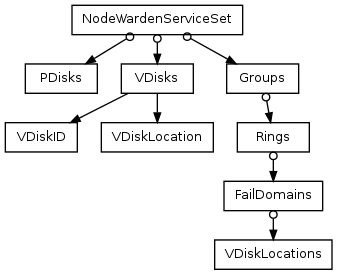

### Что это и зачем?
Таблетка **DS-Controller** (Distributed Storage Controller) управляет динамической конфигурацией распределенного хранилища BlobStorage. Для запуска на конкретных узлах компонентов BlobStorage **DS-Controller** взаимодействует с запущенным на каждом узле сервисом **[Warden](glossary.md#blobstoragenodewarden)** (BlobStorage Node Warden). **DS-Controller** хранит информацию о:

- **[PDisk-ах](pdisk.md)** и слотах на них;
- **[VDisk-ах](vdisk.md)**;
- **[BlobStorage группах](glossary.md#blobstoragegroup)**.

DS-Controller раздает хранимую информацию Warden-ам нод по запросу для запуска соответствующих компонентов на нодах кластера.
DS-Controller выдает Группы **[Hive-у](tablet_hive.md)** по запросу для использования в каналах таблеток.
Заполнение **DS-Controller** информацией о PDisk-ах, создание слотов для VDisk-ов и создание групп производится администратором при помощи [CLI-интерфейса](../api/cli.md).

### Как устроено (схема данных)

**State** - таблица (строка) с общей информацией.

|**🔑**|**Имя колонки**|**Тип**|**Описание**|
| --- | --- | --- | --- |
|X|FixedKey|Bool|Псевдо-ключ, всегда true|
| |NextGroupID|Uint32|Идентификатор следующей BS группы|

**Node** - список нод.

|**🔑**|**Имя колонки**|**Тип**|**Описание**|
| --- | --- | --- | --- |
|X|ID|Uint32|Идентификатор ноды|
| |NextPDiskID|Uint32|Идентификатор следующего зарегистрированного PDisk'а на этой ноде|

**PDisk** - список PDisk'ов.

|**🔑**|**Имя колонки**|**Тип**|**Описание**|
| --- | --- | --- | --- |
|X|NodeID|Uint32|Идентификатор ноды|
|X|PDiskID|Uint32|Идентификатор PDisk'a|
| |Path|ByteString|Путь к диску на ноде|
| |Category|Uint64|Тип диска (SSD и т.п.)|
| |PhysicalLocation|ByteString|Физическое расположение диска (стойка/сервер и т.п.)|
| |Guid|Uint64|GUID диска|

**Group** - список BS групп

|**🔑**|**Имя колонки**|**Тип**|**Описание**|
| --- | --- | --- | --- |
|X|ID|Uint32|Идентификатор группы|
| |Generation|Uint32|Поколение группы|
| |ErasureSpecies|Uint32|Тип избыточного кодирования|
| |Owner|Uint64|Владелец группы|
| |DesiredPDiskCategory|Uint64|Желаемый тип PDisk'а|
| |DesiredVDiskCategory|Uint64|Желаемый тип VDisk'а|

**VSlot** - список VSlot'ов

|**🔑**|**Имя колонки**|**Тип**|**Описание**|
| --- | --- | --- | --- |
|X|NodeID|Uint32|Идентификатор ноды|
|X|PDiskID|Uint32|Идентификатор PDisk'а|
|X|VSlotID|Uint32|Идентификатор VSlot'а|
| |Category|Uint64|Тип диска (Log и т.п.)|
| |GroupID|Uint32|Группа, занявшая этот VSlot. Null, если слот свободен.|
| |GroupGeneration|Uint32|Поколение группы|
| |RingIdx|Uint32|Номер кольца в домене|
| |FailDomainIdx|Uint32|Номер фейл-домена|
| |VDiskIdx|Uint32|Номер VDisk'а в фейл-домене|

### Протокол взаимодействия DS-Controller и Warden

После запуска Warden отправляет **DS-Controller** событие TEvControllerRegisterNode. В ответ DS-Controller отправляет NodeWardenServiceSet с описанием всех PDisk-ов и VDisk-ов, которые Warden должен запустить на своей ноде.
При необходимости конфигурировать DS-Proxy, Warden отправляет **DS-Controller** событие TEvControllerGetGroup с номером Группы. В ответ **DS-Controller** отправляет NodeWardenServiceSet с описанием запрошенной Группы.

**NodeWardenServiceSet** - сообщение верхнего уровня, описывающее конфигурацию сервисов BlobStorage: PDisk-ов, VDisk-ов и Proxy.

**PDisks** - задает конкретный PDisk:

  * NodeId ноды, на которой необходимо запустить этот PDisk
  * PDiskID - идентификатор (индекс) PDisk-а на этой ноде
  * Path - путь к блочному устройству или файлу, используемому PDisk-ом для хранения данных
  * FileSize - размер файла в байтах (0 для использования всего доступного объема блочного устройства)
  * PDiskGuid - глобально-уникальный идентификатор PDisk-а, задаваемый при форматировании

**VDisks** - описывает конкретный VDisk как пару VDiskID и VDiskLocation.

**VDiskID** - описывает место VDisk-а в группе

  * GroupID - идентификатор группы, к которой принадлежит данный VDisk
  * GroupGeneration - поколение группы (необходимо указывать 0, планируется использовать при реконфигурации)
  * Ring - индекс Колца в Группе, к которому относится данный VDisk
  * Domain - индекс Фейл-Домена в Кольце, к которому относится данный VDisk
  * VDisk - индекс данного VDisk-а в Фейл-Домене

**VDiskLocation** - описывает расположение VDisk-а:

  * NodeId ноды, на которой расположены этот VDisk и используемый им PDisk (PDisk и VDisk не могут располагаться на различных нодах)
  * PDiskID - идентификатор PDisk-а на этой ноде, используемого VDisk-ом для хранения данных
  * PDiskGuid - глобально-уникальный идентификатор PDisk-а
  * VDiskSlotID - номер слота на PDisk-е, занимаемого этим VDisk-ом (один слот не может быть занят более чем 1 PDisk-ом, номера слотов от 0 до ~2000000 могут быть использованы при описании статической конфигурации, но при этом важно отметить, что один PDisk способен обслуживать не более ~250 VDisk-ов)

**Groups** - описывает группу BlobStorage:

  * GroupId - идентификатор группы
  * GroupGeneration - поколение группы (необходимо указывать 0, планируется использовать при реконфигурации)
  * ErasureSpecies - вид Erasure-кодирования, применяемый в данной группе

**Rings** - описывает кольцо Группы.

**FailDomains** - Описывает Фейл-домен кольца. Все фейл-домены кольца должны содержать равное количество VDisk-ов. При этом общее количество VDisk-ов в кольце не может превышать 32. Количество Фейл-доменов должно быть достаточным для используемого в группе вида Erasure-кодирования.

**VDiskLocations** - Описывает расположение VDisk-а.
