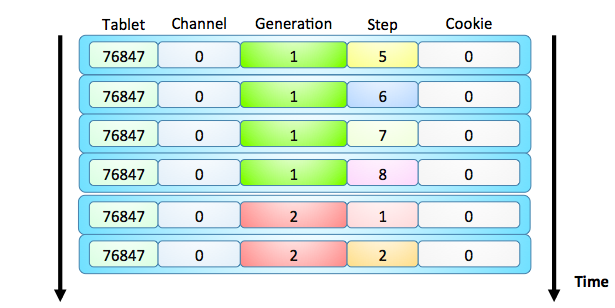
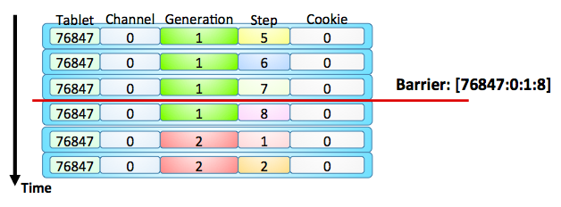

## Что такое BlobStorage
Blob Storage – это распределенная отказоустойчивая система хранения данных, обеспечивающая хранение бинарных записей, называемых LogoBlob, адресуемых по специального вида идентификаторам, называемым LogoBlobID. BS разделяется на множество BS-групп, каждая из которых является независимым хранилищем.

BS состоит из:

* DS Proxy – актор для взаимодействия BS-группы с клиентами (таблетками),
* Vdisk – принадлежит BS-группе, пишет данные в PDisk,
* Pdisk – непосредственно пишет данные на жёсткий диск,
* BS Controller – таблетка, управляющая конфигурацией BS-групп,
* BS Warden – следит за всеми компонентами, запускается на каждой ноде.

## Основные характеристики

Основные характеристики Blob Storage:

- Консистентность данных,
- Отказоустойчивость,
- Производительность.

### Консистентность данных
Blob Storage обеспечивает строгую консистентность данных. Подтверждение пользователю записи данных в BlobStorage означает, что данные действительно записаны на жесткий диск и не могут быть потеряны при внезапном отключении питания всего кластера или безвозвратной потере части оборудования в рамках Допустимых Повреждений. При получении  Недопустимых Повреждений Blob Storage Group прекращает обслуживание запросов.

### Отказоустойчивость
Blob Storage обеспечивает непрерывное обслуживание пользователей до тех пор, пока полученные повреждения ограничены рамками Допустимых Повреждений. Допустимые Повреждения однозначно определяются параметрами используемой Группы Blob Storage. Основной режим работы на данный момент (Erasure block-4-2) предполагает использование Групп, включающих в себя диски серверов из 8 разных стоек и допускает единовременную полную необратимую потерю не более чем 2 из этих 8 строек. Blob Storage поддерживает различные режимы избыточности хранения: хранение нескольких реплик (аналог RAID-1), расщепление данных на N частей с вычислением 1 или 2 частей четности (аналог RAID-3,4,5), хранение без избыточности. В Blob Storage легко можно добавить и другие режимы избыточности.

### Производительность
Blob Storage обеспечивает относительно высокую производительность даже при записи большого количества LogoBlob-ов маленького (десятки байт) размера разными пользователями или последовательном (в порядке возрастания LogoBlobID) чтении.

## Организация Blob Storage

### Группы Blob Storage {#bs-groups}
Группа является независимой единицей Blob Storage, обеспечивающей хранение данных. Группа, представляет собой набор VDisk-ов – подсистем, функционирующих над различными физическими дисками. Пользователи Blob Storage (таблетки) взаимодействуют с Группой через DS-Proxy (от Distributed Storage Proxy), выполняющих при необходимости erasure-кодирование и запись/чтение необходимого количества реплик/частей LogoBlob на VDisk-и.

### VDisk, PDisk
Один или несколько VDisk-ов используют для хранения связанный с конкретным блочным устройством PDisk (Physical Disk), который выполняет прозрачное шифрование, надежную запись (с подтверждением, без кеширования), хранение и чтение данных, разделяя полосу физического устройства между VDisk-ами разных Групп. Для обеспечения консистентности при штатном удалении, а также при восстановления данных после замены оборудования при Допустимых Повреждениях, VDisk-и Группы взаимодействуют по peer-to-peer протоколам Синхронизации и Репликации данных.

### Статическая и Динамическая конфигурация
Группы могут быть настроены как статически (в файле конфигурации Blob Storage указан идентификатор Группы и перечислены конкретные PDisk-и, на которых расположены VDisk-и Группы), так и динамически (для управления ими предназначена специальная таблетка Blob Storage Controller). Сам Blob Storage Controller может использовать для надежного хранения своего состояния только статически настроенную группу. Каждая группа обладает уникальным числовым идентификатором.

Управление всеми компонентами Blob Storage на каждом из узлов KiKiMR выполняет специальный локальный сервис Warden (Blob Storage Node Warden). Этот сервис запускает и конфигурирует все PDisk-и и VDisk-и, которые должны быть запущены на узле, а также DS-Proxy для доступа к любым группам, взаимодействуя с таблеткой Blob Storage Controller.

## Формат ключей записей в Blob Storage {#blobid-format}

Ключи блобов (TLogoBlobID) имеют специальный формат, заточенный под хранение блобов лога таблетки и "слепую" сборку мусора: таблетка говорит, что ей больше не нужны записи старше указанной (в конкретном канале), и после этого BS может их удалить.

Ключи LogoBlob-ов имеют тип TLogoBlobID и состоят из следующих полей:

  * TabletId - ui64 - таблетка-владелец блоба
  * Channel - ui8 - канал таблетки, к которому относится запись
  * Generation - ui32 - поколение таблетки, в котором был записан блоб
  * Step - ui32 - шаг внутри поколения
  * Cookie - ui24 - пользовательская кука
  * BlobSize - ui28 - размер полного блоба в байтах
  * PartId - ui4 - номер парта, имеет смысл только внутри группы блобстораджа для идентификации частей блоба. У полного пользовательского LogoBlobID - всегда 0

При сортировке происходит сравнение полей в следующем порядке:

  * TabletID
  * Channel
  * Generation
  * Step
  * Cookie



Поля BlobSize хотя физически и участвуют в сравнении (т.к. внутри реализовано как сырое сравнение трёх ui64), но фиксированы для конкретного набора остальных полей.

При выставлении барьера сборки мусора для конкретной пары TabletID и Channel указываются пороговые значения Generation и Step. Поле Cookie на порядок сборки мусора не влияет, является единственным полем, не несущим заранее определенной смысловой нагрузки и задается пользователем (то есть различного типа таблетки в своих каналах могут придавать этому полю различный смысл).

## Сборка мусора {#garbage-collection}



Сборка мусора осуществляется VDisk-ами в процессе compaction. При переносе каждого блоба выполняется проверка, нужно ли этот блоб оставить или можно выбросить. Если блоб моложе, чем выставленный барьер момента сборки, блоб оставляется. Если блоб старше, чем выставленный барьер момента сборки, но у блоба выставлен флаг keep и не выставлен флаг doNotKeep, блоб также оставляется. Удаляются блобы старше, чем выставленный барьер момента сборки, у которых либо не выставлен флаг keep, либо выставлен флаг doNotKeep, либо по результатам синхронизации VDisk-ов известно, что существует неполное количество частей (так называемые Фантомные Блобы).
Сборка мусора позволяет удалять не только блобы, о которых осведомлен их владелец (таблетка), но и мусорные, которые могли появиться как результат неудачных операций.

## API для взаимодействия с Blob Storage

### Put
Записать блоб с идентификатором id и значением buffer. Прервать операцию если наступает момент времени deadline. Обрабатывать запрос на VDisk-е по классу handleClass.

```
TEvPut(const TLogoBlobID &id, const Stroka &buffer, TInstant deadline, NKikimrBlobStorage::EPutHandleClass handleClass = NKikimrBlobStorage::TabletLog)
```
### Get
Прочитать size байт данных блоба с идентификатором id начиная с байта shift. Если size равен 0, данные читаются до конца. Прервать операцию, если наступает момент времени deadline. Если выставлен флаг mustRestoreFirst, восстановить полное количество копий частей блоба на различных VDisk-ах группы, прежде чем возвращать данные. Если установлен флаг isRealtime, обрабатывать запрос с более высоким приоритетом. Если выставлен флаг isIndexOnly, не возвращать данные блоба, а лишь убедиться в его наличии в индексе VDisk-ов.

```
TEvGet(const TLogoBlobID &id, ui32 shift, ui32 size, TInstant deadline, bool mustRestoreFirst = false, bool isRealtime = true, bool isIndexOnly = false)
```
Вторая форма этого запроса - для чтения нескольких фрагментов данных блобов, идентификаторы, смещения и размеры считываемых данных передаются в массиве записей TQuery q.

```
struct TQuery {
    TLogoBlobID Id;
    ui32 Shift;
    ui32 Size;
}
TEvGet(TArrayHolder<TQuery> &q, ui32 sz, TInstant deadline, bool mustRestoreFirst = false, bool isRealtime = true, bool isIndexOnly = false)
```
### Discover
Найти в нулевом канале таблетки tabletId успешно записанный блоб с максимальным идентификатором и вернуть этот идентификатор. Если выставлен флаг readBody, то для этого блоба будет возвращено его содержимое. Если выставлен флаг discoverBlockedGeneration, будет найдет номер заблокированного поколения. Прервать операцию если наступает момент времени deadline.

```
TEvDiscover(ui64 tabletId, bool readBody, bool discoverBlockedGeneration, TInstant deadline)
```
### CollectGarbage
Передвинуть барьер/пометить блобы как не мусор/мусор в канале channel таблетки tabletId. Прервать операцию, если наступает момент времени deadline. Операция по сути является операцией записи метаданных с поколением recordGeneration. Если выставлен флаг collect, то барьер сборки мусора смещается на поколение collectGeneration и шаг collectStep. Если указатель keep не нулевой, из вектора на который он указывает копируется перечень идентификаторов блобов, для которых необходимо выставить флаг keep. Если указатель doNotKeep не нулевой, из вектора, на который он указывает, копируется перечень идентификаторов блобов, для которых необходимо выставить флаг doNotKeep. Каждая операция должна иметь уникальный номер perGenerationCounter в рамках каждого поколения recordGeneration. Если выставлен флаг isMultiCollectAllowed, операции с большим количеством флагов keep/doNotKeep будут разделены на несколько операций с последовательно возрастающими номерами perGenerationCounter. При этом предполагается, что таблетка в следующем запросе будет использовать perGenerationCounter, увеличенный на значение, полученное из вызова
```
TEvCollectGarbage::PerGenerationCounterStepSize(yvector<TLogoBlobID> *keep, yvector<TLogoBlobID> *doNotKeep)

TEvCollectGarbage(ui64 tabletId, ui32 recordGeneration, ui32 perGenerationCounter, ui32 channel, bool collect, ui32 collectGeneration, ui32 collectStep, yvector<TLogoBlobID> *keep, yvector<TLogoBlobID> *doNotKeep, TInstant deadline, bool isMultiCollectAllowed)
```


### Block
Заблокировать запись в таблетку tabletId с поколением меньше или равным generation. Прервать операцию, если наступает момент времени deadline.
```
TEvBlock(ui64 tabletId, ui32 generation, TInstant deadline)
```
### Status
Получить флаги статуса дисков группы. Прервать операцию, если наступает момент времени deadline.

```
TEvStatus(TInstant deadline)
```
