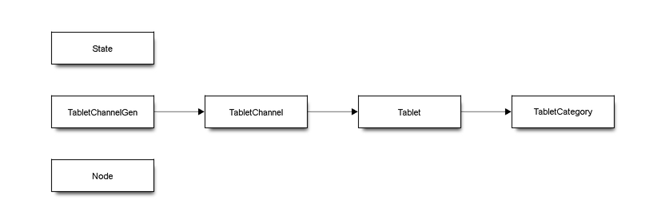
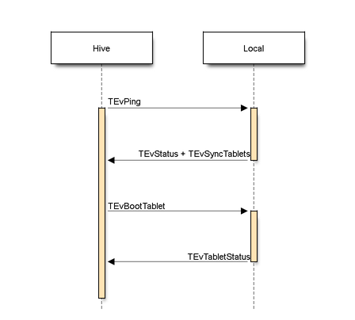
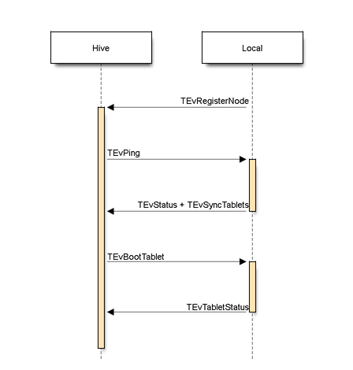
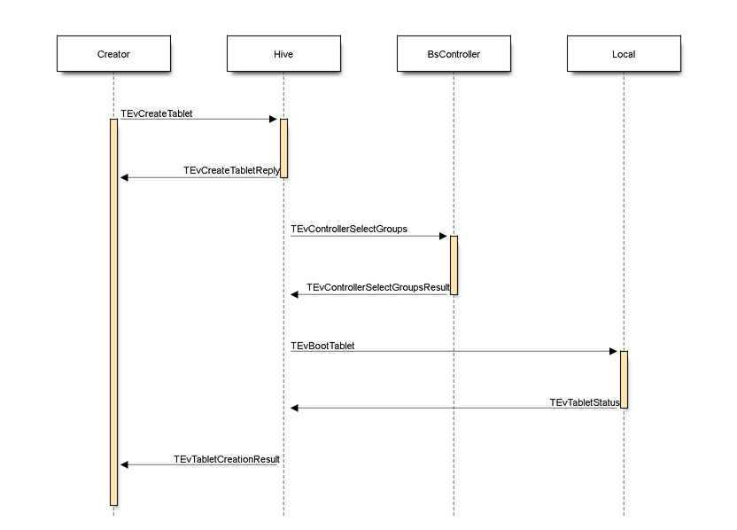

### Что это и зачем?
Системная таблетка "Hive" (Хайв) предназначена для хранения информации о других, не системных таблетках. Основные задачи **Hive'a**:

1. Создание таблетки (занесение в свою БД)
2. Получение динамической группы для таблетки
3. Распределение таблеток между нодами
4. Выполнение команды на запуск таблетки
5. Перезапуск таблетки в случае падения ее или ноды

### Как устроено (схема данных)



```
sblockdiag
{
  State [shape = "box"];
  Tablet [shape = "box"];
  TabletChannel [shape = "box"];
  TabletChannelGen [shape = "box"];
  Node [shape = "box"];
  TabletCategory [shape = "box"];
  TabletChannel -> Tablet;
  TabletChannelGen -> TabletChannel;
  Tablet -> TabletCategory;
}
```

**State** | **Таблица** | **предназначена для хранения каких-то глобальных ui64 значений**
--- | --- | ---
Key | ui64 PK | Идентификатор значения
Value | ui64 | Значение значения =)

На данный момент в этой таблице хранятся два значения:

1. Идентификатор следующей создаваемой таблетки. Меняется при каждом создании таблетки.
2. Версия текущей схемы локальной БД **Hive'a**. Меняется при изменении схемы (для миграции/апгрейда).

**Tablet** | **Таблица,** | **в которой хранится основная информация о таблетках**
 --- | --- | ---
 ID | ui64 PK | Идентификатор таблетки
Owner|<ui64,ui64>|Идентификатор владельца таблетки - является уникальным внешним идентификатором таблетки
KnownGeneration|ui64|Последнее известное поколение таблетки
Type|ui64|Тип таблетки из TTabletTypes::EType
LeaderNode|ui64|Нода, на которой запущена таблетка
State|ui64|Текущее состояние таблетки из TFlatHive::ETabletState
AllowedNodes|bytestring {vector\<TNodeId\>}|Список идентификаторов нод, на которых разрешен запуск таблетки
ActorToNotify|ActorID|Актор, которого следует оповещать о запуске (или остановке) таблетки
Weight|ui64|Вес таблетки, заданный при создании
Category|ui64|Категория таблетки

_При попытке создать таблетку с уже существующим идентификатором - вместо создания вернет существующую таблетку._

**TabletChannel** | **Таблица** | **с информацией о каналах таблетки**
 --- | --- | ---
Tablet|ui64 PK|Идентификатор таблетки
Channel|ui64 PK|Номер канала таблетки
ErasureSpecies|ui64|Параметры избыточности хранения данных таблетки
Category|ui64|Категория диска для хранения данных таблетки

_Вся эта информация берется из профиля таблетки при ее создании._

|**TabletChannelGen**|**Таблица**|**с информацией о выданных группах и поколениях таблетки**|
| --- | --- | --- |
|Tablet|ui64 PK|Идентификатор таблетки|
|Channel|ui64 PK|Номер канала таблетки|
|Generation|ui64 PK|Поколение таблетки|
|Group|ui64|Идентификатор группы слотов на VDisk'е|

_Заполняется при получении группы._

|**Node**|&nbsp;|**Информация о нодах**|
| --- | --- | --- |
|ID|ui64 PK|Идентификатор ноды (1, 2...)|
|Local|ActorID|Текущий ActorID LOCAL'а (только для "живой" ноды)|

|**TabletCategory**|&nbsp;|**Информация о категории таблетки**|
| --- | --- | --- |
|ID|ui64 PK|Идентификатор категории|
|MaxDisconnectTimeout|ui64 PK|Максимальное время (в мс) допустимое для потери связи с нодой для этой категории таблеток|

### Описание интерфейса с "Local"'ом
**[Local](glossary.md#local)** (локал) - актор/сервис на каждой ноде, обеспечивающий непосредственный запуск таблеток и поддерживающий связь с **Hive'ом**.

Вариант А



```
seqdiag
{
  Hive -> Local [label = "TEvPing"];
  Hive <- Local [label = "TEvStatus + TEvSyncTablets"];
  Hive -> Local [label = "TEvBootTablet"];
  Hive <- Local [label = "TEvTabletStatus"];
}
```
Вариант Б


```
seqdiag
{
  Hive <- Local [label = "TEvRegisterNode"];
  Hive -> Local [label = "TEvPing"];
  Hive <- Local [label = "TEvStatus + TEvSyncTablets"];
  Hive -> Local [label = "TEvBootTablet"];
  Hive <- Local [label = "TEvTabletStatus"];
}
```
При старте, Local постоянно пытается соединиться с **Hive'ом** и послать ему RegisterNode, в ответ на которое **Hive** пошлет Ping на Local. В свою очередь, **Hive** при старте посылает всем прочитанным Local'ам из БД событие Ping, в ответ на которое каждый Loacl также посылает Status. Кто окажется первым - неизвестно.

_SyncTablets_ - событие, посылаемое однократно после установления соединения, в котором Local перечисляет все свои таблетки (живые и полу-живые). Это дает возможность **Hive'у** актуализировать их состояние.
_BootTablet_ - команда на запуск таблетки.
_TabletStatus_ - оповещение о изменении состояния таблетки.


### Описание интерфейса с внешними системами

С внешними системами **Hive** общается только посредством обработки команды на создание таблетки. Выглядит это так:



```
seqdiag
{
  Creator -> Hive [label = "TEvCreateTablet"];
  Creator <- Hive [label = "TEvCreateTabletReply"];
  Hive -> BsController [label = "TEvControllerSelectGroups"];
  Hive <- BsController [label = "TEvControllerSelectGroupsResult"];
  Hive -> Local [label = "TEvBootTablet"];
  Hive <- Local [label = "TEvTabletStatus"];
  Creator <- Hive [label = "TEvTabletCreationResult"];
}
```
### Процедура отключения ноды

Как только **Hive** теряет соединение с нодой, он распределяет все запущенные таблетки на данной ноде по категориям и последовательно, с течением времени с момента отключения, помечает таблетки как мертвые и планирует их запуск на другой ноде. К примеру, заданы три категории таблеток, с таймаутами: 100мс, 1000мс и 60000мс. В случае пропадания связи с **Hive'ом** на 2 секунды, будут перезапущены таблетки из первой и второй категорий, а таблетки из третьей продолжат работу. На данный момент эта функциональность не используется.

### Балансировка таблеток

Как Hive решает, где запускать таблетки, и как их перераспределять при неравномерной нагрузке нод, [читайте на отдельной странице](tablet_hive_balancer.md).
