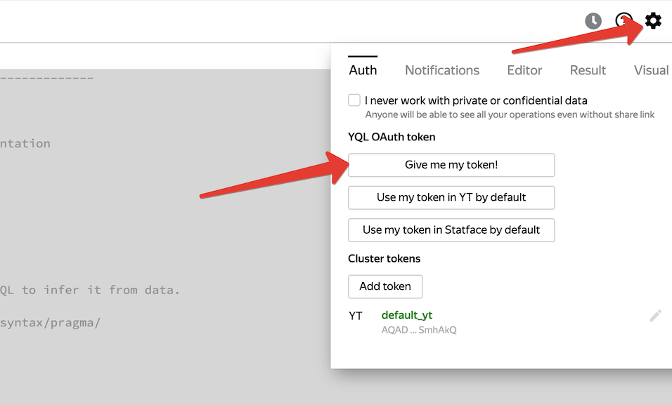
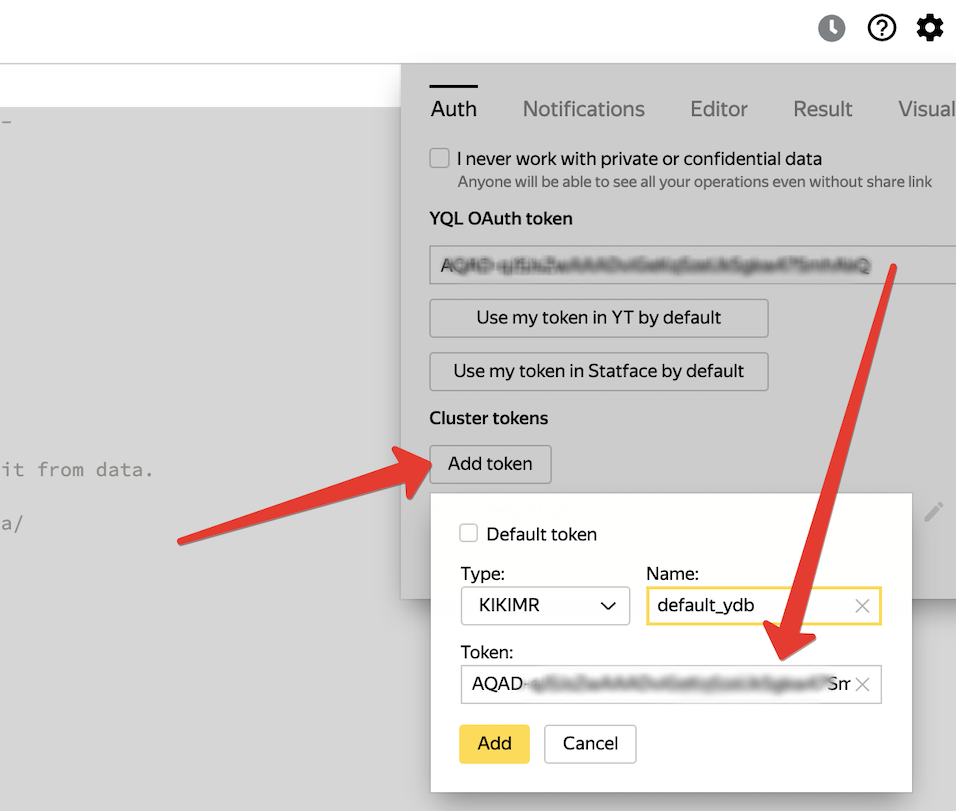
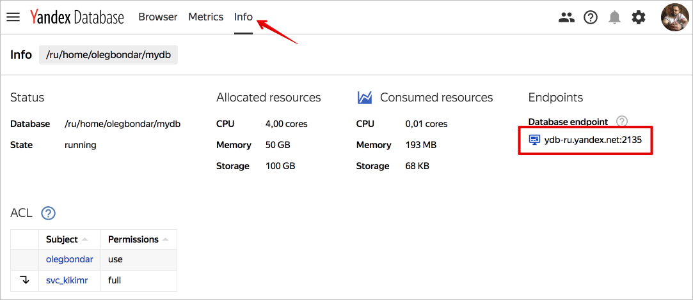
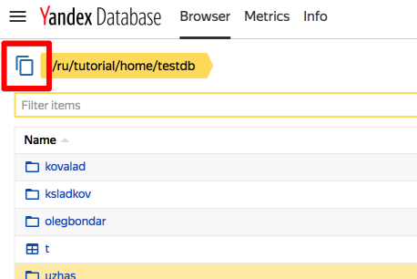

# Загрузка данных из YT

C помощью YQL-операции можно загрузить данные из таблицы YT в таблицу YDB. Подробнее про YT можно почитать в [документации к YT](https://yt.yandex-team.ru/docs/). Операция загрузки выполняется специальной UDF.

## Предварительные требования
Для любой загрузки данных из YT в YDB понадобится:

1. YQL-запрос, выбирающий данные из таблиц в одном из кластеров YT.
2. Сохранённый в YQL токен для работы с YDB.
3. Заранее созданная таблица в базе YDB, в которую вы планируете загрузить данные. Пример создания таблицы рассмотрен в [yql tutorial](https://yql.yandex-team.ru/Tutorial/ydb_01_Create_demo_tables).

Для удобства можно воспользоваться примером [yql-операции](https://yql.yandex-team.ru/Operations/Xjpysmim9TymWxWNH-KHsAbjGvJfym3SezJUyukq1nk=), загружающей тестовые данные в тестовую базу.
```sql
--------------------------------------------------------------------------------
--
-- Task: Import data from YT table at hahn to YDB table in
-- /ru/tutorial/home/testdb database
-- SPECIAL WARNING: Please consider that this query works with YT cluster
-- despite it is a part of YDB YQL Tutorial
-- More details about operation params could be found at YDB documentation
-- https://ydb.yandex-team.ru/docs/best_practices/import_from_yt
--

-- $ydb_endpoint - ydb cluster address that runs the destination database, could be found in YDB web UI http://ydb.yandex-team.ru/
-- (e.g. https://ydb.yandex-team.ru/db/ydb-ru/tutorial/home/testdb/info)
-- Required parameter.
$ydb_endpoint = "ydb-ru.yandex.net:2135";

-- $ydb_database - full destination YDB database path that contains the destination table.
-- database full path could be found in YDB web UI http://ydb.yandex-team.ru/
-- Required parameter
$ydb_database = "/ru/tutorial/home/testdb";

-- $ydb_table - full destination YDB table path, could be found in YDB web UI http://ydb.yandex-team.ru/
-- Since YQL is a strongly typed language result set columns data type should be identical to the columns data type of destination table.
-- Required parameter
$ydb_table = "/ru/tutorial/home/testdb/import_from_yt/episodes";

-- During import process data is being upserted in YDB table in batches.
-- $ydb_batch_size_bytes defines maximum size of a batch in bytes.
-- Optional parameter, default value: 1048576
$ydb_batch_size_bytes = 1048576;

-- YDB requires every user to be authenticated and authorized to perform an operation
-- Import operation uses OAuth token for authentication.
-- Valid OAuth token could be received and set up YQL web UI, please refer to YDB documentation for detailed instructions.
-- https://ydb.yandex-team.ru/docs/best_practices/import_from_yt/
$ydb_oauth_token = AsTuple("token", SecureParam("token:default_ydb"));

-- During import process data is being upserted in YDB table in batches.
-- $ydb_batch_size_rows defines maximum number of rows in a batch.
-- If both $ydb_batch_size_bytes and $ydb_batch_size_rows are passed batch size would be chosen to satisfy both parameters
-- Optional parameter, default value: 10000
$ydb_batch_size_rows = 10000;

-- PushData uses YQL UPSERT statement to import data into YDB table. Every UPSERT statement contains batch of rows.
-- Some UPSERT queries might fail. PushData handles errors and retries failed requests when error is retriable.
-- $ydb_max_retries limits number of retry attempts of a single UPSERT statement. If any UPSERT attempt fails more than $ydb_max_retries times
-- the YT operation is stopped and reported as failed. In this case destination table might contain rows upserted in successful queries
$ydb_max_retries = 10;

-- YQL documentation on pragmas https://yql.yandex-team.ru/docs/yt/syntax/pragma/
PRAGMA yt.InferSchema = '1';

-- When yt.QueryCacheMode is set to normal or refresh MapReduce operation results are stored in //<tmp_folder>/query_cache/<hash>
-- where tmp_folder is tmp/<login> or PRAGMA yt.TmpFolder
-- hash – hash calculated from tables metadata and operation''s logical program
-- Optional parameter, default value: normal
PRAGMA yt.QueryCacheMode = "disable";

-- yt.DataSizePerJob limits the data size handled by MapReduce job within current operation.
-- The larger the number the smaller the number of jobs.
-- Optional parameter, default value: 1G
PRAGMA yt.DataSizePerJob = "500485760";

-- Maximum amount of MapReduce jobs for this operation.
-- Optional parameter, default value: 16384
PRAGMA yt.MaxJobCount = "100000";

-- yt.UserSlots defines the upper limit for the number of MapReduce jobs running in parallel in YT operation.
-- In other words this pragma sets the amount of YDB clients importing data in parallel
-- Optional parameter, default value: unlimited
PRAGMA yt.UserSlots = "1000";

-- After YT operation has yt.DefaultMaxJobFails failed MapReduce jobs future attempts to execute the operation are being
-- cancelled and whole operation is considered failed.
-- Optional parameter, default value: 5
PRAGMA yt.DefaultMaxJobFails = "1";

SELECT
    SUM(Bytes) AS TotalBytes,
    SUM(Rows) AS TotalRows,
    SUM(Batches) AS TotalBatches,
    SUM(Retries) AS TotalRetries
FROM (
    PROCESS (
-- Query that produces rows for destination YDB table.
-- Result set column data types should be identical to the column data types of destination table.
-- Please use alias for every column. UDF uses aliases to find correct column in destination YBD table
        SELECT
            CAST(title AS Utf8) AS title,
            CAST(series_id AS Uint64) AS series_id,
            CAST(season_id AS Uint64) AS season_id,
            CAST(episode_id AS Uint64) AS episode_id,
            CAST(air_date AS Uint64) AS air_date
        FROM hahn.`//home/kikimr/backup_docs/episodes`
    )
    USING YDB::PushData(
        TableRows(),
        $ydb_endpoint,
        $ydb_database,
        $ydb_table,
        $ydb_oauth_token,
        $ydb_batch_size_bytes,
        $ydb_batch_size_rows,
        $ydb_max_retries
    )
);
```
<small>Листинг 1 — Пример YQL-операции для загрузки данных из YT в YDB</small>

Ниже даны подробные пояснения смысла параметров функции загрузки и рекомендации по их настройке.

## Сохранение токена в YQL

Для работы с таблицами в базе YDB yql-операции необходима [аутентификация и авторизация](../concepts/internal/iam.md) с использованием действительного OAuth-токена. Для этого нужно получить получить OAuth токен с помощью диалога настройки YQL


<small>Рисунок 1 — Диалог получения токена в YQL</small>

После получения токена его необходимо сохранить в списке токенов, доступных YQL. Для этого следует указать тип токена `KIKIMR` и имя `default_ydb`



<small>Рисунок 2 — Диалог сохранения в YQL</small>

## Описание параметров UDF
### Параметр ydb_endpoint

Параметр ```$ydb_endpoint``` используется для указания адреса кластера, на котором расположена база данных YDB.



<small>Рисунок 3 — Список ендпоинтов базы данных</small>

Пример значения параметра ```$ydb_endpoint```
```
$ydb_endpoint = "ydb-ru.search.yandex.net:2135";
```

### Параметр ydb_database

Параметр ```$ydb_database``` определяет базу данных, в которой расположена таблица. Узнать имя базы данных можно в YDB UI. В списке баз данных можно выбрать нужную базу и воспользоваться удобным элементом управления для копирования имени в буфер обмена.



### Параметр ydb_table_name

Параметр ```$ydb_table_name``` определяет таблицу, в которую будет сохранён результат выгрузки. YQL – строго типизированный язык, поэтому типы данных в столбцах должны совпадать с типами столбцов в результате запроса на выборку данных из YT.

### Параметр ydb_batch_size_bytes

Вставка строк в таблицу в YDB выполняется порциями. Параметр `$ydb_batch_size_bytes` определяет размер порции в байтах. По умолчанию - 1048576.

### Параметр ydb_batch_size_rows

Вставка строк в таблицу в YDB выполняется порциями. Параметр `$ydb_batch_size_rows` определяет размер порции в строках. По умолчанию - 1048576. При указании обоих параметров `$ydb_batch_size_bytes` и `$ydb_batch_size_rows` размер порции будет выбран при достижении первого из ограничений.

### Параметр ydb_max_retries

Операции вставки в YDB могут завершаться ошибкой. Параметр `$upload_max_retries` определяет количество повторных попыток загрузить данные в случае ошибок. При достижении указанного в `$upload_max_retries` количества попыток процесс загрузки из yt заканчивается ошибкой.

## Описание используемых YQL PRAGMAS

Подробное описание всех существующи в YQL PRAGMAS приведено в [документации YQL](https://yql.yandex-team.ru/docs/yt/syntax/pragma/).

<small>Таблица 1 — Описание используемых YQL PRAGMAS</small>

| Название | Тип значения | По умолчанию | Статическая / <br/>динамическая | Описание |
| :--- | :--- | :--- | :--- | :--- |
| `yt.QueryCacheMode` | Строка: disable / readonly / refresh / normal | normal | Статическая | Кеш работает на уровне MapReduce операций: <br> * В режиме **disable** кеш отключен. <br> * **readonly** — использовать только на чтение, не писать в него.<br> * **refresh** — использовать только на запись, не читать из него; при ошибке параллельной записи в кеш из другой транзакции выдать ошибку запроса.<br> * **normal** — использовать и на запись, и на чтение; при ошибке параллельной записи в кеш из другой транзакции считать что записаны те же данные и продолжать работу. <br> * В режимах **normal** и **refresh** результат каждой их них дополнительно сохраняется по пути `//<tmp_folder>/query_cache/<hash>`, где:<br>  * tmp_folder — по умолчанию `tmp/<login>`, либо значение [PRAGMA yt.TmpFolder](https://yql.yandex-team.ru/docs/yt/syntax/pragma/#tmpfolder);<br>  * hash — хеш от значимых метаданных входных таблиц и выполнявшейся в операции логической программы.<br> * В режимах **normal** и **readonly** перед самым запуском MapReduce операции для неё вычисляется такой путь и в зависимости от выбранного режима кеширования операция либо запускается, либо мгновенно отмечается успешной с использованием готовой таблицы вместо её результата. Если в выражении попадается недетерминированные функции Random/RandomNumber/RandomUuid/CurrentUtcDate/CurrentUtcDatetime/CurrentUtcTimestamp, то кеш для такой операции отключается. На данный момент все UDF считаются детерминированными, т.е. не мешают кешированию. Если нужно использовать недетерминированную UDF, то нужно ввести для неё дополнительный аргумент типа Uint64 и передать в него `CurrentUtcTimestamp()` — достаточно без аргументов. |
| `yt.DataSizePerJob` / `yt.DataSizePerSortJob` / `yt.DataSizePerMapJob` | Байты | 1G | Динамическая | Управление нарезкой MapReduce-операций на джобы, чем больше число, тем меньше джобов. Для вычислительно затратных джобов значение рекомендуется уменьшать, а для бегло просматривающих много данных (в частности, user_sessions) — увеличивать.<br><br>Допустимы суффиксы K, M и G для указания в килобайтах, мегабайтах и гигабайтах, соответственно. |
| `yt.MaxJobCount` | Положительное число, меньше 100 тыс. | 16384 | Динамическая | Максимальное количество джобов в рамках одной MapReduce-операции после DataSizePerJob. Таким образом, если после разбивки по размеру получилось очень много джобов, то по факту они запускаются в количестве равном MaxJobCount. |
| `yt.UserSlots` | Положительное число | Не ограничено | Динамическая | Ограничение сверху на число выполняющихся параллельно джобов в рамках MapReduce операции. Определяет степень параллелизма для импорта данных из YT в YDB|
| `yt.DefaultMaxJobFails` | Положительное число | 5 | Статическая | Количество упавших MapReduce-джобов, при достижении которого повторные попытки выполнения запроса прекращаются и запрос признается не успешным. Для импорта данных из YT в YDB значение этой PRAGMA должно быть равно 1, если загрузка должна быть признана успешной только в случае загрузки всех строк их таблицы в YT в таблицу YDB. Если допустимо (например, в рамках отладки) что-то не залить из-за ошибок, то значение `PRAGMA yt.DefaultMaxJobFails` рекомендуется сделать больше 1|

## Рекомендации по эффективной загрузке данных

В разделе [Загрузка больших объемов данных](../best_practices/batch_upload.md) собраны рекомендации, которые позволят с наибольшей эффективностью использовать ресурсы базы YDB при загрузке данных из YT.

Альтернативный вариант для загрузки больших объемов данных - использование функции `BulkPushData` вместо `PushData`. `BulkPushData` отличается тем, что выполняет заливку в обход механизма транзакций YDB, чем обеспечивает максимально доступную производительность. Ограничение подхода - невозможность заливки в таблицу содержащую вторичный индекс.

Для использования следует вызвать `YDB::BulkPushData`, в остальном синтаксис и опции полностью эквивалентны описанным выше для `YDB::PushData`. 
