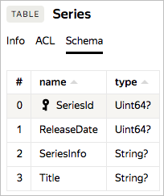

# Модель данных и схема



Основные сущности {{ ydb-short-name }}:

* *таблица* (table) — для хранения типизированных строк данных;
* *директория* (directory) — структура, позволяющая упорядочивать и систематизировать данные;
* *персистентная очередь* (persistent queue или сокращенно PQ) — реализация концепции ["очередь сообщений"](https://en.wikipedia.org/wiki/Message_queue);
* *том сетевого блочного устройства* (Network Block Store Volume) — реализация концепции сетевого высокопроизводительного отказоустойчивого блочного устройства.



Основные сущности {{ ydb-short-name }}:

* *таблица* (table) — таблица для хранения типизированных строк данных;
* *директория* (directory) — структура, позволяющая упорядочивать и систематизировать данные.



## Таблица {#table}

[*Таблица*](https://en.wikipedia.org/wiki/Table_(database)) содержит набор связанных данных, состоящий из строк и колонок. Каждая из строк представляет собой набор ячеек, предназначенных для хранения значений определенных типов в соответствии со схемой данных. Схема данных определяет имена (names) и типы (types) колонок таблицы.



Пример схемы данных показан на рисунке ниже.



На рисунке приведена схема таблицы ```Series``` из четырех колонок c именами ```SeriesId```, ```ReleaseDate```, ```SeriesInfo``` и ```Title``` и типами данных ```Uint64?``` для первых двух и ```String?``` для последних. Первичным ключом объявлен колонка ```SeriesId```.

{{ ydb-short-name }} использует типы данных [YQL](datatypes.md), в качестве типов колонок могут использоваться [простые типы данных YQL](https://yql.yandex-team.ru/docs/ydb/types/primitive/). Все колонки могут содержать специальное значение NULL, используемое для обозначения отсутствия значения.



{{ ydb-short-name }} использует типы данных [YQL](datatypes.md), в качестве типов колонок могут использоваться простые типы данных. Все колонки могут содержать специальное значение NULL, используемое для обозначения отсутствия значения.

Таблица {{ ydb-short-name }} всегда имеет один или несколько колонок, составляющих ключ ([primary key](https://en.wikipedia.org/wiki/Unique_key)). Строки таблицы уникальны по ключу, то есть для одного значения ключа может быть не больше одной строки. Таблица {{ ydb-short-name }} всегда упорядочена по ключу. Это означает, что точечное чтение по ключу, а также диапазонные запросы по ключу выполняются эффективно (фактически используя индекс). Допускаются таблицы, состоящие только из ключевых колонок. Таблицы без первичного ключа создавать нельзя.

Часто при проектировании схемы таблицы имеется набор полей, естественным образом подходящий для использования в качестве первичного ключа. Тем не менее, к выбору ключа нужно подходить аккуратно, чтобы не создать хотспоты.
Например, если вы вставляете в таблицу данные с монотонно возрастающим ключом, то вы будете писать в конец таблицы. А так как {{ ydb-short-name }} разбивает данные таблицы по диапазонам ключей, это означает, что ваши вставки будут обрабатываться одним конкретным сервером, и перестанут использоваться основные преимущества распределенной БД.
Для того, чтобы нагрузка равномерно распределялась по различным серверам и при обработке больших таблиц не было хотспотов, рекомендуется применять хэширование естественного ключа и использование хеша в качестве первой компоненты первичного ключа, а также изменение порядка следования компонент первичного ключа.

### Шардирование таблиц {#table-sharding}

Таблица в БД может быть шардирована по диапазонам значений первичного ключа. Каждый шард таблицы отвечает за свой  диапазон первичных ключей. Диапазоны ключей, обслуживаемых разными шардами, не пересекаются. Различные шарды таблицы могут обслуживаться разными серверами распределенной БД (в том числе расположенными в разных локациях), а также могут независимо друг от друга перемещаться между серверами для перебалансировки или поддержания работоспособности шарда при отказах серверов или сетевого оборудования.

При малом объеме данных таблица может состоять из одного шарда. При росте объема данных, обслуживаемых шардом, {{ ydb-short-name }} автоматически разбивает увеличившийся шард на два. Разбиение происходит по медианному значению первичного ключа и основано на объеме данных: при превышении заданного порога объемом данных шарда, происходит разделение шарда на два.

Порог разделения шарда и включение/выключение автоматического разделения могут быть настроены индивидуально для каждой таблицы базы данных.

Помимо автоматического разделения предоставляется возможность создать пустую таблицу с предопределенным количеством шардов. При этом можно вручную задать точные границы разделения ключей по шардам или указать равномерное разделение на предопределенное количество шардов. В этом случае границы создадутся по первой компоненте первичного ключа. Равномерное распределение можно указать для таблиц, у которых первая компонента первичного ключа — целое число.





Настройка шардирования (Partitioning Policy) таблицы при ее создании в текущей версии возможна только через [С++](https://a.yandex-team.ru/arc/trunk/arcadia/kikimr/public/sdk/cpp/client/ydb_table.h), [Java](https://a.yandex-team.ru/arc/trunk/arcadia/kikimr/public/sdk/java/table/src/settings/PartitioningPolicy.java) и [Python](https://a.yandex-team.ru/arc//trunk/arcadia/kikimr/public/sdk/python/client/table.py) SDK.







Настройка шардирования (Partitioning Policy) таблицы при ее создании в текущей версии возможна только через Java и Python SDK.







## Персистентная очередь {#pq}

Персистентная очередь состоит из одной или более партиций, каждая партиция представляет собой [FIFO](https://en.wikipedia.org/wiki/FIFO_(computing_and_electronics)) [очередь сообщений](https://en.wikipedia.org/wiki/Message_queue), обеспечивающую надежную доставку между несколькими участниками. Сообщения данных нетипизированы и представляют собой blob данных. Партиция является инструментом параллельности и позволяет обеспечить высокую пропускную способность очереди. Предусмотрены механизмы для реализации at least once и exactly once гарантий работы с персистетной очередью. Персистентная очередь {{ ydb-short-name }} похожа на концепцию topic в [Apache Kafka](https://en.wikipedia.org/wiki/Apache_Kafka).



В текущей версии в БД сервиса {{ ydb-short-name }} доступны для использования только таблицы и директории. Персистентная очередь доступна в сервисе Logbroker.



## Том сетевого блочного устройства {#nbd}

Одним из примеров применения {{ ydb-short-name }} в качестве платформы для создания широкого спектра систем хранения и обработки данных является реализация [сетевого блочного устройства](https://en.wikipedia.org/wiki/Network_block_device) на базе {{ ydb-short-name }}. Сетевые блочные устройства реализуют интерфейс локального блочного устройства, при этом являются отказоустойчивыми (за счет избыточности) и хорошо масштабируются как по размеру тома, так и по количеству операций ввода-вывода в единицу времени. К недостаткам сетевого блочного устройства можно отнести то, что любая операция ввода-вывода на таком устройстве требует сетевого взаимодействия, что может увеличить latency сетевого устройства по сравнению с локальным. На сетевом блочном устройстве можно развернуть обычную файловую систему и/или запустить приложение, напрямую работающее с блочным устройством, например СУБД.



В текущей версии в БД сервиса {{ ydb-short-name }} доступны для использования только таблицы и директории. Тома сетевого блочного устройства доступны в сервисе Network Block Store, представляющем собой аналог [Amazon EBS](https://en.wikipedia.org/wiki/Amazon_Elastic_Block_Store).





## Иерархия сущностей {#hierarchy}



Для удобства организации описанных выше сущностей базы данных (таблиц, персистентных очередей, томов сетевых блочных устройств) поддерживается создание директорий по аналогии с файловой системой, то есть вся база состоит из дерева директорий, а таблицы, персистентные очереди и сетевые блочные устройства находятся в листах этого дерева (аналогично файлам файловой системы). В одной директории могут быть несколько поддиректорий и несколько сущностей других типов. Имена у директорий и других хранимых сущностей внутри одной директории уникальны.



Для удобства организации таблиц поддерживается создание директорий по аналогии с файловой системой. Вся база состоит из дерева директорий, а таблицы находятся в листьях этого дерева (аналогично файлам файловой системы). В одной директории могут быть несколько поддиректорий и несколько сущностей других типов. Имена у директорий и других хранимых сущностей внутри одной директории уникальны.


