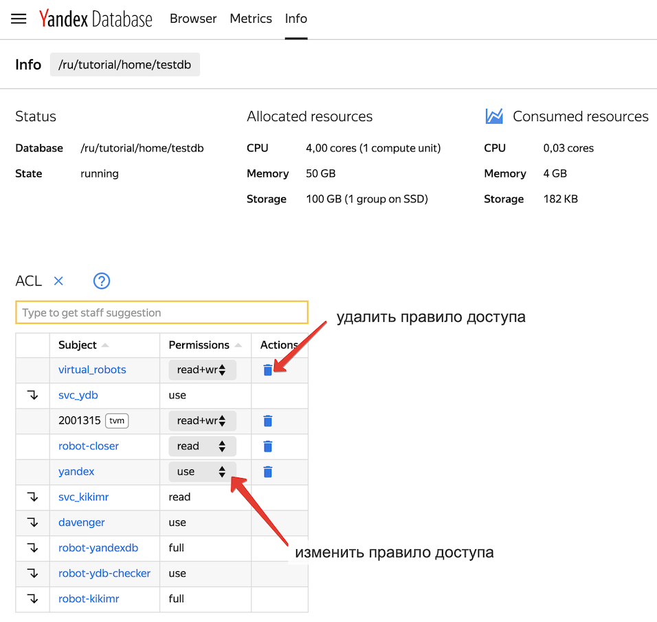
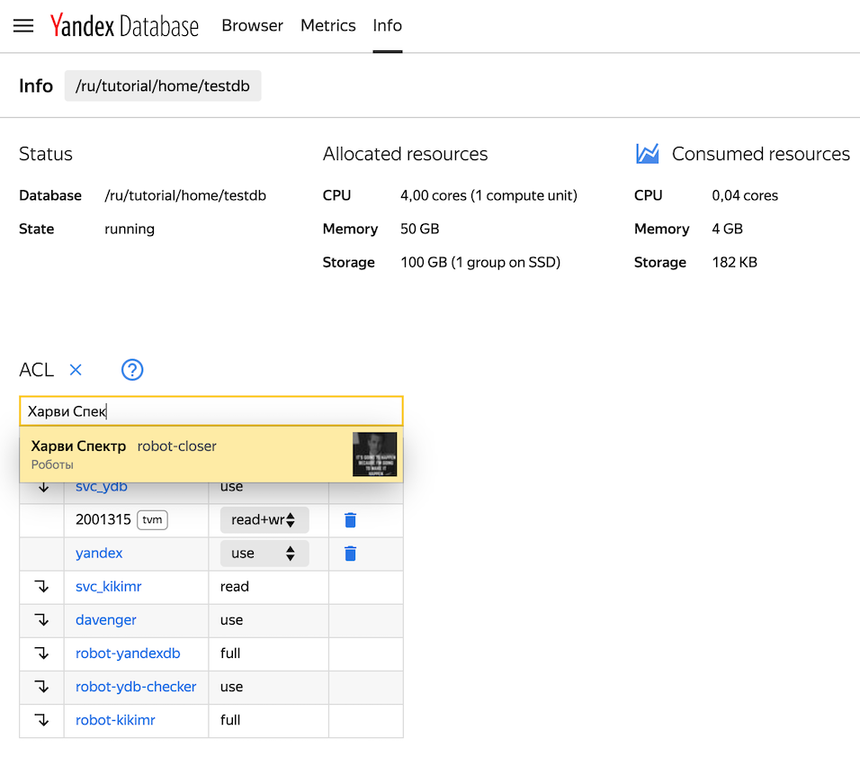
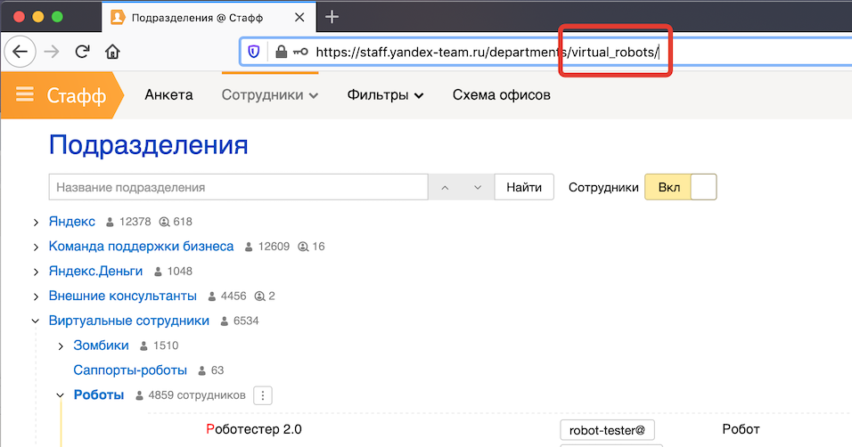
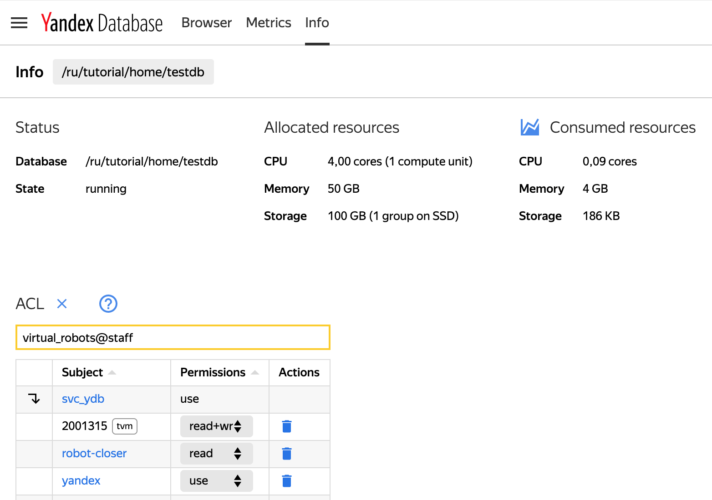
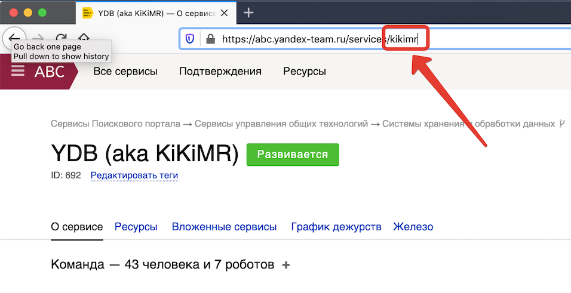
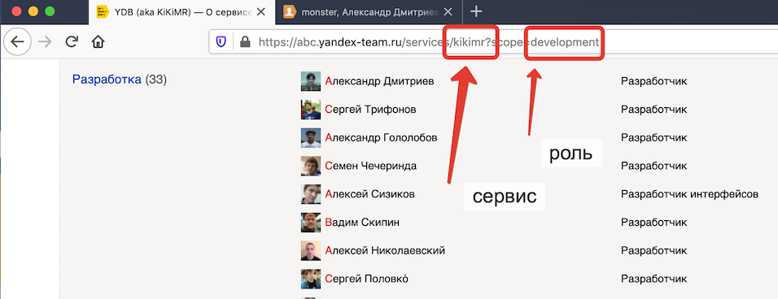
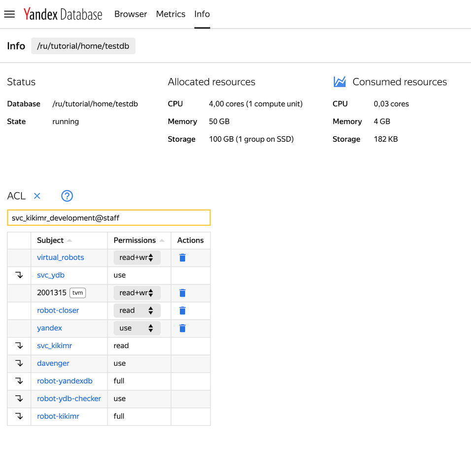
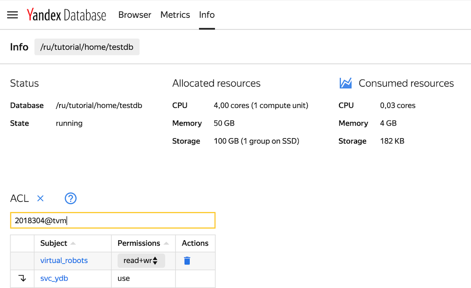

# Разграничение прав доступа

В этом разделе описаны аутентификация и разграничение прав доступа в YDB.

## Аутентификация {#authentication}
В YDB используется аутентификация на основе токенов, которые пересылаются пользователем вместе с запросом.

На данный момент поддерживаются следующие типы токенов:

* TVM2 – механизм межсервисной аутентификации, подробнее в [документации по TVM2](https://wiki.yandex-team.ru/passport/tvm2/);
* OAuth – токен используется для подтверждения личности пользователя, права доступа к объектам YDB настраиваются и проверяются средствами YDB;
* Сессионная cookie Session_id в домене yandex-team.ru.

### TVM2 Аутентификация

TVM2 – это механизм межсервисной аутентификации, разработанный в Яндексе. На [вики сервиса](https://wiki.yandex-team.ru/passport/tvm2/) TVM2 есть [краткая инструкция](https://wiki.yandex-team.ru/passport/tvm2/quickstart/) как начать использовать TVM2.

Для доступа к production и prestable кластерам выпущено TVM приложение [2002490](https://abc.yandex-team.ru/services/passp/resources/?search=ydb&state=requested&state=approved&state=granted&view=supplying&show-resource=4408476).



Сейчас TVM2 аутентификация поддержана в public sdk для C++, Java, Python и GO.



### OAuth

Чтобы использовать OAuth-токен для аутентификации, следует отправлять действующий токен в заголовке каждого запроса к YDB. Получение личного токена и токена для роботного пользователя подробно описано в документе [Начало работы/Разграничение прав доступа](../getting_started/start_auth.md#get_oauth_token).

Все доступные в настоящий момент public sdk позволяют передать токен при создании экземпляра драйвера.

YDB отправляет полученный токен в [Чёрный ящик](https://doc.yandex-team.ru/blackbox/concepts/about.xml), чтобы убедиться в его валидности. В ответ черный ящик возвращает UID. YDB отправляет UID в [Staff API](https://wiki.yandex-team.ru/staff/apiv3/), чтобы получить имя пользователя и список групп.

YDB использует OAuth токен для аутентификации пользователя. Настройки прав доступа к объектам хранятся в YDB, авторизация выполняется средствами YDB.

### Сессионная cookie {#session_cookie}

Для работы с внутренними сервисами Яндекса в домене yandex-team.ru пользователям необходимо войти с [Яндекс ID](https://passport.yandex-team.ru/profile). В результате браузер сохранит сессионную cookie, по которой большинство внутренних сервисов смогут аутентифицировать пользователя.

YDB также позволяет передавать в заголовках с каждым запросом к базе сессионную cookie, которая будет использована для аутентификации и авторизации.

Процесс преобразования сессионной cookie в имя пользователя и список групп идентичен такому же процессу для OAuth токена.

## Авторизация

В YDB права доступа настраиваются для каждого элемента схемы и автоматически наследуются вложенными элементами. Права доступа выдаются субъекту доступа.

### Субъекты доступа

В качестве субъекта доступа могут выступать:

* TVM приложение;
* пользователь [staff](http://staff.yandex-team.ru/);
* группы со [staff](http://staff.yandex-team.ru/): департаментные группы и сервисные группы;
* ролевые скоупы в сервисах [ABC](https://abc.yandex-team.ru/).

Информация о субъекте – SID – представляется в виде ```<login>@<subsystem>```. Например, для пользователей, полученных от [staff](http://staff.yandex-team.ru/) SID будет иметь вид ```<login>@staff```.
Подробнее о группах со staff можно прочитать в [документации к сервису staff](https://wiki.yandex-team.ru/staff/groups/).

В таблице 1 приведено описание компонентов login и subsystem для каждого вида субъектов

<small>Таблица 1 — описание компонентов login и subsystem </small>

| Субъект | Login | Subsystem | Пример |
| :--- | :--- | :--- | :--- |
| TVM приложение | tvm-id приложения | tvm | `23876@tvm` |
| пользователь staff | login пользователя | staff | `robot-ydb@staff` |
| Департаментная группа | Идентификатор группы на staff, который можно узнать из Staff API, поле `group.url`. [Пример обращения в API](https://staff-api.yandex-team.ru/v3/groupmembership?_pretty=1&_fields=joined_at%2Cgroup&person.login=robot-ydb). | staff | `virtual_robots@staff` |
| Сервисная группа | Идентификатор группы на staff, имеет префикс `svc_`. Участие в сервисах abc также отражается в виде группы на staff. | staff | `svc_meta_infra@staff` |
| Ролевой скоуп в сервисе abc | Идентификатор группы на staff, имеет префикс `svc_`. Ролевые скоупы сервисов abc также отражается как группа на staff. | staff | `svc_meta_infra_tvm_management@staff` |

### Объекты доступа

Объектами определения правил контроля доступа могут быть:

* [база данных](databases.md#db);
* [директория](databases.md#dir);
* [таблица](datamodel.md#table).

### Доступные виды прав {#ui_permissions}

На текущий момент для настройки через веб-интерфейс доступны следующие права:

* read - чтение данных и аттрибутов схемы;
* write - запись данных и атрибутов схемы;
* use - чтение, запись и выдача прав;
* manage - создание, изменение и удаление баз данных. Доступно только администраторам сервиса;
* full - полный, неограниченный доступ к сервису (use + manage).

## Создание и изменение БД

При создании базы данных через [веб-интерфейс YDB](https://ydb.yandex-team.ru/), операция выполняется от имени пользователя `robot-yandexdb`, который получает права **full** на БД. Пользователю, инициировавшему создание БД, выдаются права **use**.

Права use дают возможность:

* создавать и удалять таблицы и директории в БД;
* выполнять операции чтения и записи;
* выдавать права доступа другим пользователям, но только в рамках перечисленных выше прав use.

Управление правами из приложений в текущей версии возможно только через [С++](https://a.yandex-team.ru/arc/trunk/arcadia/kikimr/public/sdk/cpp/client/ydb_scheme.h), [Python](https://a.yandex-team.ru/arc/trunk/arcadia/kikimr/public/sdk/python/client/scheme.py) и [go](https://a.yandex-team.ru/arc/trunk/arcadia/kikimr/public/sdk/go/ydb/scheme/scheme.go) SDK, которые содержат методы предоставления, отзыва, изменения выданного списка прав, а также метод смены владельца таблицы, директории или БД.



Пользователь не может самостоятельно изменять параметры БД или удалять БД. В текущей версии эти действия может совершить только администратор системы.

Для изменения параметров базы данных или удаления базы следует заполнить форму.

* [форма](https://forms.yandex-team.ru/surveys/30510/) на изменение выделенных базе ресурсов;
* [форма](https://forms.yandex-team.ru/surveys/30513/) на удаление базы.




## Управление правами доступа из веб-интерфейса

### Изменение прав доступа пользователя

Чтобы выдать права субъекту доступа, перейдите на вкладку [Info](https://ydb.yandex-team.ru/db/ydb-ru/tutorial/home/testdb/info) выбранной базы данных. На рисунке 1 приведён вид списка прав доступа, настроенных для выбранной базы данных.


<small>Рисунок 1 — список выданных прав доступа</small>

Для перехода в режим редактирования прав доступа нажмите на символ карандаша возле слова ACL. На рисунке 2 приведён вид формы изменения списка прав доступа. Нажатие на символ корзины приведёт к удалению выданного ранее права доступа.



Удаление существующего правила или добавление нового начинает действовать мгновенно. Система не будет запрашивать дополнительного подтверждения при внесении изменений.





<small>Рисунок 2 — форма редактирования прав доступа</small>

Чтобы создать новое правило, начните набирать логин пользователя (человека или робота) в текстовом поле. Форма снабжена автодополнением. При совпадении введённой в текстовое поле подстроки с фамилией, именем или логином на [staff](https://staff.yandex-team.ru), будет отображен список для выбора, как показано на рисунке 3.



<small>Рисунок 3 — создание нового правила доступа</small>




YDB предоставляет возможность определения правил доступа для [таблиц](datamodel.md#table) и [директорий](databases.md#dir)




### Изменение права доступа для группы со staff

Кроме создания правил для определённых пользователей, можно создать правило для группы. В качестве группы может использоваться подразделение сотрудника на staff или с abc-сервис.

Подробнее о группах со staff можно прочитать в [документации к сервису staff](https://wiki.yandex-team.ru/staff/groups/).



В текущей реализации автодополнение не работает при добавлении прав доступа для групп.



Чтобы добавить правило доступа для группы, включающей сотрудников определённого подразделения на [staff](https://staff.yandex-team.ru), нужно ввести кодовое название подразделения. Доступ, выданный на подразделение, наследуется всеми вложенными подразделениями и сотрудниками в них.



<small>Рисунок 4 — как узнать кодовое название подразделения</small>

В текстовое поле нужно вписать строку вида `кодовое_название_подразделения@staff` например, `virtual_robots@staff` и нажать клавишу **Ввод** для сохранения правила.



<small>Рисунок 5 — ввод subject для группы со staff при создании правила</small>


### Выдать права членам abc-сервиса

Чтобы добавить правило для группы, включающей членов всего abc-сервиса или имеющих определённую роль, нужно ввести slug сервиса или роли в нём. На рисунке 7 показано, как можно скопировать slug abc-сервиса [YDB (aka KiKiMR)](https://abc.yandex-team.ru/services/kikimr) из адресной строки браузера.



<small>Рисунок 6 — как узнать slug abc-сервиса</small>

Чтобы создать правило для сотрудников abc-сервиса, имеющих определённую роль в этом сервисе, понадобится узнать slug abc-сервиса и роли. На рисунке 7 показано, как скопировать slug abc-сервиса [YDB (aka KiKiMR)](https://abc.yandex-team.ru/services/kikimr?scope=development) и роли **Разработчик**  из адресной строки браузера.



<small>Рисунок 7 — как узнать slug abc-сервиса и определённой роли</small>

В текстовое поле нужно вписать строку вида `svc_{service-slug}_{role-slug}@staff` например, `svc_kikimr_development@staff` и нажать клавишу **Ввод** для сохранения правила.



<small>Рисунок 8 — ввод subject для ролевого скоупа abc-сервиса при создании правила</small>

### Выдать права tvm-приложению

Чтобы создать правило для tvm-приложения, понадобится tvm-id приложения. Узнать tvm id можно на вкладке **ресурсы** сервиса в abc.


<small>Рисунок 9 — копирование tvm id</small>

В текстовое поле нужно вписать строку вида `tvm-id@tvm` например `23876@tvm` и нажать клавишу **Ввод** для сохранения правила.



<small>Рисунок 9 — ввод subject для приложение tvm при создании правила</small>

## Управление правами доступа через ydb cli

Для работы с правами доступа через ydb cli понадобится ydb cli. Описание установки и настройки ydb cli, а также подробная документация доступны в разделе [{#T}}](../getting_started/ydb_cli.md).



Названия прав, которые можно устанавливать на объекты схемы YDB через ydb cli, отличаются от названий прав, доступных в веб-интерфейсе YDB.



В таблице 2 приведён список доступных для установки через ydb cli прав.

<small>Таблица 2 — список доступных для установки через ydb cli прав</small>

| **Право** | **Соответствие в web UI** | **Пояснение** |
| :--- | :--- | :--- |
| ydb.generic.read | read | Чтение данных и атрибутов схемы |
| ydb.generic.write | write | Запись данных и атрибутов схемы |
| ydb.generic.use | use | Чтение, запись и выдача прав |
| ydb.generic.manage | manage | Создание, изменение и удаление баз данных. Доступно только администраторам сервиса |
| ydb.generic.full | full | Полный, неограниченный доступ (use + manage) |


### Проверка токена

Иногда в работе приложения запросы завершаются с ошибой **Access Denied**. Для диагностики бывает полезно проверить, как отправленный в YDB токен преобразуется в субъекты прав доступа. YDB cli предоставляет возможность выполнить команду `ydb whoami`.

Подробный пример приведён в разделе [Использование консольного клиента YDB](../getting_started/ydb_cli.md#whoami).

### Просмотр прав доступа

Для отображения прав доступа, установленных для определённого объекта схемы, в ydb cli используется команда `scheme describe` с опцией `--permissions`. В листинге 1 приведён результат выполнения команды `scheme describe`.

<small>Листинг 1 — результат выполнения команды ydb scheme describe --permissions</small>

```
robot-ydb-OSX:docs robot-ydb$ ya ydb -e ydb-ru.yandex.net:2135 -d /ru/tutorial/home/testdb scheme describe --permissions /ru/tutorial/home/testdb
<sub-domain> testdb

Owner: robot-kikimr@staff

Permissions:
yandex@staff:ydb.generic.use
2001315@tvm:ydb.generic.read
2001315@tvm:ydb.generic.write
robot-closer@staff:ydb.generic.read
virtual_robots@staff:ydb.generic.read
virtual_robots@staff:ydb.generic.write

Effective permissions:
svc_kikimr@staff:ydb.generic.read
robot-yandexdb@staff:ydb.generic.full
svc_ydb@staff:ydb.generic.use
davenger@staff:ydb.generic.use
robot-ydb-checker@staff:ydb.generic.use
robot-kikimr@staff:ydb.generic.full
yandex@staff:ydb.generic.use
2001315@tvm:ydb.generic.read
2001315@tvm:ydb.generic.write
robot-closer@staff:ydb.generic.read
virtual_robots@staff:ydb.generic.read
virtual_robots@staff:ydb.generic.write
```

В результаты выполнения команды содержатся три секции: Owner, Permissions и Effective Permissions.

**Owner**

В разделе **Owner** отображён владелец объекта – пользователь YDB, создавший объект. Обладает полными правами на объект.

**Permissions**

В данном разделе отображён список правил доступа, установленных непосредственно на данный объект.

Правила доступа отображаются в формате `<login>@<subsystem>:<permission>`, например, запись `robot-closer@staff:ydb.generic.read` следует интерпретировать так: "у пользователя с логином robot-closer на staff есть доступ на чтение данных и атрибутов схемы данного объекта".

**Effective permissions**

В разделе отображён список правил доступа, установленных непосредственно на данный объект, объединённый с правилами доступа, установленными на все родительские объекты схемы по отношению к данному.

### Изменение прав доступа пользователя

Для изменения прав доступа к объекту схемы в ydb cli существует несколько подкоманд команды `scheme permissions`:

* chown - изменяет владельца;
* clear - очищает список правил доступа, установленных непосредственно на объект схемы;
* grant - выдаёт указанному пользователю указанные права;
* revoke - отзывает указанные права у указанного пользователя;
* set - устанавливает указанный набор правил доступа указанному объекту.

В листинге 2 приведён результат выполнения команды `scheme permissions grant`. В результате её выполнения пользователю с логином robot-ydb на staff будут выданы права на запись в таблицу /ru/tutorial/home/testdb/episodes.

<small>Листинг 2 — результат выполнения команды ydb scheme permissions grant</small>

```
robot-ydb-OSX:docs robot-ydb$ ya ydb -e ydb-ru.yandex.net:2135 -d /ru/tutorial/home/testdb scheme permissions grant -p ydb.generic.write /ru/tutorial/home/testdb/episodes robot-ydb@staff
Status: SUCCESS
Issues:
<main>: Error:
```




Значение SUCCESS в поле Status результата выполнения команды, означает успешное выполнение команды. Пустой список Error: означает, что ошибок выполнения команды нет.



В листинге 3 приведён результат выполнения команды `scheme permissions set`. В результате её выполнения пользователю с логином robot-ydb на staff будут установлены права `use` и `write` на таблицу /ru/tutorial/home/testdb/episodes. Права, которые ранее были выданы пользователю robot-ydb@staff на таблицу /ru/tutorial/home/testdb/episodes, будут отозваны.


<small>Листинг 3 — результат выполнения команды ydb scheme permissions set</small>

```
robot-ydb-OSX:docs robot-ydb$ ya ydb -e ydb-ru.yandex.net:2135 -d /ru/tutorial/home/testdb scheme permissions set -p ydb.generic.write -p ydb.generic.use /ru/tutorial/home/testdb/episodes robot-ydb@staff
Status: SUCCESS
Issues:
<main>: Error:
```
