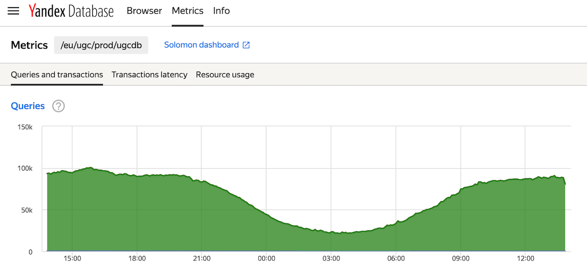

# Квоты и лимиты

В разделе подробно описаны квоты – организационные ограничения на разные типы ресурсов доступные базам данных. Квоты можно менять по запросу в пределах согласованных заявок на квоты. Лимиты – технические ограничения, обусловленные особенностями архитектуры, подробно описаны в разделе [{#T}](../api/limits.md).

## Квоты {#quotas}

Кластеры YDB являются мультиарендными – предназначены для одновременной изолированной работы нескольких баз данных несвязанных пользователей и проектов на выделенных ресурсах. Для обеспечения гарантированных ресурсов применяется квотирование.

В YDB квотируются:

* [вычислительные ресурсы](databases.md#compute_units);
* [группы хранения](databases.md#gruppy-hraneniya-(storage-groups)).


## Предоставление и изменение квоты {#change_quota}

Каждая база данных YDB размещается в определённом [аккаунте](databases.md#akkaunt). Аккаунт как правило соответствует сервису в [ABC](https://abc.yandex-team.ru/). При создании новой базы или изменении размеров существующий на кластере YDB выделяются физические ресурсы: ядра CPU и место на физических накопителях, входящих в [группы хранения](databases#gruppy-hraneniya-(storage-groups)).

Любой сотрудник Яндекса может самостоятельно создать базу данных в YDB для экспериментов. Подробно процесс создания базы описан в разделе [Базы данных - создание и управление](../getting_started/create_manage_database.md). Базы данных для экспериментов создаются с минимальными значениями квот для обоих ресурсов: 1 [группой хранения](databases#gruppy-hraneniya-(storage-groups)) и 1 [слотом](databases.md#compute_units)

Создание и последующее изменение параметров баз данных для production и prestable контуров выполняются администратором YDB. Для production и prestable контуров ресурсы выдаются из согласованных заявок на квоты, дата поставки которых наступила.

Для создания заявки следует заполнить одну из форм:

* [заявка на создание](https://forms.yandex-team.ru/surveys/45941/);
* [заявка на изменение](https://forms.yandex-team.ru/surveys/30510/).

Заявки на квоты создаются в рамках [регулярного сбора заказов](https://wiki.yandex-team.ru/intranet/abc/features/hardware/) на оборудование. Об открытии нового или уточнении созданного ранее заказа можно узнать, подписавшись на рассылку [ydb@yandex-team.ru](https://ml.yandex-team.ru/lists/ydb/) или клуб [Yandex Database](https://clubs.at.yandex-team.ru/ydb/) в Этушке. Заявки собираются централизованно в системе сбора заявок. Процесс планирования серверных ресурсов в компании в целом описан в [документации к процессу](https://capacity-planning.daas.yandex-team.ru/about/index.html). Оформление заявок на квоты и приёмы работы с системой сбора заявок описаны в [документации](https://wiki.yandex-team.ru/Intranet/abc/features/hardware/#create)

## Заявка на квоту {#request_qouta}

### Расчёт потребления для заявки {#how_to_order}

Заявка на квоту создаётся с помощью формы в [веб-интерфейсе ABC](https://abc.yandex-team.ru/), приведённую на рисунке 1. Красным прямоугольником выделены поля, значения которых участвуют в расчёте квот.


<small>Рисунок 1 — форма заявки на квоты</small>

Ниже описаны рекомендации по заполнению полей формы.

**Название базы**

Это обязательное поле. При создании заявки на квоту для новой базы, введите **новая база**. Для существующей базы следует вписать полное название production базы данных. На рисунке 2 показано, как с помощью [веб-интерфейса YDB](https://ydb.yandex-team.ru) узнать название базы данных.


<small>Рисунок 2 — полное имя базы данных</small>

**RPS**

Это обязательное поле, для заполнения которого нужно указать прирост количества запросов в секунду, отправляемых из приложения в базу данных. Следует указывать общее количество запросов включая запросы, изменяющие данные и запросы на чтение. Например, если в момент заказа база `/ru/tutorial/home/testdb` получает и обрабатывает **10 000** запросов в секунду, а на дату поставки формируемой заявки ожидается **18 000** запросов в секунду, то в поле RPS следует вписать **8 000**.

Поле следует заполнять в случае, когда планируется положительное изменение RPS.

Узнать текущее значение показателя можно по графику Queries на вкладке [Metrics](https://ydb.yandex-team.ru/db/ydb-ru/tutorial/home/testdb/metrics/tx-and-queries) веб-интерфейса YDB.



<small>Рисунок 3 — график Queries вкладки Metrics</small>

Нажатие на ссылку Queries откроет [интерфейс Solomon](https://nda.ya.ru/t/YcsaOPz03VuByw), с помощью которого можно оценить рост количества запросов к базе за период, подходящий для прогнозирования количества запросов на дату поставки.

**Объём хранимых данных**

Это обязательное поле, при заполнении которого нужно указать изменение размера хранимых данных.



Для новой базы данных следует использовать наивную методику расчёта. Рассмотрим базу данных из одной таблицы, команда создания которой приведена на листинге 1. Пусть в таблице планируется хранить не больше десяти миллионов строк, в поле `title` строки длиной не больше килобайта.

```sql
CREATE TABLE episodes
(
    series_id Uint64,
    season_id Uint64,
    episode_id Uint64,
    title Utf8,
    air_date Uint64,
    PRIMARY KEY (series_id, season_id, episode_id)
);
```
<small>Листинг 1 — команда создания таблицы</small>

После умножения размеров всех ячеек таблицы на количество строк получим ~ 10 Гигабайт. Это значение следует использовать при заполнении формы.



Для существующей базы данных текущий размер можно узнать с помощью графика **Disk space usage** на вкладке [Metrics/Resource usage](https://ydb.yandex-team.ru/db/ydb-ru/tutorial/home/testdb/metrics/resource-usage) веб-интерфейса YDB. Нажатие на ссылку **Disk space usage откроет** интерфейс [Соломон](https://wiki.yandex-team.ru/solomon/), с помощью которого можно оценить рост размера базы за период.

## Просмотр установленных значений квот {#current_quota_values}

Текущие значения квот и их потребление доступно на вкладке [Info](https://ydb.yandex-team.ru/db/ydb-ru-prestable/tutorial/home/testdb/info) пользовательского веб-интерфейса. Примерный вид таблиц с выделенными квотами и текущим потреблением показан на рисунке 4.


<small>Рисунок 4 — установленные значения квот</small>

Сравнив значение в блоке **Allocated resources** со значениями в блоке **Consumed resources** можно оценить, насколько в данный момент использованы выделенные ресурсы.

## Мониторинг потребления квот {#monitoring}

На рисунке 5 показано мгновенное значение потребления в сравнении с выделенными квотами. Стрелкой показана иконка, нажатие на которую откроет вкладку **Metrics** с графиками потребления выделенных ресурсов.


<small>Рисунок 5 — ссылка для переход к графикам потребления</small>

На рисунке 6 показан примерный вид вкладки **Metrics** пользовательского веб-интерфейса YDB.


<small>Рисунок 6 — примерный вид вкладки Metrics</small>

В отображении единиц измерения на вертикальной оси запятая используется в качестве разделителя целой и дробной частей.

Нажатие на заголовок графика откроет соответствующий график в [Соломоне](https://wiki.yandex-team.ru/solomon/).

С помощью графиков можно оценить потребление квотирумых ресурсов во времени и заметить моменты, когда потребление приближается к размеру выделенной квоты.

Важно следить за потреблением выделенных ресурсов, своевременно оформлять заявки на квоты. YDB как правило используется приложениями, чувствительными к задержкам, исчерпание квоты по CPU или RAM может негативно сказаться на характеристиках приложения, например, при недостатке CPU могут вырасти времена обработки запросов. При достижении примерно 80% потребления [вычислительных ресурсов](databases.md#compute-units) от выделенной квоты следует заполнить [заявку](https://forms.yandex-team.ru/surveys/30510/) на изменение параметров базы.

В случае исчерпания квоты на [группы хранения](databases#gruppy-hraneniya-(storage-groups)) база данных продолжит работать и обрабатывать запросы на запись и чтение. Тем не менее пользователю следует следить за потреблением квоты на группы хранения и своевременно оставлять заявки на квоты в YDB и на расширение базы данных.
