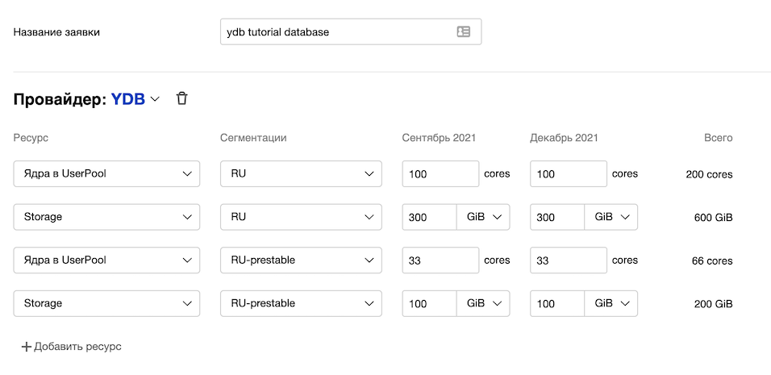
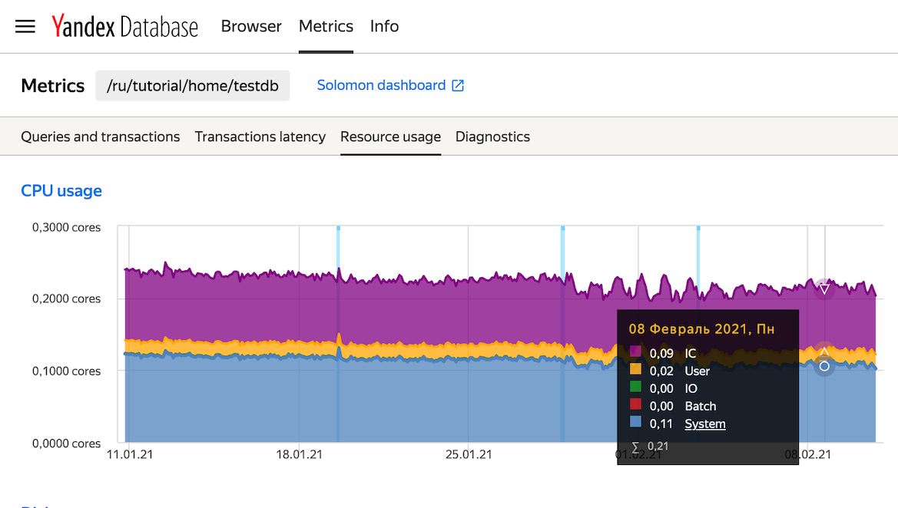
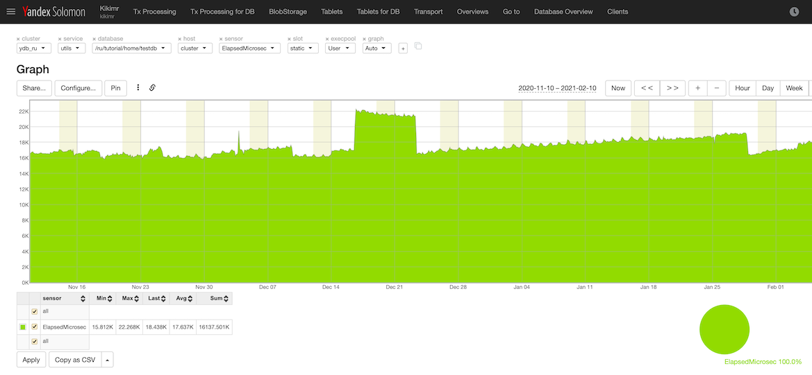
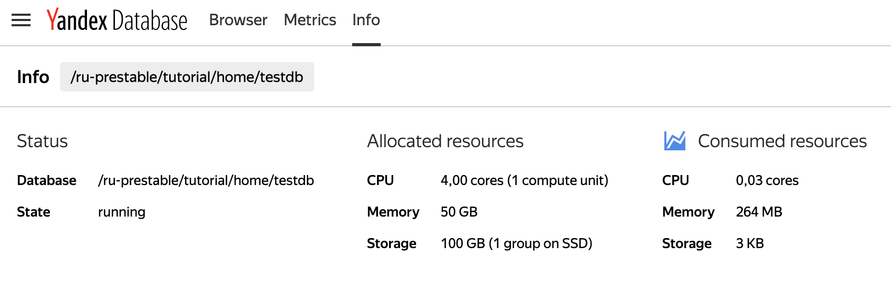
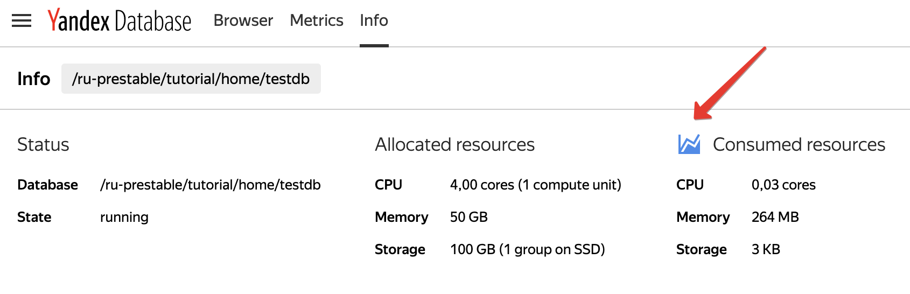
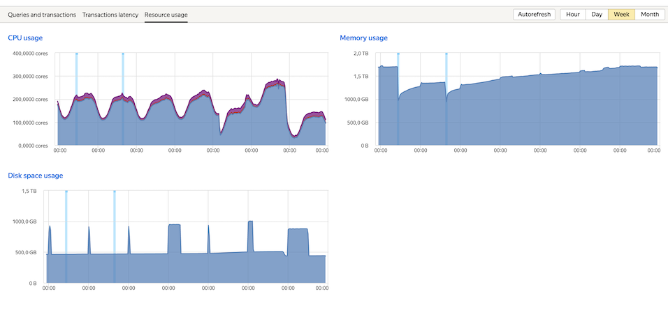

# Квоты и лимиты

В разделе подробно описаны квоты – организационные ограничения на разные типы ресурсов доступные базам данных. Квоты можно менять по запросу в пределах согласованных заявок на квоты. Лимиты – технические ограничения, обусловленные особенностями архитектуры, подробно описаны в разделе [{#T}](../concepts/limits-ydb.md).

## Квоты {#quotas}

Кластеры YDB являются мультиарендными – предназначены для одновременной изолированной работы нескольких баз данных несвязанных пользователей и проектов на выделенных ресурсах. Для обеспечения гарантированных ресурсов применяется квотирование.

В YDB квотируются:

* [вычислительные ресурсы](databases.md#compute_units);
* [группы хранения](databases.md#gruppy-hraneniya-(storage-groups)).


## Предоставление и изменение квоты {#change_quota}

Каждая база данных YDB размещается в определённом [аккаунте](databases.md#akkaunt). Аккаунт как правило соответствует сервису в [ABC](https://abc.yandex-team.ru/). При создании новой базы или изменении размеров существующий на кластере YDB выделяются физические ресурсы: ядра CPU и место на физических накопителях, входящих в [группы хранения](databases#gruppy-hraneniya-(storage-groups)).

Любой сотрудник Яндекса может самостоятельно создать базу данных в YDB для экспериментов. Подробно процесс создания базы описан в разделе [Базы данных - создание и управление](../getting_started/create_manage_database.md). Базы данных для экспериментов создаются с минимальными значениями квот для обоих ресурсов: 1 [группой хранения](databases#gruppy-hraneniya-(storage-groups)) и 1 [слотом](databases.md#compute_units)

Создание и последующее изменение параметров баз данных для продакшн и prestable контуров выполняются администратором YDB. Для продакшн и prestable контуров ресурсы выдаются из согласованных заявок на квоты, дата поставки которых наступила.

Для создания заявки следует заполнить одну из форм:

* [заявка на создание](https://forms.yandex-team.ru/surveys/45941/);
* [заявка на изменение](https://forms.yandex-team.ru/surveys/30510/).

Заявки на квоты создаются в рамках [регулярного сбора заказов](https://wiki.yandex-team.ru/intranet/abc/features/hardware/) на оборудование. Об открытии нового или уточнении созданного ранее заказа можно узнать, подписавшись на рассылку [ydb@yandex-team.ru](https://ml.yandex-team.ru/lists/ydb/) или клуб [Yandex Database](https://clubs.at.yandex-team.ru/ydb/) в Этушке. Заявки собираются централизованно в системе сбора заявок. Процесс планирования серверных ресурсов в компании в целом описан в [документации к процессу](https://capacity-planning.daas.yandex-team.ru/about/index.html). Оформление заявок на квоты и приёмы работы с системой сбора заявок описаны в [документации](https://wiki.yandex-team.ru/Intranet/abc/features/hardware/#create)

## Заявка на квоту {#request_qouta}

### Расчёт потребления для заявки {#how_to_order}

Заявка на квоту создаётся с помощью формы в [веб-интерфейсе ABC](https://abc.yandex-team.ru/), приведённой на рисунке 1.



<small>Рисунок 1 — форма заявки на квоты</small>

Для создания заявки необходимо указать изменения в потреблении квотируемых ресурсов для каждого кластера. Для продакшн баз рекомендуется использовать кластер RU, для разработки и тестирования – RU-prestable. Подробно кластеры YDB описаны в разделе [Кластеры](clusters.md).

Ниже для каждого квотируемого ресурса приведены рекомендации по расчёту изменений в потреблении для заказа.

### Ядра в UserPool {#user_pool_cores}

Это обязательно поле. Нужно указать количество ядер в штуках, которое будет использовано для обработки запросов.

Вычислительные ресурсы для баз данных во внутренних кластерах YDB предоставляются в виде [слотов](databases.md#compute-units). Каждому слоту доступно ограниченное количество физических ядер. Ядра разделены на несколько тредпулов. В основном изменения в пользовательской нагрузке влияют на потребление ядер в UserPool.

Узнать потребление ядер в UserPool можно с помощью графика **CPU Usage**, расположенного на вкладке [Metrics](https://ydb.yandex-team.ru/db/ydb-ru/tutorial/home/testdb/metrics/resource-usage) веб-интерфейса YDB. На этом графике изображено суммарное потребление ядер во всех пулах. Пример такого графика приведён на рисунке 2.



<small>Рисунок 2 — полное имя базы данных</small>

Подробней графики описаны в разделе [{#T}](../maintenance/monitoring.md).

Нажатие на заголовок [CPU usage](https://nda.ya.ru/t/CKRKGzx23jC9pH) откроет график в [Соломоне](https://solomon.yandex-team.ru/docs/), с помощью интерфейса Соломона можно оставить только UserPool и выбрать временной диапазон три месяца, чтобы оценить текущее потребление CPU, сопоставить с профилем нагрузки на базу данных и планируемым изменением нагрузки. На рисунке 3 приведён пример графика использования ядер в UserPool из Соломона.

На вертикальной оси этого графика отображено использование доступных в UserPool ядер в единицу времемни. Потребление 1 000 000 соответствует потреблению 1 ядра в тредпуле.



<small>Рисунок 3 — использование ядер UserPool</small>

Зная планируемые изменения в профиле нагрузки на базу данных и приложение, зная текущие показатели использования ядер в UserPool с помощью линейной экстраполяции можно приблизительно оценить потребность в ядрах для нагрузки, ожидаемой в периоде, для которого нужно сделать заявку.

### Storage

Это обязательное поле. Нужно указать изменение размера хранимых данных.

Для существующей базы данных текущий размер можно узнать с помощью графика **Disk space usage** на вкладке [Metrics/Resource usage](https://ydb.yandex-team.ru/db/ydb-ru/tutorial/home/testdb/metrics/resource-usage) веб-интерфейса YDB. Нажатие на ссылку **Disk space usage** откроет интерфейс [Соломон](https://solomon.yandex-team.ru/docs/), с помощью которого можно оценить рост размера базы за период.

Чтобы оценить размер данных для новой базы, следует [создать пробную базу данных](../getting_started/create_manage_database.md) минимального размера, загрузить в неё некоторую долю от продакшн данных и нагрузить базу схожим с планируемым в продакшене профилем нагрузки.

В идеале длительность испытаний должна составлять сутки, а профилю нагрузки следует повторять реальный суточный профиль. В результате с помощью графика **Disk space usage** на вкладке [Metrics/Resource usage](https://ydb.yandex-team.ru/db/ydb-ru/tutorial/home/testdb/metrics/resource-usage) веб-интерфейса YDB можно оценить размер базы данных, необходимый для хранения данных приложения.

Исходный размер данных приложения можно оценить, если использовать наивную методику расчёта. Рассмотрим базу данных из одной таблицы, команда создания которой приведена на листинге 1.

```sql
CREATE TABLE episodes
(
    series_id Uint64,
    season_id Uint64,
    episode_id Uint64,
    title Utf8,
    air_date Uint64,
    PRIMARY KEY (series_id, season_id, episode_id)
);
```
<small>Листинг 1 — команда создания таблицы</small>

Пусть в таблице планируется хранить не больше десяти миллионов строк, в поле `title` строки длиной не больше килобайта. После умножения размеров всех ячеек таблицы на количество строк получим ~ 10 Гигабайт.

Используя максимальное значение размера базы данных с графика **Disk space usage**, расположенного на вкладке [Metrics/Resource usage](https://ydb.yandex-team.ru/db/ydb-ru/tutorial/home/testdb/metrics/resource-usage) веб-интерфейса YDB и исходный размер загруженных данных, можно выичислить отношение размера базы данных к размеру исходных данных. Полученное отношение следует использовать как коэффициент для расчёта размера базы данных в будущем, зная размер исходных данных в будущем.



Для каждой продакшн базы на ydb-ru или ydb-eu рекомендуется создавать prestable базу на кластере ydb-ru-prestable и настраивать зеркалирование части продакшн нагрузки. Если зеркалирование невозможно, целесообразно организовать проведение регулярных нагрузочных испытаний.



## Просмотр установленных значений квот {#current_quota_values}

Текущие значения квот и их потребление доступно на вкладке [Info](https://ydb.yandex-team.ru/db/ydb-ru-prestable/tutorial/home/testdb/info) пользовательского веб-интерфейса. Примерный вид таблиц с выделенными квотами и текущим потреблением показан на рисунке 4.



<small>Рисунок 4 — установленные значения квот</small>

Сравнив значение в блоке **Allocated resources** со значениями в блоке **Consumed resources** можно оценить, насколько в данный момент использованы выделенные ресурсы.

## Мониторинг потребления квот {#monitoring}

На рисунке 5 показано мгновенное значение потребления в сравнении с выделенными квотами. Стрелкой показана иконка, нажатие на которую откроет вкладку **Metrics** с графиками потребления выделенных ресурсов.



<small>Рисунок 5 — ссылка для переход к графикам потребления</small>

На рисунке 6 показан примерный вид вкладки **Metrics** пользовательского веб-интерфейса YDB.



<small>Рисунок 6 — примерный вид вкладки Metrics</small>

В отображении единиц измерения на вертикальной оси запятая используется в качестве разделителя целой и дробной частей.

Нажатие на заголовок графика откроет соответствующий график в [Соломоне](https://solomon.yandex-team.ru/docs/).

С помощью графиков можно оценить потребление квотирумых ресурсов во времени и заметить моменты, когда потребление приближается к размеру выделенной квоты.

Важно следить за потреблением выделенных ресурсов, своевременно оформлять заявки на квоты. YDB как правило используется приложениями, чувствительными к задержкам, исчерпание квоты по CPU или RAM может негативно сказаться на характеристиках приложения, например, при недостатке CPU могут вырасти времена обработки запросов. При достижении примерно 80% потребления [вычислительных ресурсов](databases.md#compute-units) от выделенной квоты следует заполнить [заявку](https://forms.yandex-team.ru/surveys/30510/) на изменение параметров базы.

В случае исчерпания квоты на [группы хранения](databases#gruppy-hraneniya-(storage-groups)) база данных продолжит работать и обрабатывать запросы на запись и чтение. Тем не менее пользователю следует следить за потреблением квоты на группы хранения и своевременно оставлять заявки на квоты в YDB и на расширение базы данных.
