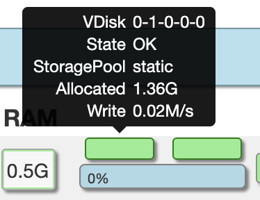
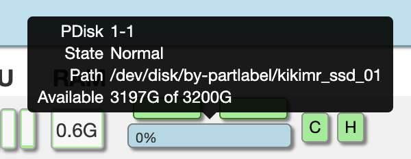
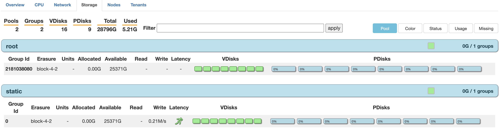
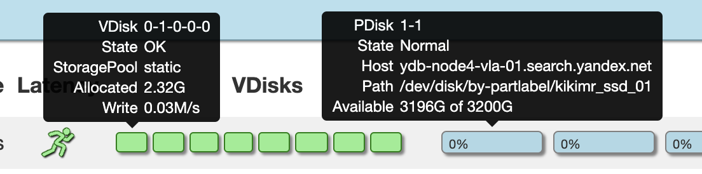
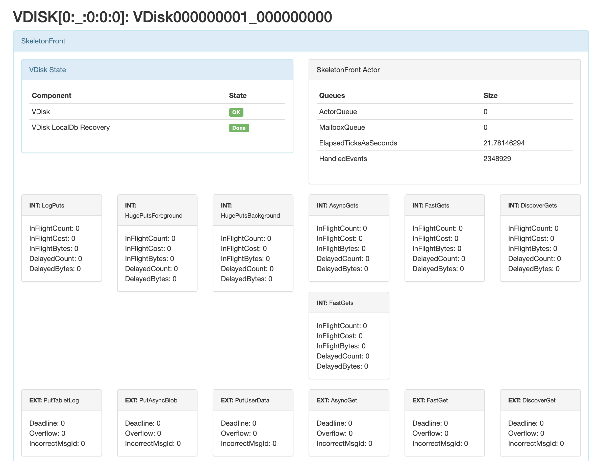
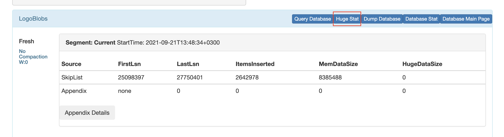

# Viewer

## Страница Nodes

```
http://<ендпоинт>:8765/viewer/v2/nodes
```


Это главная страница вьювера, на ней можно увидеть состояние каждого узла.

На самом верху расположены вкладки вьювера, через них можно переключиться на другие страницы.

После них начинается страница Nodes(узлов) и последующие элементы:

1. Список вариантов группировки узлов:

    * **DC**/**Domain**/**Rack**/**Host** - по расположению
    * **Role** - по роли ноды (storage, tenant)
    * **Tenant** - по тенантам к которым узлы привязаны
    * **Status** - по состоянию узлов (Good, Bad)
    * **Uptime** - по времени работы ноды
    * **Version** - версии
    * **Usage** - по количеству занятого места у самого заполненного блочного устройства на узле

1. Группы узлов скгруппированные по вышевыбранному признаку

Каждый узел представляет собой строку со информацией представленной в заданном порядке:

1. ID узла
1. Хост узла
    * Имя хоста
    * Под именем индикатор загруженности узла по cpu
1. Uptime ноды
1. Потребление CPU узлом разными задачами
1. Поребление ОЗУ узлом
1. ВДиски и блочные устройства
   * Снизу располагаются блочный устройства с индикатором занятого места
   * Сверху находятся вдиски которые используют устройство под ними
1. Таблеки которые запущены на данном узле и поддерживают работу БД

При наведение на вдиск, появится всплывающее окно с основной информацией:



1. **VDisk** - уникальный индетификатор состоящий из нескольких значений разделенных тире

    * ID группы хранения (Group ID)
    * Поколение группы (Group generation)
    * FailRealm
    * FailDomain
    * Номер слота на блочном устройстве

1. **State** - состояние вдиска

1. **Storage pool** - пулл хранения данных

1. **Allocated** - количество использованного места вдиском

1. **Read** - скорость чтения с вдиска

1. **Write** - скорость записи с видска

Если вдиск еще не использовал место или на него не идут запросы чтения или записи, то последние 3 пункта могут не показываться.

При наведении на блочное устройство так же появляется основная информация:



1. **PDisk** - уникальный индетификатор состоящий из пары значений разделенных тире

    * ID узла
    * Номер блочного устройства

1. **State** - состояние устройства

1. **Path** - путь до партлейбла устройства

1. **Available** - доступная память у устройства

При нажатии на вдиск или блочное устройства можно перейти на страницы с подробной информацией.

## Страница Storages

```
http://<ендпоинт>:8765/viewer/v2/storage
```



Это страница состояния групп хранения.

Ниже вкладок viewer'а страница представлена следующей структурой:

1. Шапка страницы
    * Краткая статистика по группам
        * **Pools** - количество пулов хранения данных
        * **Groups** - количество групп хранения данных во всех пулах
        * **VDisks** - количество вдисков во всех группах
        * **PDisks** - количество блочных устройств используемые вдисками
        * **Total** - суммарное место на всех блочных устройствах
        * **Used** - занятое место на всех блочных устройствах

    * Строка для записи выражения фильтрации групп

    * Список вариантов группировки групп хранения
        * **Pool** - по пулу хранения данных
        * **Color** - по цвету, показывающий состояние группы хранения
        * **Status** - по состоянию (Good, Bad)
        * **Usage** - по количеству занятого места у самого заполненного блочного устройства в группе
        * **Missing** - по количеству отсутствующих или реплецирующихся вдисков 

1. Сгруппированные группы хранения

Каждая группа хранения представляет собой строку:

1. **Group Id** - ID группы хранения
1. **Erasure** - используемая тополгия хранения данных
1. **Units** - количество таблеток пишущие в данную группу
1. **Allocated** - суммарное используемое количество места всеми вдисками группы
1. **Avaible** - суммарное доступное место на всех пдисках группы
1. **Read** - скрорость чтения данных с группы
1. **Write** - скорость записи данных в группу
1. **Latency** - состояние группы относительно задержки ответов
1. **VDisks** - вдиски группы, цветами показываются их состояние
1. **PDisks** - блочные устройства используемые группой

При наведении на вдиск или блочное устройство, покажутся всплывающие сообщения с информацией о вдиске и о блочном устройстве на котором находится вдиск.



## Страница ВДиска

При использовании кубернетиса и переходе на страницу вдиска, ссылка на страницу будет содержать приватный адрес узла, где расположен вдиск.

Перед тем как зайти на страницу, надо прокинуть порт узла в кубернетисе на локальную машину, после заменить адрес на localhost:<выбранный вами порт>.



На странице представлено очень подробная информация о вдиске.

Чтобы узнать процент неэффективно использованной памяти на вдиске, следует выполнить следующие шаги:

1. Найти блок `Logoblobs` и нажать кнопку `Huge Stat`

    

1. В открывшейся странице поле `GarbageOverheadWithRespectToSlotAlignmentPercentage` показывает процент неэффективно используемой памяти вдиском.
