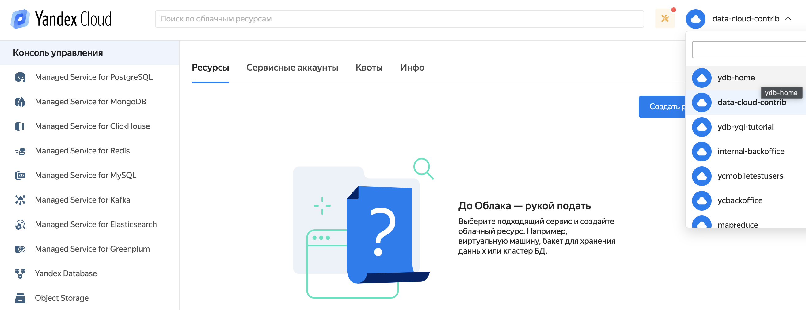
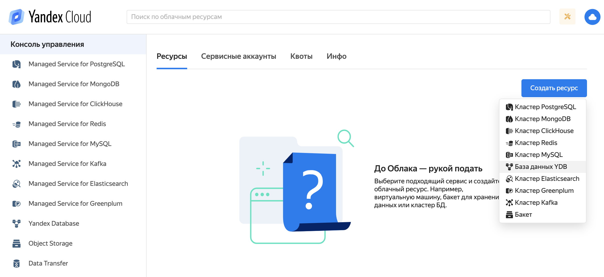
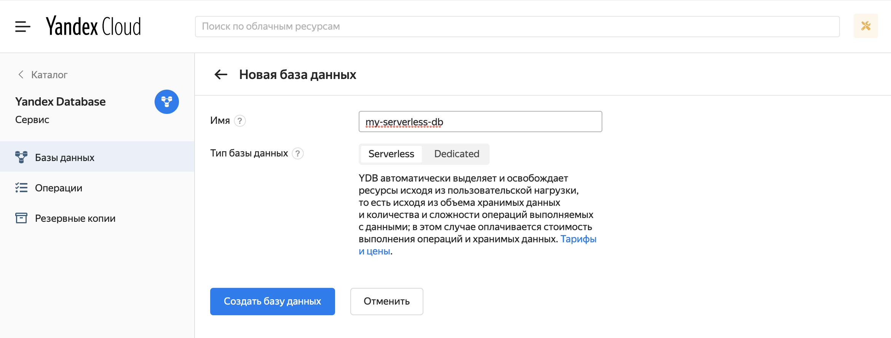
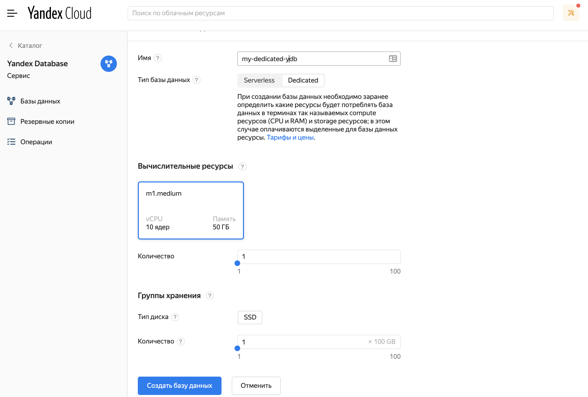
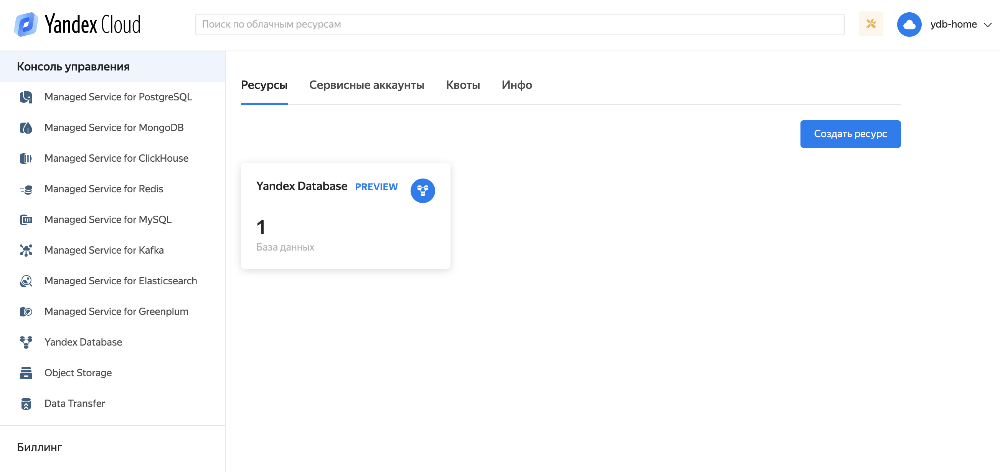

# Базы данных - создание и управление

В этом разделе описано как создать, просмотреть, изменить и удалить базы данных (БД). Подробно о базах данных написано в разделе [Базы данных](../concepts/databases.md).

## Создание БД с помощью web-интерфейса YDB {#create-db-via-ui}

Для создания базы данных следует выполнить следующие действия:

1. Перейти в [web-интерфейс https://yc.yandex-team.ru](https://yc.yandex-team.ru).
1. Выбрать каталог `ydb_home` в выпадающем списке в правом верхрнем углу экрана, как показано на рисунке 1.
1. Нажать копку `Создать ресурс` и выбрать тип ресурса `База данных YDB`, как показано на рисунке 2.

<small>Рисунок 1 — Выбор каталога</small>

<small>Рисунок 2 — Выбор создаваемого ресурса</small>

Форма создания базы данных YDB позволяет выбрать между serverless и dedicated режимами.

### Создание базы данных в режиме Serverless {#create-db-via-ui-serverless}

1. Выберите тип базы данных `Serverless`, как показано на рисунке 3.
1. Укажите подходящее имя для базы данных и нажмите кнопку `Создать базу данных`.
1. База будет отображена в списке в статусе `Provisioning`, как показано на риснуке 4. После завершения операции выделения ресурсов для базы данных, она будет отображена в списке в статусе `Running`.

<small>Рисунок 3 — Форма создания базы данных в режиме serverless</small>

<small>Рисунок 4 — Список баз данных в каталоге</small>

### Создание базы данных в режиме Dedicated {#create-db-via-ui-dedicated}



Название базы данных регистрозависимое, должно начинаться с латинской буквы, дальше допустимы буквы латинского алфавита, цифры и дефис '-'.



1. В диалоге создания БД следует настроить параметры базы:
   * Имя БД.
   * Тип и количество вычислительных ресурсов [(compute units)](../concepts/databases.md#compute-units).
   * Тип и количество групп хранения [(storage groups)](../concepts/databases.md#storage-groups). Каждой группе хранения соответствует определенная схема хранения, влияющая на количество используемых дисков, модель отказа и коэффициент избыточности. Для однодатацетровых кластеров обычно используется схема ``block4-2``, при которой группа хранения расположена на 8 дисках в 8 стойках, переживает отказ любых двух дисков и дает избыточность с коэффициентом 1.5. В мультидатацентровых кластерах используется схема ``mirror-3dc``, где в группе хранения задействовано 9 дисков, расположенных по 3 в трех датацентрах, выдерживает отказ датацентра и диска в любом другом датацентре, дает избыточность с коэффициентом 3. Группа хранения может состоять из накопителей, относящихся к одному из трех типов: SATA HDD, SATA SSD, NVMe SSD.
1. Для создания базы данных с вышеуказанными параметрами следует нажать на кнопку `Создать базу данных`.



В текущей инсталляции YDB доступны только SATA SSD накопители.



На рисунке 5 приведен внешний вид формы создания новой базы данных в режиме `Dedicated`:

<small>Рисунок 5 — Форма создания базы данных в режиме dedicated</small>

## Просмотр списка БД с помощью web-интерфейса

Для просмотра списка баз данных следует зайти на главную страницу [web-интерфейса](https://yc.yandex-team.ru). На появившейся странице будет отображен список сервисов, в которых созданы ресурсы    в каталоге по умолчанию, как показано на рисунке 6.

<small>Рисунок 6 — Список сервисов в каталоге</small>

Нажмите на плашку Yandex Database, чтобы перейти к списку баз данных YDB.

<small>Рисунок 7 — Список БД</small>

## Создание БД требуемого размера {#custom_database}
В результате выполнения описанных выше шагов будет создана пробная база данных с параметрами по умолчанию. Такую базу данных **нельзя** использовать в продакшн-процессах. Для обеспечения работы пробных баз используются ресурсы из квоты сервис-провайдера YDB.

Создание баз, отличающихся размером от доступного по умолчанию, выполняется администратором системы. Для создания БД большего размера для разработки или продакшн-сервиса следует заполнить [форму](https://forms.yandex-team.ru/surveys/45941/).

Для обеспечения работы баз, созданных по заявкам, используются ресурсы из квоты сервиса, указанного при заполнении формы на [создание](https://forms.yandex-team.ru/surveys/45941/) или [изменение](https://forms.yandex-team.ru/surveys/30510/) базы данных. Подробней процесс заказа ресурсов описан в разделе [{#T}](../concepts/quotas_and_limits.md).



Пользователь не может самостоятельно изменять параметры БД или удалять БД. В текущей версии эти действия может совершить только администратор системы.

Для изменения параметров базы данных или удаления базы следует заполнить форму.

* [форма](https://forms.yandex-team.ru/surveys/30510/) на изменение выделенных базе ресурсов;
* [форма](https://forms.yandex-team.ru/surveys/30513/) на удаление базы.



