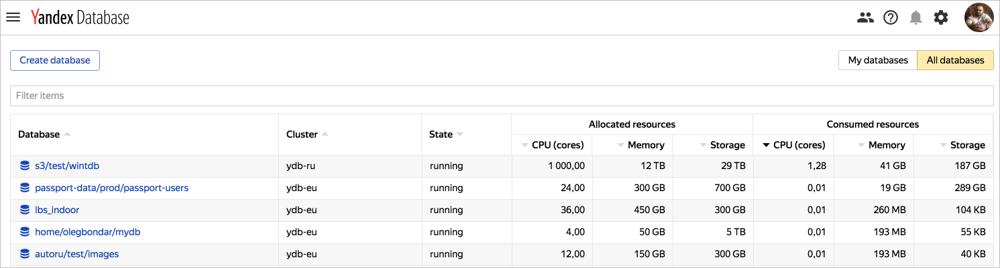

# Управление базами данных



## Создать базу данных {#create-db}

1. Перейдите в [консоль управления](https://ydb.yandex-team.ru) и нажмите кнопку **Create database**.

    

1. Настройте параметры базы в диалоговом окне:

    1. Кластер (cluster). Доступен выбор однодатацентровых (`ydb-vla`, `ydb-sas`, `ydb-man`, `ydb-myt`) и многодатацетровых кластеров (`ydb-ru`, расположенный в датацентрах VLA-SAS-MYT, и `ydb-eu`, расположенный в датацентрах VLA-SAS-MAN).

    

    В текущей инсталляции {{ ydb-short-name }} доступен кластер `ydb-ru`, расположенный в датацентрах VLA-SAS-MYT.

    

    1. **Аккаунт**. Если вы только начинаете работать с сервисом {{ ydb-short-name }} и аккаунта вашего проекта еще нет, заполните, [форму](https://st.yandex-team.ru/createTicket?template=1911&queue=KIKIMR) для создания аккаунта. Если вы хотите попробовать создать личную БД для тестирования, воспользуйтесь аккаунтом *home*.

    1. **Директория**. Выберите директорию из списка существующих директорий выбранного аккаунта или создайте новую. Если вы выбрали аккаунт *home*, автоматически будет создана директория с вашим именем пользователя. Название директории регистрозависимое, должно начинаться с латинской буквы, дальше допустимы буквы латинского алфавита, цифры, подчеркивание '_' и дефис '-'.

    1. **Имя**. На имя базы данных накладываются те же ограничния, что и на название директории.

    1. **Вычислительные ресурсы**. Тип и количество вычислительных ресурсов (compute units).

    1. **Политика распределения**. Политику распределения вычислительных ресурсов между датацентрами (distribution policy) для многодатацентровых кластеров. Возможные варианты:

        * *auto* — вычислительные ресурсы будут расположены в доступных датацентрах, в случае выхода из строя датацентра переедут в оставшиеся доступные датацентры;
        * *in one DC* — вычислительные ресурсы будут расположены в одном датацентре, в случае его выхода из строя переедут в другой датацентр, но также будут располагаться в пределах одного датацентра;
        * *uniform distribution* — вычислительные ресурсы равномерно распределены по датацентрам, в случае выхода из строя одного из датацентров, переезжают в оставшиеся датацентры.

    1. **Группы хранения**. Тип и количество групп хранения. Каждой группе хранения соответствует определенная схема хранения, влияющая на количество используемых дисков, модель отказа и коэффициент избыточности. Для однодатацентровых кластеров обычно используется схема ``block4-2``, при которой группа хранения расположена на 8 дисках в 8 стойках, переживает отказ любых двух дисков и дает избыточность с коэффицентом 1.5. В мультидатацентровых кластерах используется схема ``mirror3dc``, где в группе хранения задействовано 9 дисков, расположенных по 3 в трех датацентрах, выдерживает отказ датацентра и диска в любом другом датацентре, дает избыточность с коэффицентом 3. Группа хранения может состоять из накопителей, относящихся к одному из следующих типов: SATA HDD, SATA SSD.

    

    В текущей инсталляции {{ ydb-short-name }} доступены только SATA SSD накопители.

    

1. Нажмите на кнопку **Create** для создания базы данных с указанными параметрами.

Пример формы создания базы данных:


## Посмотреть список баз данных {#db-list}

Для просмотра списка баз данных зайдите на главную страницу [вeб-интерфейса](https://ydb.yandex-team.ru).
На странице появится список созданных БД. Для каждой базы указаны полное имя БД, расположение (кластер), количество зарезервированных под БД ресурсов и количество используемых ресурсов.



## Создать базу данных требуемого размера {#create-custom-db}

В настоящее время создание БД отличающихся размером от доступного по умолчанию в интерфейсе, выполняется администратором системы.
Для изменения параметров создаваемой  БД следует заполнить [форму](https://st.yandex-team.ru/createTicket?template=2082&queue=YDBREQUESTS).

## Изменить параметры базы данных {#change-db-params}

В настоящее время изменение параметров БД выполняется администратором системы.
Для изменения параметров БД следует заполнить [форму](https://st.yandex-team.ru/createTicket?template=1918&queue=YDBREQUESTS).

## Удалить базу данных {#delete-db}

В настоящее время удаление БД выполняется администратором системы.
Для удаления БД следует заполнить [форму](https://st.yandex-team.ru/createTicket?template=1919&queue=YDBREQUESTS).





## Посмотреть список баз данных {#db-list}

Для просмотра списка баз данных зайдите на главную страницу консоли управления **Базы данных**.
На странице появится список созданных БД. Для каждой базы указаны полное имя БД и [статус ВМ](../../compute/concepts/vm-statuses.md).

## Как сделать запрос к базе данных {#db-query}

Чтобы сделать запрос к базе данных:

1. Выберите базу данных на главной странице консоли управления.

1. Нажмите кнопку **SQL-запрос** в правом верхнем углу. Откроется страница **Корневая папка**. В поле **Запрос**  осуществляются запросы к базе данных.

1. Введите запрос. Например, чтобы создать новую таблицу, скопируйте следующий запрос:

    ```
    CREATE TABLE series
    (
        series_id Uint64,
        title Utf8,
        series_info Utf8,
        release_date Uint64,
        PRIMARY KEY (series_id)
    );
    ```

1. Нажмите кнопку **Выполнить**. Новая таблица *series* и имя владельца таблицы отобразятся в поле слева. Если навести курсор на таблицу и кликнуть на значок <svg viewBox="0 0 24 24" width="18" height="18" fill="#26a"><path id="icon.info" d="M11,9H13V7H11M12,20C7.59,20 4,16.41 4,12C4,7.59 7.59,4 12,4C16.41,4 20,7.59 20,12C20,16.41 16.41,20 12,20M12,2A10,10 0 0,0 2,12A10,10 0 0,0 12,22A10,10 0 0,0 22,12A10,10 0 0,0 12,2M11,17H13V11H11V17Z"></path></svg> справа от таблицы, в левом нижнем углу экрана отобразится схема таблицы.

