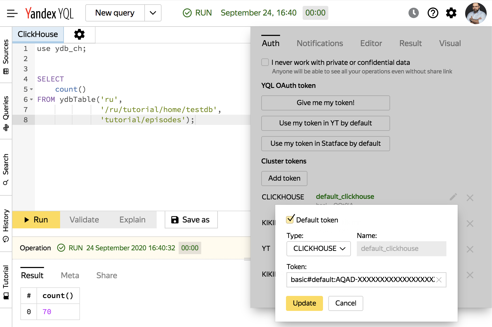

# ClickHouse over YDB

В этом разделе приведены инструкции для выполнения аналитических запросов с помощью ClickHouse over YDB.

В настоящее время YDB оптимизирована для OLTP-нагрузки. Используемый в YDB подход детерминистических транзакций имеет ограничения: когда транзакция выполняется на шарде, то все данные, необходимые для этой транзакции, должны находиться в памяти. Из-за этого ограничения проблематично сделать запрос по широкому диапазону ключей к большой таблице. Скорее всего подобный запрос будет отклонён из-за превышения ограничений на суммарный размер результата чтения.

Для выполнения ad hoc аналитических запросов на OLTP-данных мы представляем вам экспериментальную функицональность - ClickHouse over YDB. ClickHouse over YDB позволяет выполнять аналитические ReadOnly-запросы над таблицами в YDB фактически без ограничения на их размер. В текущей реализации чтение таблиц происходит с уровнем изоляции Read Committed, но скоро появится возможность сделать консистентный снапшот всех таблиц запроса перед началом сканов.

## Принцип работы

Для поддержки запросов из ClickHouse в YDB добавлен специальный API, который позволяет:

* сканировать шарды таблицы, выдавая блоки данных, содержащие только запрошенные колонки; при этом данные формируются и выдаются в формате ClickHouse для того, чтобы избежать лишних конвертаций данных;
* запрашивать месторасположение шардов таблицы, чтобы отправлять запросы сканирования данных непосредственно на ноды с данными и избегать лишних пересылок по сети внутри YDB.

 ClickHouse over YDB запущен на отдельном кластере и представляет собой stateless-сервис, который умеет обращаться за данными в YDB и выполнять запросы распараллеливая обработку данных по нодам этого кластера. При выполнении запроса ClickHouse запрашивает метаданные о шардах и их граничных ключах для таблиц, участвующих в запросе. По этим метаданным делается partition pruning, отбрасывающий шарды, которые не содержат строк подходящих под условие WHERE. Для оставшихся шардов делаются подзапросы с фильтрациями и предагрегацииями, которые выполняются параллельно на нодах кластера ClickHouse, и высылают промежуточные результаты на одну агрегирующую ноду.

## Как воспользоваться

### Кластеры

#### ydb-clickhouse.yandex.net
* главный общедоступный кластер ClickHouse Over YDB;
* доступны стандартные порты **9000** (CH native protocol) и **8123** (HTTP);
* для использование через [YQL UI](https://yql.yandex-team.ru/) нужно создать запрос в синтаксисе ClickHouse и в запросе добавить ```use ydb_ch;```.

#### ydb-clickhouse-prestable.yandex.net
* престейбл кластер, содержит свежие версии кода и может быть нестабилен, предназначен для тестирования ClickHouse over YDB;
* доступны стандартные порты **9000** (CH native protocol) и **8123** (HTTP);
* для использование через [YQL UI](https://yql.yandex-team.ru/) нужно создать запрос в синтаксисе ClickHouse и в запросе добавить ```use ydb_ch_pre;```.

### Кластеры в {{ yandex-cloud }}
Доступ к данным в {{ yandex-cloud }} ограничен и возможен только через [бастион](https://wiki.yandex-team.ru/cloud/security/services/bastion/).
Кластеры в облаке разделены, поэтому данные из препрод облака доступны только через препрод кластер ClickHouse Over YDB, данные из прод облака - только через прод кластер.



[Бастион](https://wiki.yandex-team.ru/cloud/security/services/bastion/) – это сервис для аудирования и контроля доступа к данным.
Для пользователя это прозрачный HTTPS прокси.
Бастион не позволяет использовать порт **9000** (CH native protocol). Для работы с ClickHouse over YDB в {{ yandex-cloud }} необходимо передавать в заголовках запроса [OAuth-токен](https://ydb.yandex-team.ru/docs/getting_started/start_auth#get_oauth_token). 

 

Пример запроса к кластеру clickhouse over ydb в препроде {{ yandex-cloud }}, возвращающий список YDB кластеров
```bash
TOKEN="$(cat ~/.yql/token)";
curl -H "Authorization: OAuth $TOKEN" \
 https://kikhouse.svc.kikhouse.bastion.cloud-preprod.yandex-team.ru/ \
 -d "SELECT * FROM system.ydb_clusters format Pretty"
```

#### kikhouse.svc.cloud.yandex.net
* ClickHouse Over YDB для прода {{ yandex-cloud }};
* доступ осуществляется через L7 bastion — **kikhouse.svc.kikhouse.bastion.cloud.yandex-team.ru:443** (HTTPS);

#### kikhouse.svc.cloud-preprod.yandex.net
* ClickHouse Over YDB для препрода {{ yandex-cloud }};
* доступ осуществляется через L7 bastion — **kikhouse.svc.kikhouse-preprod.bastion.cloud.yandex-team.ru:443** (HTTPS);

### Обращение к таблицам YDB
Обращение к таблицам YDB в запросах к ClickHouse over YDB осуществляется при помощи табличной функции:

```sql
ydbTable(cluster_name, database_name, relative_table_path)
```

* cluster_name - наименование кластера.
    * ```ru-prestable``` для кластера ydb-ru-prestable
    * ```ru``` для кластера ydb-ru
    * ```eu``` для кластера ydb-eu

* database_name - базы данных, например ```/ru-prestable/home/olegbondar/testdb```
* relative_table_path - относительный путь к таблице в базе данных, например ```hits_100m_obfuscated```


### Контроль доступа

Контроль доступа к данным осуществляет непосредственно YDB на основе проброшенного через ClickHouse токена. Для работоспособности данного механизма необходимо настроить проброс токена через параметр password для протокола ClickHouse или через Authorization-заголовок для HTTP. Контроль [прав доступа](../concepts/iam#avtorizaciya) к таблицам YDB работает так же, как и при доступе к данным через OLTP-запросы.

### Стандартный клиент ClickHouse

Пример запроса через стандартный клиент ClickHouse:

```bash
$ echo "
 SELECT count(*) AS cnt
 FROM ydbTable('ru-prestable', '/ru-prestable/home/olegbondar/testdb', 'hits_100m_obfuscated')" \
 | clickhouse client -h ydb-clickhouse.yandex.net --password "$(cat ~/.yql/token)"
```

### HTTP

Пример запроса через HTTP:

```bash
$ TOKEN="$(cat ~/.yql/token)";
$ curl -H "Authorization: Basic $(printf 'default:%s' "$TOKEN" | base64)" \
 http://ydb-clickhouse.yandex.net:8123/ \
 -d "SELECT count(*) AS cnt FROM ydbTable('ru-prestable', '/ru-prestable/home/olegbondar/testdb', 'hits_100m_obfuscated')"
```

### HTTPS L7 bastion

Пример запроса в {{ yandex-cloud }} через L7 bastion:
```bash
$ TOKEN="$(cat ~/.yql/token)";
$ curl -H "Authorization: OAuth $TOKEN" \
 https://kikhouse.svc.kikhouse.bastion.cloud-preprod.yandex-team.ru/ \
 -d "SELECT * FROM ydbTable('pre-prod_global', '/pre-prod_global/ycloud', '.sys/top_queries_by_duration_one_hour') order by Duration desc limit 3"
```

### YQL UI

Для того, чтобы выполнить запросы к кластеру ydb-ru через [YQL UI](https://yql.yandex-team.ru/) нужно создать запрос в синтаксисе ClickHouse, добавить свой токен в качестве токена по-умолчанию (```default_token```) для ClickHouse с префиксом "```basic#default:```", а в запросе добавить ```use ydb_ch;```.



<small>Рисунок 1 — Выполнение запроса ClickHouse over YDB с помощью [YQL UI](https://yql.yandex-team.ru/)</small>

## Дополнительные возможности

В одном запросе через ClickHouse over YDB можно обращаться к таблицам из разных баз YDB:

```bash
$ echo "
 SELECT '/home/davenger', count()
 FROM ydbTable('ru-prestable', '/ru-prestable/home/davenger/mydb', 's3_with_ext_blols/ListingObjects')
 UNION ALL
 SELECT '/home/olegbondar', count()
 FROM ydbTable('ru-prestable', '/ru-prestable/home/olegbondar/mydb', 'mobile_sorted_medium_compressed')" \
  | clickhouse client -h ydb-clickhouse.yandex.net --password=$(cat ~/.yql/token)
/home/davenger  268948
/home/olegbondar        629965802
```




1. Аналитические запросы над базой, в которую идёт OLTP-нагрузка, могут повлиять на её производительность, привести к деградации latency запросов основной нагрузки. В качестве антипримера можно привести попытку раз в секунду выполнять ```SELECT count(*)``` на большой таблице, чтобы вывести это на график.
2. Существуют ограничения на размер джойнов, которые можно выполнить - они должны помещаться в память одной ноды ClickHouse.
3. Для выполнения аналитических запросов предоставляется один общий кластер ClickHouse для всех пользователей YDB. Его ресурсы ограничены, и тяжелые запросы могут мешать запросам других пользователей, выполняемых на этом кластере.



