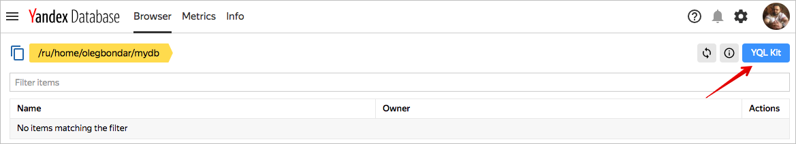
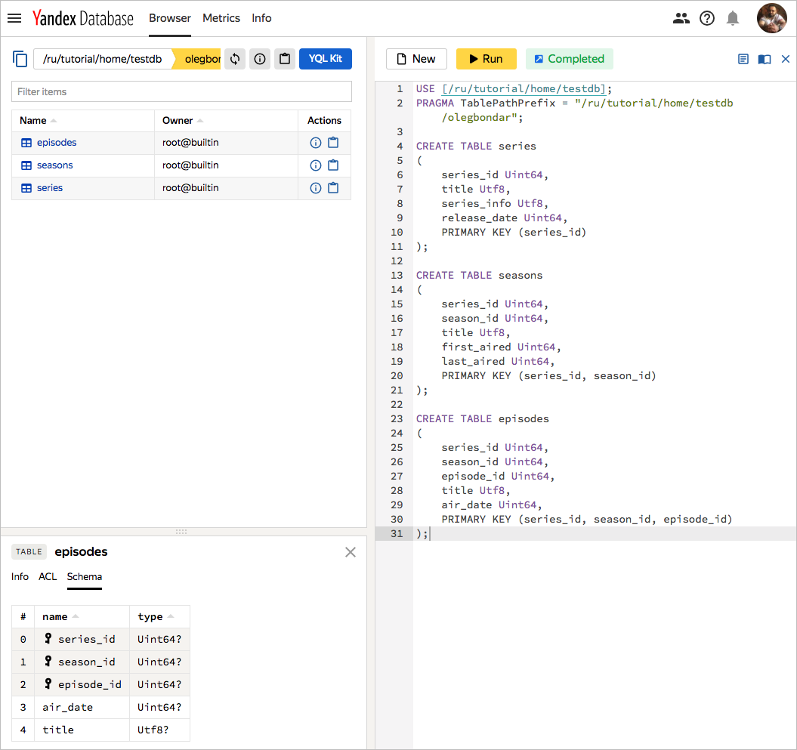

# Работа со схемой

В этом разделе описана работа со схемой YDB при помощи языка [YQL](https://yql.yandex-team.ru/docs/ydb/). Вы узнаете как создавать и модифицировать таблицы в базе данных, а также как работать с директориями. Так как этот раздел является введением в использование языка [YQL](https://yql.yandex-team.ru/docs/ydb/), в нем используются только базовые конструкции и малая часть параметров.

YQL запросы могут быть отправлены для выполнения в YDB следующими способами:

* из приложения, написанного с использованием YDB SDK для [C++](start_cpp.md), [Java](start_java.md), [Python](start_python.md);
* при помощи [YQL](https://yql.yandex-team.ru/) интерфейса;
* с помощью встроенного в [веб-интерфейс](https://ydb.yandex-team.ru) YQL Kit.

Для выполнения инструкций языка YQL в этом разделе будет использоваться встроенный в [веб-интерфейс](https://ydb.yandex-team.ru) YQL Kit.





Руководство по работе со схемой YDB при помощи [YQL](https://yql.yandex-team.ru/docs/ydb/) можно пройти в веб-интерфейсе [https://yql.yandex-team.ru/Tutorial/](https://yql.yandex-team.ru/Tutorial/ydb_01_Create_demo_tables).



## Предварительные требования
Для выполнения запросов из этого раздела понадобится база данных. Подробно о создании и управлении базой данных написано в разделе ["Базы данных — создание и управление"](create_manage_database.md).

## Создание таблицы

Чтобы создать таблицу, нужно указать имя таблицы, имена и типы данных для каждого столбца таблицы и перечислить столбцы, формирующие первичный ключ. Первичный ключ в таблицах YDB является обязательным. Каждый столбец в YDB может содержать значение NULL. При попытке создать таблицу с уже существующим именем, не будет произведено никакого действия.



Подробнее о модели данных и схему YDB написано в разделе [Модель данных и схема](../concepts/datamodel.md).<br>Список типов данных и ссылки на их описание см. в разделе [Типы данных](https://cloud.yandex.ru/docs/ydb/oss/public/develop/concepts/datatypes).



В окне редактора запросов введите и выполните следующий код, чтобы создать простую таблицу series. Столбцы таблицы имеют имена series_id, title, series_info и release_date.  Столбец series_id является первичным ключом таблицы. Таблицы seasons и episodes, представленные в примере ниже, описываются аналогичным образом.

<small>Листинг 1</small>

```sql
CREATE TABLE series (
    series_id Uint64,
    title Utf8,
    series_info Utf8,
    release_date Uint64,
    PRIMARY KEY (series_id)
);

CREATE TABLE seasons (
    series_id Uint64,
    season_id Uint64,
    title Utf8,
    first_aired Uint64,
    last_aired Uint64,
    PRIMARY KEY (series_id, season_id)
);

CREATE TABLE episodes (
    series_id Uint64,
    season_id Uint64,
    episode_id Uint64,
    title Utf8,
    air_date Uint64,
    PRIMARY KEY (series_id, season_id, episode_id)
);
```

С помощью [web-интерфейса YDB](https://ydb.yandex-team.ru) можно убедиться, что таблицы были созданы.



### Группы колонок

Колонки одной таблицы  в YDB можно объединять в группы. Для каждой группы колонок можно задать следующие параметры:

* `DATA` — тип хранилища для данных колонок этой группы. Допустимые значения: ```"ssd"```, ```"hdd"```.
* `COMPRESSION` — кодек сжатия данных. Допустимые значения: ```"off"```, ```"lz4"```.

По умолчанию все колонки находятся в одной группе с именем ```default```.  При желании, параметры этой группы тоже можно переопределить.

В примере ниже для создаваемой таблицы добавляется группа колонок ```family_large``` и устанавливается для колонки ```series_info```, а также переопределяются параметры для группы ```default```, которая по умолчанию установлена для всех остальных колонок.

Расширенные настройки можно указать только в версии YQL v1. Т.к. на многих кластерах по умолчанию еще используется версия v0, первой строчкой каждого YQL-запроса следует указывать `--!syntax_v1`.

<small>Листинг 2</small>

```sql
CREATE TABLE series_with_families (
    series_id Uint64,
    title Utf8,
    series_info Utf8 FAMILY family_large,
    release_date Uint64,
    PRIMARY KEY (series_id),
    FAMILY default (
        DATA = "ssd",
        COMPRESSION = "off"
    ),
    FAMILY family_large (
        DATA = "hdd",
        COMPRESSION = "lz4"
    )
);
```


### Дополнительные параметры таблицы

Для таблицы можно также указать ряд специфичных для YDB параметров. При создании таблицы, используя YQL, такие параметры перечисляются в блоке ```WITH```. В общем случае команда ```CREATE TABLE``` выглядит так:

<small>Листинг 3</small>

```sql
CREATE TABLE table_name (...)
WITH (
    key1 = value1,
    key2 = value2,
    ...
)
```

Здесь key — это название параметра, а value — его значение.

Например, такой код создаст таблицу с включенным автоматическим партиционированием по размеру партиции и предпочитаемым размером каждой партиции 512 мегабайт:

<small>Листинг 4</small>

```sql
CREATE TABLE series_partitionable (
    series_id Uint64,
    title Utf8,
    series_info Utf8,
    release_date Uint64,
    PRIMARY KEY (series_id)
)
WITH (
    AUTO_PARTITIONING_BY_SIZE = ENABLED,
    AUTO_PARTITIONING_PARTITION_SIZE_MB = 512
);
```

В таблице 1 приведены имена всех настроек таблицы для YDB.

<small>Таблица 1 — имена настроек таблицы для YDB</small>

| Имя параметра                                | Описание                                                     | Тип    | Допустимые значения                                           | Возможность изменения | Возможность сброса |
| -------------------------------------------- | ------------------------------------------------------------ | ------ | ------------------------------------------------------------- | --------------------- | ------------------ |
| ```COMPACTION_POLICY```                      | Название предустановленного набора настроек compaction для таблицы | String | ```"default"```, ```"small_table"```, ```"log_table"``` | Да                    | Нет                |
| ```AUTO_PARTITIONING_BY_SIZE```              | Режим автоматического партиционирования по размеру партиции  | Enum   | ```ENABLED```, ```DISABLED```                                 | Да                    | Нет                |
| ```AUTO_PARTITIONING_PARTITION_SIZE_MB```    | Предпочитаемый размер каждой партиции, в мегабайтах          | Uint64 | Натуральные числа                                             | Да                    | Нет                |
| ```AUTO_PARTITIONING_MIN_PARTITIONS_COUNT``` | Минимальное количество партиций, при достижении которого перестаёт работать автоматическое слияние партиций | Uint64 | Натуральные числа | Да                 | Нет                |
| ```AUTO_PARTITIONING_MAX_PARTITIONS_COUNT``` | Максимальное количество партиций, при достижении которого перестаёт работать автоматическое разделение партиций | Uint64 | Натуральные числа | Да             | Нет                |
| ```UNIFORM_PARTITIONS```                     | Начальное количество партиций для таблицы. Обязательное требование: первая колонка первичного ключа должна иметь тип Uint64 или Uint32 | Uint64 | Натуральные числа | Нет | Нет    |
| ```PARTITION_AT_KEYS```                      | Граничные значения ключей для разделения на партиции. Представляется списком граничных значений, разделенных запятыми и обрамленными в скобки. Каждое граничное значение может быть либо набором значений ключевых колонок (также разделенных запятыми и обрамленными в скобки), либо единичным значением, если указываются только значения первой ключевой колонки. Примеры: ```(100, 1000)```, ```((100, "abc"), (1000, "cde"))``` | Expression | | Нет | Нет |
| ```KEY_BLOOM_FILTER```                       | Использование [фильтра Блума](https://en.wikipedia.org/wiki/Bloom_filter) по ключу | Enum   | ```ENABLED```, ```DISABLED```           | Да                    | Нет                |
| ```READ_REPLICAS_SETTINGS```                 | Настройка читающих реплик. ```PER_AZ``` означает использование указанного количества реплик в каждом AZ, ```ANY_AZ``` — во всех AZ суммарно. | String | ```"PER_AZ:<count>"```, ```"ANY_AZ:<count>"``` где ```<count>``` — число реплик | Да | Нет |
| ```TTL```                                    | Настройка [Time to Live (TTL)](../concepts/ttl.md)                         | Expression | ```Interval("<literal>") ON <column>```                   | Да                    | Да                 |

## Изменение структуры таблицы

При помощи команды ```ALTER TABLE``` можно изменить состав колонок и дополнительные параметры таблицы. В одной команде можно указать несколько действий. В общем случае команда ```ALTER TABLE``` выглядит так:

<small>Листинг 5</small>

```sql
ALTER TABLE table_name action1, action2, ..., actionN;
```

```action``` — это любое действие по изменению таблицы (см. примеры ниже).

### Изменение состава колонок

YDB поддерживает возможность добавлять столбцы в таблицу, а также удалять неключевые колонки из таблицы.

```ADD COLUMN``` — добавляет столбец с указанными именем и типом. Приведенный ниже код добавит к таблице ```episodes``` столбец ```is_deleted``` с типом данных ```Bool```.

<small>Листинг 6</small>

```sql
ALTER TABLE episodes ADD COLUMN is_deleted Bool;
```

```DROP COLUMN``` — удаляет столбец с указанным именем. Приведенный ниже код удалит столбец ```is_deleted``` из таблицы ```episodes```.

<small>Листинг 7</small>

```sql
ALTER TABLE episodes DROP column is_deleted;
```

### Добавление или удаление вторичного индекса

```ADD INDEX``` — добавляет индекс с указанным именем и типом для заданного набора колонок. Приведенный ниже код добавит глобальный индекс с именем ```title_index``` для колонки ```title```.

<small>Листинг 8</small>

```sql
ALTER TABLE `series` ADD INDEX `title_index` GLOBAL ON (`title`);
```

Удаление индекса:

<small>Листинг 9</small>

```DROP INDEX``` — удаляет индекс с указанным именем. Приведенный ниже код удалит индекс с именем ```title_index```.

```sql
ALTER TABLE `series` DROP INDEX `title_index`;
```

### Изменение групп колонок

```ADD FAMILY``` — создаёт новую группу колонок в таблице. Приведенный ниже код создаст в таблице ```series_with_families``` группу колонок ```family_small```.

<small>Листинг 10</small>

```sql
ALTER TABLE series_with_families ADD FAMILY family_small (
    DATA = "ssd",
    COMPRESSION = "off"
);
```

При помощи команды ```ALTER COLUMN``` можно изменить группу колонок для указанной колонки. Приведенный ниже код для колонки ```release_date``` в таблице ```series_with_families``` сменит группу колонок на ```family_small```.

<small>Листинг 11</small>

```sql
ALTER TABLE series_with_families ALTER COLUMN release_date SET FAMILY family_small;
```

Две предыдущие команды из листингов 8 и 9 можно объединить в один вызов ```ALTER TABLE```. Приведенный ниже код создаст в таблице ```series_with_families``` группу колонок ```family_small``` и установит её для колонки ```release_date```.

<small>Листинг 12</small>

```sql
ALTER TABLE series_with_families
	ADD FAMILY family_small (
    	DATA = "ssd",
    	COMPRESSION = "off"
	),
	ALTER COLUMN release_date SET FAMILY family_small;
```

При помощи команды ```ALTER FAMILY``` можно изменить параметры группы колонок. Приведенный ниже код для группы колонок ```default``` в таблице ```series_with_families``` сменит тип хранилища на ```hdd```:

<small>Листинг 13</small>

```sql
ALTER TABLE series_with_families ALTER FAMILY default SET DATA "hdd";
```

### Изменение дополнительных параметров таблицы

Большинство параметров таблицы в YDB можно изменить командой ```ALTER```. В таблице 1 представлен полный список поддерживаемых параметров, где в предпоследнем столбце отражена возможность их изменения.

В общем случае команда для изменения любого параметра таблицы выглядит следующим образом:

<small>Листинг 14</small>

```sql
ALTER TABLE table_name SET (key = value);
```

```key``` — имя параметра, ```value``` — его новое значение.

Например, такая команда выключит автоматическое партиционирование таблицы:

<small>Листинг 15</small>

```sql
ALTER TABLE series SET (AUTO_PARTITIONING_BY_SIZE = DISABLED);
```

### Сброс дополнительных параметров таблицы

Некоторые параметры таблицы в YDB можно сбросить командой ```ALTER```. В таблице 1 представлен полный список поддерживаемых параметров, где в последнем столбце отражена возможность их сброса.

Команда для сброса параметра таблицы выглядит следующим образом:

<small>Листинг 16</small>

```sql
ALTER TABLE table_name RESET (key);
```

```key``` — имя параметра.

Например, такая команда сбросит (удалит) настройки TTL для таблицы:

<small>Листинг 17</small>

```sql
ALTER TABLE series RESET (TTL);
```

### Просмотр информации о таблице

Просмотр информации о таблице в текущей версии возможен только через SDK и [YDB CLI](../getting_started/ydb_cli.md).

Самым простым и быстрым способом является CLI (команда ```scheme describe```).  Но для автоматизации процессов лучше использовать SDK.


## Удаление таблицы

DROP TABLE — удаляет указанную таблицу. Если таблицы с таким именем не существует, возвращается ошибка. Приведенный ниже код вернет ошибку ```Table not found```, так как мы не создавали таблицу ```actors```.

<small>Листинг 18</small>

```sql
DROP TABLE actors;
```

### Работа с директориями

Создание и удаление директорий в текущей версии возможно только через SDK и [YDB CLI](../getting_started/ydb_cli.md). SDK предоставляет методы создания, удаления, листинга и просмотра информации о директории. В таблице 2 приведены имена методов в SDK для [С++](https://a.yandex-team.ru/arc/trunk/arcadia/kikimr/public/sdk/cpp/client/ydb_scheme.h), [Java](https://a.yandex-team.ru/arc/trunk/arcadia/kikimr/public/sdk/java/table/src/SchemeClient.java) и [Python](https://a.yandex-team.ru/arc/trunk/arcadia/kikimr/public/sdk/python/client/scheme.py).

<small>Таблица 2 — имена методов для работы с директориями в SDK</small>

| Метод    | С++ | Java | Python |
| :--- |:---| :--- | :--- |
| Создание директории | ```TClient::MakeDirectory``` | ```SchemeClient.makeDirectory``` | ```scheme_client.make_directory``` |
| Удаление директории | ```TClient::RemoveDirectory``` | ```SchemeClient.removeDirectory``` | ```scheme_client.remove_directory``` |
| Просмотр информации о директории  | ```TClient::DescribePath``` | ```SchemeClient.describePath``` | ```scheme_client.describe_path``` |
| Листинг директории  | ```TClient::ListDirectory``` | ```SchemeClient.listDirectory``` | ```scheme_client.list_directory``` |
