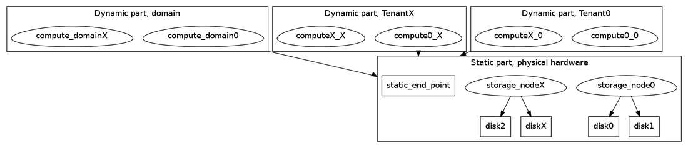

### Как видим идеальную систему
В общих словах это большая инсталляция кикимр кластера, которая обслуживает нескольких пользователей с разными характерами нагрузки, предоставляет им разные гарантии производительности. Кластер расширяется по мере увеличения количества или размера пользователей. Пользователи изолированны друг от друга как по данным так и по производительности/ресурсам.

### Какие вообще есть варианты решения
Изоляция внутри приложения.
Это один из вариантов, который мы долго и не рассматривали. Делать разделение пользователей внутри приложения. То есть все задачи по изоляции решать самим. Это сложно. Но в некоторых местах системы нам придется это делать.

Изоляция вне приложения.
Другой вариант это использовать изоляцию на уровне ОС. Это либо разные процессы, либо разные VM на хосте, обслуживают разных пользователей. Выделять разные хосты пользователем нецелесообразно, это уже больше про однопользовательский режим -- каждому по кластеру.

### Как мы хотим решить задачу
Мы разделяем задачу на две. Место и процессинг. Пользователям нужно предоставить определенный обьем диска и его производительность. И предоставить вычислительные ресурсы (cpu mem) для проведение запросов/транзакций к системе.

#### Картинка для ориентации


#### Место
Хотим всех селить на общие диски. С дисками будем делать внутреннюю изоляцию. Над дисками будет работать планировщик, который знает про наличие тенантов и старается учесть их настройки. Он обеспечивает заданную пропускную способность для пользователя.
Так же будет возможность добавить хостов с дисками в кластер. Добавление хостов требует внимания администратора. Это выделение статических node-Id и привязывание их к физическому железу, дорисовывать конфиг нужно.

#### Процессинг
Вычислительные ресурсы шарить не планируем. В этом месте планируем использовать изоляцию вне приложения. Тут я расскажу подробнее. Именно этим я и занимаюсь.

###### Ресурсы
Нужно перечислить куда и сколько тратим ресурсов на пользовательские запросы.
Пользовательский запрос прилетает на машинку, **end-point**, обычно это grpc сервер. Это первое место для оценки потребляемых ресурсов -- end-point. Далее запрос рассылается таблеткам на выполнение. В зависимости от запроса, это могут быть разные таблетки и делать они могут разные вещи. Поэтому имеем второе место для оценки -- **tablets**.
####### end-point
  Cpu. Значительные затраты на компиляцию запроса.
  Mem. Небольшой кеш схем таблиц.
####### tablets
Таблеток много разных, так что пройдем по типам.



- Allocator

  Для всех пользователей используются общие доменные таблетки аллокации TxId с дисками в статической группе.
  **Cpu** Незначительно, O(Nodes). На каждой ноде сервис TxProxy арендует диапазон TxId по мере необходимости.
  **Mem** Незначительно, кеш локальной базы, который O(1).

- Coordinator

  Персональные таблетки. Количество задается при регистрации тенанта. Обычно 3 шт. Диски в динамической группе, выделенной тенанту. Особенности -- постоянно пишет в диск. Сохраняет текущий PlanStep даже если не было транзакций, это можно рассматривать, как продвижение времени на кластере.
  **Cpu** Незначительно, пересортировка/перегруппировка транзакций по PlanStep O(TxInFly).
  **Mem** Незначительно, кеш локальной базы который O(TxInFly)

- Mediator

  Персональные таблетки. Количество задается при регистрации тенанта. Обычно 3 шт. Особенности -- с диска читает конфигурацию на старте, потом не использует. Нужно для оптимизации общения координаторов с шардами. Сокращает количество пайпов в системе.
  **Cpu** Незначительно, группировка транзакций по дата шардам внутри одного PlanStep. O(TxInFly) * O(DataShardsInFly)
  **Mem** Незначительно, кеш локальной базы который O(1) + пайпы на шарды O(DataShardsInFly).

- SchemeShard

  В планах сделать эту таблетку персональной. Поэтому буду описывать сразу планируемый вариант. <span style="color:red;">Он еще не реализован в таком виде.</span>
  Корневой SchemeShard уникален и хранит дерево путей домена, некоторые поддеревья представлены как ссылки на вложенные SchemeShard'ы. SchemeShard координирует и проводит операции над схемами таблиц и деревом путей. Каждый пользователь при регистрации получает свой собственный SchemeShard, который является вложенным в доменный. Это и есть корневой путь для пользователя, куда он имеет доступ. Пользователь может создавать дополнительные SchemeShard'ы у себя в поддереве путей при необходимости для распределения схемных запросов на несколько SchemeShard'ов.
  **Cpu** В основном SchemeShard отвечает на запрос DescribePath. Сам по себе он не тяжелый, но их может быть много. При каждом запросе к нему обращаются c запросом DescribePath и иногда даже по несколько раз. И того O(TxInFly).
  **Mem** Кеш локальной базы и индексы вдоль и поперек, это O(SchemaTxInFly) + O(AlivePath) + O(AliveDataShard). Конкретно сейчас не удаляются пути из базы, просто помечаем их удаленными, они висят в памяти. Думаю, будем удалять.

- Hive

  В планах сделать эту таблетку персональной. Поэтому буду описывать сразу планируемый вариант. <span style="color:red;">Он еще не реализован в таком виде.</span>
  Корневой Hive создает доменные таблетки и Hive для пользователя. Далее все таблетки пользователя создает и запускает персональный Hive.
  К Hive'у обращаются за созданием и удалением таблетки, он реагирует на подключение/отключение нод и переносит таблетки. Так же он собирает статистику с таблеток.
  **Cpu** O(Nodes) + O(DataShard)
  **Mem** O(Nodes) + O(DataShard)

- BSController

  Что-то ничего не могу про него сказать про эту таблетку. Кроме того что она уникальна для домена и используется всеми. Он отвечает за конфигурации групп дисков. Вроде не сильно тяжелая таблетка, она всем рассказывает о этих самых конфигурациях.

- DataShard

  Таблетка которая хранит часть данных таблицы. Количество таблеток DataShard'ов в таблице пропорционально размеру данным в таблице, если включен автосплит. Все таблетки DataShard в таблицах пользователя принадлежат пользователю, то есть они персональные. Это такая таблетка ниндзя. Она участвует в запросах к таблицам. Точечные чтения и записи, координированные транзакции чтения и записи, схемные операции над таблицами: alter схемы, copy, split/merge. Чтение аля stream. Блокировки в многоступенчатой оптимистичной транзакции. Это все она. Таблетки DataShard в запросе не только выдают данные на запрос, но и рассылают данные друг другу. Поэтому тут потребление Cpu и Mem зависит и от размера таблицы и от самого запроса. Строгой формулы тут нет.
  **Cpu** Значительно
  **Mem** Значительно



###### Изоляция
После того как мы описали какие ресурсы мы тратим и где. Можно говорить о том, как их изолировать. Тут мы используем внешнюю изоляцию. У пользователя будут свои персональные инстансы, запущенные с некоторыми ограничениями по cpu и mem, например, запущенные на виртуальной машине. Этот инстанс параметризован конкретным идентификатором пользователя еще на старте и точно знает для кого работает.
К end-point'ам на этих хостах есть доступ только у пользователя-владельца.
На инстансах пользователя запускаются только персональные таблетки этого пользователя. Нигде больше персональные таблетки пользователя не запускаются.
Отсюда получаем, что по cpu и mem пользователи конфликтовать не должны. Вычислительные ресурсы пользователя это  ресурсы виртуальных машин с запущенными внутри инстансами кикимра.

### Что и как уже работает
Если раньше были абстрактные разговоры о модели. То здесь хочу в деталях что и как.
Так же будут ссылки на таски/статьи на эту тему. Вот они.
* Костя поднял первый кластер с разделением ролей storage и compute у нод. https://st.yandex-team.ru/KIKIMR-3729[ --Протестировать возможность запуска kikimr-compute и kikimr-storage-- ]( komels )
* Андрей об особенностях деплоя мультитенантного кикимра https://clubs.at.yandex-team.ru/ycp/101

#### Роли в кластере
Раньше кластер у нас был однородный. Теперь нет. В нем появились роли. storage-node, compute-node. Причем compute-node нода привязана к конкретному пользователю. Сам домен является также пользователем со своими набором compute-node. Можно даже отождествить домен с пользователем администратор. Потому что никто кроме администратора не сможет делать операции прям в домене. Таблетка может запускаться только на определенных compute-node, обычно на compute-node своего пользователя. Есть одно исключение: Системные таблетки (C, M, SS, H) пользователя будут запущены на compute-nod'ах домена, но только если в системе нет ни одной compute-node этого пользователя.

###### storage-node
Это инстанс кикимра который запущен на физическом железе и имеет доступ к диску. Его основная задача это работа с диском и предоставление его другим нодам в кластере. Он должен потреблять ресурсов как можно меньше. На нем не запускаются ни пользовательские ни доменные таблетки. Только те, что являются уникальными для системы в целом и запускаются бутстраппером. А это доменные SchemeShard, Coordinator, Mediator, Allocator, Hive, BsController, NodeBroker. Тут важное слово **доменные**. Эти таблетки обслуживают домен. Не пользователей.
Эти ноды нуждаются в конфигурировании через конфиг, у них есть node-Id прописанный в конфиге, который и связывает запущенный инстанс с железом. В каком-то смысле это обычные ноды кикимра без таблеток. Вот только слово обычные скоро будет иметь другой смысл.

###### compute-node
Это инстанс кикимра который не использует физическое железо. Это динамическая часть кластера, которая предоставляет ресурсы пользователю. В первую очередь это cpu и mem.
Эти инстансы не прописаны в конфиге и их подключение/отключение не требуют редактирование конфигов кластера. Но запускаются они немного по другому. В первую очередь не нужно указывать node-id. Вместо этого нужно указать grpc end-point storage кластера. Также нужно указать имя пользователя для которого предоставляются ресурсы этой ноды. compute-node сама зарегистрируется в кластере и на ней будут запущены таблетки пользователя. Именно в эти ноды будет ходить пользователь со своими запросами.

#### Как реализовано
Внутри кода используется другая терминология. Там не пользователи, там [домены](domains.md). Так как домены вложенные, то домены уровнем ниже называются [поддомены](subdomains.md). Для каждого пользователя мы создаем в дереве путей отдельный поддомен в домене. Например дерево может выглядет так
```
/root_domain
/root_domain/dir_inside_domain
/root_domain/dir_inside_domain/table_1_inside_domain
/root_domain/dir_inside_domain/table_2_inside_domain
/root_domain/subdomain_for_tenant_A
/root_domain/subdomain_for_tenant_A/dir_inside_tenant_A
/root_domain/subdomain_for_tenant_A/dir_inside_tenant_A/table_1_inside_tenant_A
/root_domain/subdomain_for_tenant_B
/root_domain/subdomain_for_tenant_B/table_1_inside_tenant_B
```
Допустим мы имеем кластер из 8 нод, все эти ноды storage-node. То мы может добавлять любое количество compute-node для пользователей
```
/root_domain
/root_domain/subdomain_for_tenant_A
/root_domain/subdomain_for_tenant_B%%
```
Причем DataShard таблетки таблиц
```
/root_domain/dir_inside_domain/table_1_inside_domain
/root_domain/dir_inside_domain/table_2_inside_domain
```
будут запушены только на compute-node пользователя `/root_domain`.
DataShard таблетки таблицы `/root_domain/subdomain_for_tenant_A/dir_inside_tenant_A/table_1_inside_tenant_A` запустятся на compute-node пользователя `/root_domain/subdomain_for_tenant_A`.
И соответственно для пользователя `/root_domain/subdomain_for_tenant_B`. При наличии рабочих compute-node у пользователя. В противном случае операции над таблицами будут не возможны, так как таблетки не будут подняты нигде.

###### создание поддомена
Это схемная операция к корневому SchemeShard'у. Заполняется протобуф TEvFlatSchemeShard::TEvModifySchemeTransaction с типом операции NKikimrFlatSchemeOp::EOperationType::ESchemeOpCreateSubDomain. Параметры операции описывает протобуф NKikimrSubDomains::TSubDomainSettings.
Все аналогично созданию директории. Поведение поддомена аналогично поддиректории в дальнейшем. Внутри можно создавать другие узлы, можно удалять, когда нет дочерних узлов. Отличие лишь в том, что для поддомена сохраняются некоторые переданные настройки и создаются и инициализируются служебные таблетки для дальнейшей работы.

###### создание поддомена руками
Работает только с mbs интерфейсом. Не разбирался почему.
```
$ cat cmd
ModifyScheme {
    WorkingDir: "/dc-1"
    OperationType: ESchemeOpCreateSubDomain
    SubDomain {
      PlanResolution: 10
      Coordinators: 3
      Mediators: 3
      Name: "ycloud_test"
      TimeCastBucketsPerMediator: 2
    }
}

./kikimr -s kikimr0530.search.yandex.net:2134 db schema execute cmd
```



- Проверка, команда describe

  ```
  $ ./kikimr -s kikimr0530.search.yandex.net:2134 db schema describe /dc-1/ycloud_test -t -P
  72075186232623600/1     <dir>      dc-1
  Self {
    Name: "dc-1"
    PathId: 1
    SchemeshardId: 72075186232623600
    PathType: EPathTypeDir
    CreateFinished: true
    CreateTxId: 1
    CreateStep: 0
    ParentPathId: 1
    PathState: EPathStateNoChanges
    Owner: "root@builtin"
    ACL: ""
    EffectiveACL: ""
  }
  Children {
    Name: "ycloud_test"
    PathId: 2
    SchemeshardId: 72075186232623600
    PathType: EPathTypeSubDomain
    CreateFinished: true
    CreateTxId: 1125899906847626
    CreateStep: 1517481160000
    ParentPathId: 1
    PathState: EPathStateNoChanges
    Owner: "root@builtin"
    ACL: ""
  }
  DomainDescription {
    SchemeShardId_Depricated: 72075186232623600
    PathId_Depricated: 1
    ProcessingParams {
      Version: 0
      PlanResolution: 100
      Coordinators: 72075186232360961
      Coordinators: 72075186232360962
      Coordinators: 72075186232360963
      TimeCastBucketsPerMediator: 2
      Mediators: 72075186232426497
      Mediators: 72075186232426498
      Mediators: 72075186232426499
    }
    DomainKey {
      SchemeShard: 72075186232623600
      PathId: 1
    }
  }

  └─ 72075186232623600/2     <unknown>  ycloud_test
  Self {
    Name: "ycloud_test"
    PathId: 2
    SchemeshardId: 72075186232623600
    PathType: EPathTypeSubDomain
    CreateFinished: true
    CreateTxId: 1125899906847626
    CreateStep: 1517481160000
    ParentPathId: 1
    PathState: EPathStateNoChanges
    Owner: "root@builtin"
    ACL: ""
    EffectiveACL: ""
  }
  DomainDescription {
    SchemeShardId_Depricated: 72075186232623600
    PathId_Depricated: 2
    ProcessingParams {
      Version: 1
      PlanResolution: 50
      Coordinators: 72075186224037888
      Coordinators: 72075186224037889
      Coordinators: 72075186224037890
      TimeCastBucketsPerMediator: 2
      Mediators: 72075186224037891
      Mediators: 72075186224037892
      Mediators: 72075186224037893
    }
    DomainKey {
      SchemeShard: 72075186232623600
      PathId: 2
    }
  }
  ```



###### создание таблиц в поддомене
Код тот же самый, что и в случае создания таблицы в домене. Но будет выбран поддоменный координатор для проведения шаренной транзакции. Так же будут созданы таблетки даташардов с привязкой к конкретному пользователю. И эти даташарды подпишутся на временя именно своего поддоменного медиатора.

###### операции в поддомене
Так же, код тот же. Особенности -- транзакция затрагивающая шарды из разных доменов/поддоменов будет отвергнута при резолве. Выбирается поддоменный координатор.

###### запуск таблеток поддомена
Hive регистрирует для таблетки привязку к пользователю. А так же для ноды региструет аналогичную привязку. Таблетка запустится на ноде, только если списки пользователей пересекаются. Причем порядок пользователей у таблетки задает приоритет запуска. Таблетка не будет запускаться на пользователе второго порядка, если есть доступные ноды пользователя первого порядка. Но для дата шардов все проще. Они привязаны только к одному пользователю. Двойная привязка есть только у системных таблеток, что бы они запустились на нодах домена, если ноды пользователя не доступны.

### Тестирование
Постараюсь ответить на вопрос. Что делать в тестах, если нужно тестировать операции из под пользователя?

##### c++ ut тесты
Примеры стоит смотреть тут ydb/core/tx/tx_proxy/proxy_ut.cpp.
Основные этапы.
1. Задаем сколько и каких нод максимально хотим в тестовом кластере.
```
        ui32 staticNodes = 2;
        ui32 dynamicNodes = 2;
        Settings = new Tests::TServerSettings(PortManager.GetPort(3534));
        GetSettings().SetNodeCount(staticNodes);
        GetSettings().SetDynamicNodeCount(dynamicNodes);
```
2. Создаем необходимые сущности
```
        Server = new Tests::TServer(GetSettings());
        Client = new Tests::TClient(GetSettings());
        Tenants = new Tests::TTenants(Server);
```
3. Создаем поддомен на схеме
```
        auto subdomain = GetSubDomainDefaultSetting("USER_0");
        Client->CreateSubdomain("/dc-1", subdomain)
```
4. Подключаем compute-node к поддомену
```
        Tenants->Run("/dc-1/USER_0", 2);
```
5. Играем дальше как хотим. Интерфейс позволяет добавлять, убирать ноды. Листать активные и тушить определенные на свой вкус.
  Интерфейс тут /kikimr/core/testlib/test_client.h класс TTenants

Как это работает под капотом.
Внутри тестового рантайма нет никаких нод. Есть плейсхолдеры для якобы нод. Это просто запись с регистрацией nodeId. Вместо нод поднимается актор TLocal. Это такое актор, который правильно здоровается с Hive, сообщая ему таблетки каких пользователей он может запускать у себя. В тестовом рантайме подключить/отключить ноду это поднять/убить актор TLocal. Tests::TTenants знает какие плейсхолдеры выделены для динамических якобы нод. Он ведет списки свободных и занятых позиций, а также помнит какому пользователю что поднял. В общем оперирует пулом nodeId, запускает правильно TLocal акторы.

##### python ut тесты
Тут все интересней и ближе к реальности. Смотреть примеры стоит здесь kikimr/ci/tests/tenants/test_tenants.py
Если у вас есть просто тест без тенантов, то превратить его в тест под тенатом можно так
1 создайте обьект представляющий динамический кластер, например так
```
        root_client = self.kikimr_cluster.client
        dynamic_cluster = tenant_cluster_factory(
            static_cluster_uris=self.kikimr_cluster.URIs,
            static_cluster_config=self.kikimr_cluster.config,
            local_nodes=2,
            cluster_nodes_multiply=1
        )
```
Это фабрика которая создаст экземпляр класса DynamicCluster.  Фабрика передает DynamicCluster где и какие инстансы можно запускать. Картеж (host, grpc-port, ...еще порты) определяется именно кодом в фабрике, DynamicCluster работает с уже определенным кортежем.
  Фабрика запускает вот столько инстансев local_nodes на локальном хосте и на каждой ноде основного кластера поднимает по cluster_nodes_multiply интсансов. Порты она придумает сама с помощью PortManager. Если кластер локальный, то все запуститься на локальном хосте.
2 создать тената на схеме
```
        tenants_operation = scheme_operations.TenantOperations(root_client)
        root_dir = root_client.scheme_root_key.path_as_string
        user_path = join(root_dir, user_name)
        tenants_operation.create_and_wait(user_path)
```
3 проверить что тенат создан.
```
        response = tenants_operation.describe(user_path)
        scheme_operations.Assertions(response)\
            .is_finished()\
            .is_tenant_root()

```
Вообще п2 и п3 могут быть одной командой create_and_wait_and_assert. Но если тенант уже существуют, то лучше валидацию сделать отдельно. Потому что создание тенанта поверх существующего (собсна как директории) завершится ошибкой. Но вне зависимости от этого, мы можем проверить, что тенат уже есть.
4 запустить ноды для пользователя. Так как будут запущены реальные процессы, то лучше использовать контекст менеджер, что бы попытаться при выходе убить процессы и не оставить мусор.
```
            with tenant_session(TenantRuntime(user_name, dynamic_cluster)) as tenant_runtime:
            pass
```
5 Дальше можно развлекаться, как хочется. Добавлять нод, удалять их, поднимать/убивать конкретных. Но что бы было все по честному, ходить нужно через свои ноды. Например так
```
            with tenant_session(TenantRuntime(user_name, dynamic_cluster)) as tenant_runtime:
            table_path = join(root_dir, user_name, 'table_0')
            table_operations = scheme_operations.TableOperations(tenant_runtime.client)
            table_operations.creation_options.add_column('key', PType.Uint32, is_key=True)
            table_operations.create_and_wait_and_assert(table_path)
```
