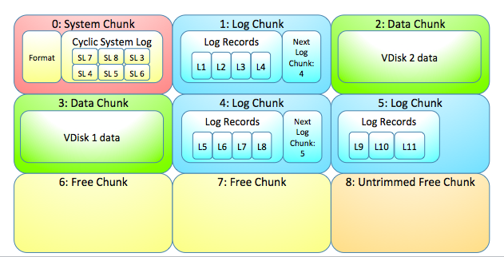
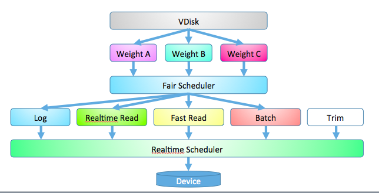

### PDisk - что это и зачем
PDisk обеспечивает надежное хранение данных на блочном устройстве. PDisk можно рассматривать как файловую систему специального назначения, обеспечивающую надежность записи, разделение полосы диска между пользователями (VDisk-ами) и файлы двух видов: Лог и Чанк. В Лог пишутся небольшие записи, которые нужно записать как можно быстрее. В Чанк пишутся большие записи. Сами чанки имеют размер 128Мб. При этом внутри Лог реализован как связный список чанков.

Пользователями PDisk-а являются VDisk-и. Один PDisk обслуживает несколько VDisk-ов, при этом он поддерживает один общий лог и один набор чанков. Чанки принадлежат разным пользователям или являются свободными.

Лог позволяет:

* записать запись в лог в привязке к идентификатору владельца (владельцем выступает VDisk),
* прочитать весь лог (данного владельца) от начала до конца,
* пометить записи с sequence number <= такой-то как ненужные.
Лог не предполагает произвольного доступа или точечного удаления объектов, а предназначен для восстановления после сбоев в работе BS. При восстановлении лог читают:
* PDisk - для понимания, кому принадлежал какой чанк,
* VDisk - для понимания, какие чанки сейчас ему принадлежат.
Если VDisk записывает в Лог PDisk-а какие-то мелкие данные, он делает это только для сохранности, но параллельно копит их в памяти, и когда накопится много, записывает в Чанк.


Чанк позволяет:

* получить чанк в пользование,
* прочитать чанк от байта M до байта N,
* записать данные в чанк (можно с начала, можно в произвольное смещение),
* пометить чанк как ненужный (освободить),
* атомарно выполнить сразу несколько операций над чанками: коммит чанка (подтверждение записи), удаление чанка. Операции записываются в лог PDisk-а.

Нулевой чанк (или несколько первых) - служебный. Используется для хранения:

* собственного идентификатора PDisk-а
* циклического лога syslog, в котором хранится адрес головы (самой старой записи) Лога PDisk, а также таблица принадлежности чанков (поскольку чанки большие и их немного, эта таблица небольшая),
* мапинга номеров пользователей на идентификаторы VDisk-ов (как записи лога?).
Когда Лог PDisk разрастается и выполняется его компакшен, в syslog пишется новая запись.



PDisk поддерживает непрерывные 64-битные индексы для записей лога VDisk-ов
Пишет
```
{ui8 owner, ui64 msn}
```
msn разных owner не зависят друг от друга.

Для каждого пользователя поддерживается msn, старше которого записи более не нужны. Чанки с никому не нужными логами освобождаются.
Сам PDisk является пользователем основного лога.

PDisk разрешает делать записи только с msn больше последнего использованного этим пользователем.

**Надежность**
Записи "формата", системного лога, сектора с указателем следующего чанка лога хранятся с тройной репликацией.
Сектора записи лога пишутся с избыточностью в режиме 4 + 1.
Сектора чанков пишутся с избыточностью 14 + 1.

**Шифрование**
Данные на диске прозрачно зашифрованы, каждый "сектор" – самостоятельно. Шифр - по сути поточный ([Salsa20/8](http://cr.yp.to/snuffle/spec.pdf), ChaCha).

### API Интерфейс PDisk-а

Записи в лог имеют Signature (тип записи).
``` cpp
ESignature {
    SignatureChunkCommit = 255
};
```
``` cpp
typedef ui8 TOwnerId;

struct TRecord {
    EReplyStatus Status;
    ui64 Lsn;
    ui64 *Cookie;
    ui8 Signature;
};
typedef yvector<TRecord> TResults;

struct TCommitRecord : TLogRecord {
    ui64 FirstLsnToKeep; // 0 == not set
    yvector<TChunkIdx> CommitChunks;
    yvector<TChunkIdx> DeleteChunks;
    bool IsStartingPoint;
};

struct TLogRecord {
    ui64 Lsn;
    THolder<TCommitRecord> CommitRecord;
    Stroka Data;
    ui8 Signature;
};

struct TReadLogResults {
    EReplyStatus Status;
    yvector<TLogRecord> LogRecords;
    ui64 Position;
    ui64 NextPosition;
    bool IsEnd)
};
```

- запрос данных для начала работы
```
TEvYardInit(const TVDiskID &vDiskId)
```
- набор информации для начала работы
``` cpp
TEvYardInitResult {
    EReplyStatus Status;
//    ui64 FirstLsn;
//    ui64 LastLsn;
    ui32 ChunkSize;
    ui32 AppendBlockSize; // we can append data blocks to chunk of size AppendBlockSize
    TOwner Owner;
    ymap<TSignature, TLogRecord> StartingPoints;
};
```

- запись в лог
``` cpp
TEvLog(TOwnerId OwnerId, ui8 signature, const Stroka &data, ui64 lsn, ui64 *cookie);
TEvLog(TOwnerId OwnerId, ui8 signature, ui64 data0, const Stroka &data, ui64 lsn, ui64 *cookie);
TEvLog(TOwnerId OwnerId, ui8 signature, ui64 data0, ui64 data1, const Stroka &data, ui64 lsn, ui64 *cookie);
TEvLog(TOwnerId OwnerId, const TCommitRecord &commitRecord, const Stroka &data, ui64 lsn, ui64 *cookie); //signature = SignatureChunkCommit
```
- результат записи в лог
``` cpp
TEvLogResult(TResults results)
```

- чтение лога
``` cpp
TEvReadLog(TOwnerId OwnerId, ui64 position /*(0 == с начала)*/, ui64 sizeLimit)
```
- результат чтения лога
``` cpp
TEvReadLogResult(TReadLogResults results)
```
- резервирование чанков (после падения чанк снова будет считаться свободным) - необходимо только если хочется заранее узнать chunkId или чтобы было выделено несколько чанков, по возможности расположенных на диске подряд.
``` cpp
TEvChunkReserve(TOwnerId OwnerId, ui32 sizeChunksб )
```
- результат резервирования чанков
``` cpp
TEvChunkReseveResult(EReplyStatus status, yvector<TChunkIdx> chunkIds)
```

- запись в чанк (новый/существующий)
``` cpp
TEvChunkWrite(TOwnerId OwnerId, TChunkIdx chunkIdx /*(0 == новый чанк)*/, ui32 offset, const Stroka &data, ui64 *cookie)

TEvChunkWrite(TOwnerId OwnerId, TChunkIdx chunkIdx /*(0 == новый чанк)*/, ui32 offset, const yvector<Stroka> &data, ui64 *cookie)
```
- результат записи в чанк
``` cpp
TEvChunkWriteResult(EReplyStatus status, TChunkIdx chunkIdx, ui64 *cookie)
```

- финализация записи с получением владения чанком(или чанками), и освобождение чанка(или чанков), освобождение лога. Операция осуществляется через запись в лог (после падения соответствующие чанки будут считаться передаными пользователю/свободными, если эта запись в логе сохранилась)
Команда осуществляется путем записи в лог с сигнатурой SignatureChunkCommit:
``` cpp
TEvLog(TOwnerId OwnerId, const TCommitRecord &commitRecord, const Stroka &data, ui64 lsn, ui64 *cookie);
```
При записи в лог, PDisk дополняет такие записи служебными данными, скрытыми от пользователя при чтении лога.

- результат финализации записи и получения владения чанком - результат записи в лог,
- если был указан FirstLsnToKeep != 0, то все записи с Lsn меньше указанного после этого недоступны


- чтение чанка
``` cpp
TEvChunkRead(TOwnerId OwnerId, TChunkIdx chunkIdx, ui32 offset, ui32 size)
```
- результат чтения чанка
``` cpp
TEvChunkReadResult(EReplyStatus status, TChunkIdx chunkIdx, ui32 offset, const Stroka &data)
```
- уничтожение данных skeleton (после этого yard забывает о том, что был когда-то такой скелетон, трет все его данные и можно начинать взаимодействие с чистого листа)
``` cpp
TEvHarakiri(TOwnerId OwnerId)
```
- результат уничтожения данных yard
``` cpp
TEvHarakiriResult(EReplyStatus status);
```

### Разделение места на диске

Место на диске разделяется между N пользователями (VDisk-ами) следующим образом:

| **Назначение**       | **Доля диска**                    | **На маленьком диске** |
| -------------------- | --------------------------------- | ---------------------- |
| Системный лог        | около 1 чанка                     | `~1`                   |
| Системный резерв     | 5 чанков                          | 5                      |
| Статический лог      | 0 или 70 чанков                   | 5% или 16              |
| Общий лог            | `N * 70`  чанков, но не менее 200 | 20% или `N * 16`       |
| Каждый из N VDisk-ов | `(всего_чанков - системный_лог - системный_резерв - статический_лог - общий_лог) / N` чанков | |

Общий лог используется VDisk-ами совместно, для нормальной работы системы необходимо, чтобы VDisk-и обрезали свои старые
записи в общем логе по требованию PDisk. В таблице приведены пороговые значения длины общего лога:

| **Длина**          | **Флаг**  | **N = 8** | **Действия PDisk**                                     |
| ------------------ | --------- | --------- | ------------------------------------------------------ |
| `< N * 5 / 4`      |           | `< 10`    | нормальная работа                                      |
| `>= N * 5 / 4`     |           | `>= 10`   | рассылка VDisk-ам сообщений с требованием обрезать лог |
| `> N * 5 / 4 * 4`  | YellowLog | `> 40`    | выставление в 1 счетчика TooMuchLogChunks              |
| `> N * 5 / 4 * 20` | OrangeLog |           |                                                        |
| `> N * 5 / 4 * 30` | RedLog    |           |                                                        |
| `> N * 5 / 4 * 40` | BlackLog  | `> 400`   | отключаемый ответ ERROR на запись в лог (в запасе останется `~ N * 20` чанков) |
| `> N * 5 / 4 * 56` | BlackLog  | `> 560`   | ответ ERROR на запись в лог                            |

Для статической группы при этом сохраняется возможность записи в общий лог после того как для остальных групп операции
останавливаются. Фактически, для статической группы все пороги длины лога увеличены на `статический_лог` чанков.

По мере того, как заканчивается зарезервированное для VDisk место, PDisk поднимает цветные флаги, возвращаемые в ответах на запросы.
При том, что для каждого из N VDisk-ов резервируется
`R = (всего_чанков - системный_лог - системный резерв - статический_лог - общий_лог) / N` чанков, пороги поднятия флагов следующие:

| **Цвет** | **Порог свободных чанков** | **N = 8, всего_чанков = 10000** | **Порог на маленьком диске** |
| -------- | -------------------------- | ------------------------------- | ---------------------------- |
| Yellow   | `< 0.20 * R + 7`           | `< 242`                         | 40% или 7 чанков             |
| Orange   | `< 0.05 * R + 5`           | `< 63`                          | 20% или 5 чанков             |
| Red      | `< 0.01 * R + 3`           | `< 14`                          | 7% или 3 чанка               |
| Black    | `< 0.001 * R + 1`          | `< 2`                           | 1% или 1 чанк                |

При всех флагах кроме Black PDisk выполняет любые операции.

### Планировщик PDisk-а

На данный момент в PDisk-е может использoваться один из двух реализованных планировщиков: FORT и HGRUB+

Планировщик FORT (Fair Or Real-Time) обеспечивает либо обработку всех поступающих Задач в реальном времени (с соблюдением заданных для каждого Типа Задач дедлайна), либо, если FORT не может обслужить поток Задач в реальном времени, обеспечивающий честное (пропорциональное заданым для Типов Задач весам) разделение времени работы Системы Выполнения (жесткого диска) между Пользователями (VDisk-ами) и Задачами разных Типов.

Планировщик HGRUB+ (Hard Greedy Reclamation of Unused Bandwidth plus version) обеспечивает разделение полосы между
пользователями при помощи набора `CBS*` (Constant Bandwidth Server star version), гарантируя, что каждому пользователю
будет предоставлена не менее чем `1 / количество_пользвателей` доля полосы.


На вход Планировщика от Пользователей поступают Задачи, на выходе Планировщик в определенном порядке передает Задачи в Систему Выполнения. Поступающие на вход Задачи в зависимости от их Типа и Пользователя, от которого они поступают, попадают в одну из Входных Очередей, из которых задачи поступают на вход честного планировщика. Задачи через честный планировщик поступают в зависимости от Приоритета в одну из Выходных Очередей, размер которых ограничен, и получают дедлайн обработки. Задачи из Выходных Очередей обрабатывает планировщик реального времени. Если дедлайн обработки хотя бы одной из задач в Выходных Очередях нарушен, подача задач из Входных Очередей в Выходные Очереди блокируется до тех пор, пока в Выходных Очередях остается хотя бы одна задача с нарушенным дедлайном. Планировщик реального времени подает задачи в Систему Выполнения.

Заявка на патент в процессе оформления.



### Модель угроз

Перечень угроз:

|**Обозначение**|**Описание**|**Вероятность**|
| --- | --- | --- |
|ПотеряСектора|На диске появляется нечитаемый сектор|Очень высокая|
|Поломка|Диск в неработоспособном неремонтопригодном состоянии|Высокая|
|ПотеряХвостика|Отключение питания в процессе записи, последний фрагмент данных не записан|Высокая|
|Реордеринг|Отключение питания в процессе записи, предпоследний фрагмент данных не записан|Высокая|
|СмещеннаяЗапись|Отключение питания в процессе записи, последние фрагменты данных записаны по неверным адресам|Средняя|
|Подмена|На месте диска случайно оказался другой диск (возможно, от другого PDiska)|Средняя|
|Кража|Диск был извлечен и похищен злоумышленником|Низкая|
|Модификация|Диск извлечен злоумышленником, данные модифицированы, диск возвращен на место|Очень низкая|

Меры по защите от угроз:

|**Обозначение**|**Меры по защите от угрозы**|
| --- | --- |
|ПотеряСектора|Запись избыточных данных для восстановления потерянного сектора|
|Поломка|Шифрование данных на диске для безопасной утилизации диска|
|ПотеряХвостика|Использование логов, сплошная нумерация записываемых данных для определения последних успешных записей|
|Реордеринг|Использование логов, сплошная нумерация записываемых данных для определения последних успешных записей|
|СмещеннаяЗапись|Хранение в каждой записи ее позиции на диске/хеша от позиции|
|Подмена|Запись уникального идентификатора на диск|
|Кража|Шифрование данных на диске|
|Модификация|Снабжение всех данных на диске кодами аутентификации/цифровой подписью (код аутентификации в 32 бита может быть недостаточен!)|

### Раскладка по байтам структур данных на диске

Диск делится на Чанки

Чанки бывают 5 видов: НулевойЧанк, ЧанкЛога, ЧанкДанных, СвободныйОттриманныйЧанк, СвободныйНеОттриманныйЧанк

ЧанкЛога состоит из ГруппСекторов

ГруппаСекторов состоит из 4 СекторовДанных и 1 СектораЧетности

СекторДанных (4096 bytes) состоит из:

* **КодаАутентификации** от адреса сектора на диске, MagicNumber и оставшейся части СектораДанных (8 bytes)
* **Version** (8 bytes)
* **Nonce** (8 bytes)
* **EncryptedPayload** (4072 bytes)

СекторЧетности (4096 bytes) состоит из:

* **КодаАутентификации** от адреса сектора на диске, MagicNumber, Nonce предыдущего сектора + 1 и оставшейся части СектораДанных (8 bytes)
* **Nonce** (8 bytes)
* **ParityData** для Nonce и EncryptedPayload 4 предыдущих секторов данных (4080 bytes)

Для ЧанкаЛога EncryptedPayload состоит из одной или более СтраницЛога

СтраницаЛога содержит часть или целую запись лога. СтраницаЛога состоит из: ТипаСтраницы(1 byte) (начало/середина/конец/целиковая запись/терминатор), Размера страницы(2 bytes), РазмераДанных(8 bytes или переменной длины, присутствует только у страниц типа "начало"), ЗаголовкаЗаписиЛога (присутствует только у страниц типа "начало"), ДанныхСтраницы (переменной длины, содержит 0 для страниц типа "терминатор")

Неполная СтраницаЛога всегда завершается Темринатором

ДанныеСтраницы, помеченные начало,середина,...,середина,конец, или целиковая запись (начало|конец), являются результатом разделения Данных лога (переменной длины) на страницы.

ЗаголовокЗаписиЛога состоит из: OwnerId(1 byte), Signature(1 byte), OwnerLsn (8 bytes)

НулевойЧанк состоит из СекторовДанных, записанных в 3 репликах подряд.
Первой тройкой идут специальные сектора размером в 32768 байт, содержащие данные о формате диска:
РазмерЧанка, ИдентификаторДиска - данные, идентифицирующие данный диск + MagicNumber (для уверенной идентификации оставшихся от предыдущего диска секторов)
КлючиШифрования (Данных, Лога), (сами ключи зашифрованы на мастер-ключе, получаемом извне)
Далее идет КольцевойСлужебныйЛог ограниченной длины, записи по структуре такие же как у обычного лога. В качестве Payload содержит ТекущееПоложениеГоловыЛога, текущее значение Nonce данных, МассивТекущихИдентификаторовПользователей, данные о принадлежности блоков пользователям, по состоянию на момент переноса головы лога.


ЧанкДанных состоит из ГруппСекторов, аналогично ЧанкуЛога
Для ЧанкаДанных EncryptedPayload содержит непосредственно данные чанка


В качестве независящего от номера пользователя нормера СтраницыЛога служит Nonce этой страницы. Так как лог шифруется независимо, у целостного лога эти номера всегда идут подряд.

Каждому чанку данных при открытии записи выдается диапазон Nonce. При коммите записи чанка, диапазон Nonce указывается в записи лога о коммите. Это позволяет иметь последовательные Nonce для всех секторов в пределах чанка данных и использовать их в том числе для контроля целостности данных. Так, при поднятии, возможно проведение проверки целостности последних записанных чанков данных.

Для предотвращения повторного использования Nonce при записи данных после падения: периодически (раз в сколько-то Nonce), текущее значение Nonce для СекторовДанных пишется в лог. При поднятии производится увеличение Nonce на 2х периода и запись нового значения в лог.

### Лампочки PDisk в Solomon

PDisk имеет набор датчиков состояния, которые называются "лампочки". Все Лампочки идеально работающего PDisk должны быть "зелеными" ("лампочки не горят"). При возникновении различного рода проблем, лампочки становятся "красными" ("лампочки горят"). Есть следующий набор лампочек:

| **Наименование**| **Значение "горящей лампочки"**|
| --- | --- |
| L0_redMs| Во входящем потоке запросов к PDisk есть берсты, обработка которых в реальном времени может быть невозможна|
| L1_redMs| Поток высокоприоритетных запросов от Честного Планировщика превышает модельную производительность диска и/или содержит существенные берсты и был ограничен TokenBucket-ом на входе в Планировщик Реального Времени|
| L3_redMs| Шедулинг высокоприоритетного запроса начат не сразу после поступления запроса к PDisk|
| L4d_redMs| Нарушен deadline обраотки высокоприоритетного запроса, включен честный режим|
| L4s_redMs| Превышен пороговый суммарный объем высокоприоритетного запросов, включен честный режим|
| L5d_redMs| Нарушен deadline обраотки низкоприоритетного запроса, включен честный режим|
| L5s_redMs| Превышен пороговый суммарный объем низкоприоритетных запросов, включен честный режим|
| L6_redMs| Железо (диск) обрабатывает запросы медленнее, чем предусмотрено пессимистичной моделью|

Выводимые датчики содержат время в миллисекундах, которое лампочка была в "зажженном" состоянии. Так, 1000 означает, что ламочка была в "зажженном" состоянии 1000 миллисекунд каждую секунду из 15-секундного интервала, то есть все 15 секунд наблюдалась проблема.

Датчики, называющиеся Lххх_count содержат количество "вспышек" лампочки.
