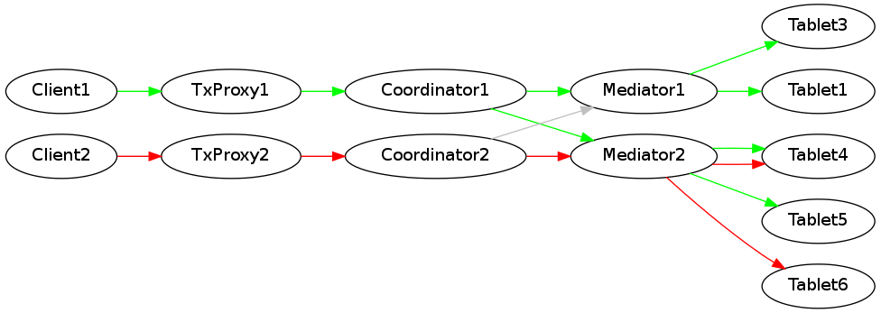

Планированием транзакций (и как следствие - продвижением времени в домене) заведует набор таблеток - **Coordinator'ов** домена. **Coordinator'ы** работают независимо и обслуживают часть общего потока транзакций.

В процессе работы каждый **Coordinator** (независимо от других **Coordinator'ов**) делит время на кванты (частота квантования может быть переменной, синхронности между **Coordinator'ами** не требуется), назначает каждому кванту метку времени - шаг - и помещает транзакции (обычно в порядке прихода, но с учётом ограничений на границы окна планирования транзакции) в квант. Получившийся список надёжно фиксируется в **[локальной базе](localdatabase.md)** и после коммита - агрегируется по **[Mediator'ам](tablet_mediator.md)** и рассылается для дальнейшего распространения на таблетки.

Надёжность доставки до таблеток обеспечивается неизменностью плана (и следовательно идемпотентности применения плана) и ретраями при обрывах, осуществляющихся до достижения успеха.

**Важно**: продвижение времени в кластере происходит только при работе всей популяции **Coordinator'ов**, на время рестарта одного из **Coordinator'ов** - логических прогресс замораживается (транзакции продолжаются планироваться, но конечный план для таблеток не может быть сформирован из-за неизвестности плана с "отсутствующего" **Coordinator'а**). Поэтому необходимо разумное минимальное количество **Coordinator'ов** в домене, для минимизации вероятности инцидента.

См. [Пайплайн выполнения транзакций](tx_processing_graph.md)
