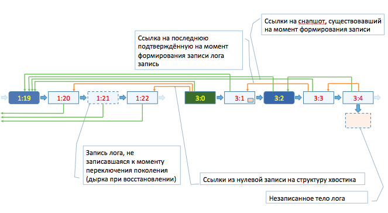

Таблетки, работая в модели с выделенным лидером, зависят от корректности и устойчивости алгоритма выбора лидера. Фактически речь идёт о нескольких требованиях:

  * в каждый момент времени существует не более одного активного лидера,
  * если лидер подтвердил операцию пользователю, то при рестартах эта операция не будет потеряна.
Во время жизни лидера дополнительной синхронизации не требуется.

#### Уникальность лидера
В **KiKiMR** первое требование обеспечивается правилом назначения каждому следующему инстансу лидера нового увеличенного поколения (generation поле в logoblobid). Первым шагом апгрейда кандидата в лидер является установка блокировки записи в канал лога новых записей с поколением меньше предложенного. Любые конфликты (например, когда два кандидата пытаются заблокировать одно и то же поколение) считаются гонкой и никто из участников не считается начавшим апгрейд.

Потенциально это могло бы привести к ситуации бесконечных гонок, когда ни один кандидат не продвигается, на практике - для управляемых таблеток [Hive](tablet_hive.md) запускает одиночного кандидата с назначенным поколением (т.е. два кандидата никогда не будут иметь одно и то же предложение), а для неуправляемых - бутстрапперы проводят предварительное голосование и кандидата запускает только выигравший.

Кандидат начинает процедуру восстановления лога только после того, как успешно закоммитит блокировку на канал лога таблетки и, следовательно, зафиксирует состояние лога и захватит номер поколения в единоличное владение.

#### Устройство лога таблетки
Под системный лог таблетки зарезервирован нулевой канал. В нулевой канал должна писать только системная логика и только записи специального формата `TTabletLogEntry`. При формировании LogoBlobID записи лога таблетка всегда использует то поколение, лидером которого является, а в качестве шага - монотонно растущее число. Под номером 0 пишется системная запись о начале поколения.

При формировании записи коммита в запись лога записываются:

  * флаг, является ли эта запись снапшотом
  * последний известный на момент формирования подтверждённый снапшот (в виде пары generation:step).
  * последняя запись текущего поколения, до которой лог полностью подтверждён.
  * список шагов, от которых зависит текущий шаг из числа еще неподтвержденных.
  * опционально - список ссылок на логоблобы, от которых зависит данная запись лога. Записи должны либо коммититься параллельно, либо быть уже закоммичены к моменту формирования записи.
  * опционально - списки логоблобов для пользовательского трекинга мусора.
  * если снапшот - флаг, является ли запись полным снапшотом (возможно восстановление лога в недоступности предыдущих записей).
  * опционально - встроенное тело пользовательского лога.

Запись лога считается успешной (и рапортуется таковой пользовательскому коду), когда:

  * успешно записана сама запись в нулевом канале,
  * успешно записаны все блобы, которые коммитятся параллельно (перечисленные в references),
  * успешно закоммичены все шаги, от которых зависит текущая запись.

Записи снапшота лога (если это не total-снапшот) считаются зависящими от всех предыдущих (т.к. могут содержать неявные ссылки на них). total-снапшоты считают независящими ни от кого и полностью заменяют все предыдущие записи лога.

#### Восстановление лога

Следующее, что делает кандидат после успешного захвата номера поколения на себя, - это восстанавливает лог. Для этого сначала находится самая свежая запись в нулевом канале (пока - без проверки успешности коммита соответствующей записи, нас интересует только само тело записи лога). Из него извлекается ссылка на снашпот лога (??кажется, не хватает слова «подтверждённый»???) и подтвержденный шаг - всё это по состоянию на момент формирования найденной самой свежей записи.

Дальше range_read-ом зачитываются все записи лога между выясненным снапшотом лога и самой последней записью. Если снапшот лога не попадает в то же поколение, что и последняя запись, то структура лога в записях в поколениях между снапшотом и последним поколением восстанавливаются по нулевым записям поколений (??тут непонятно; и что в точности пишется в нулевую запись???). Записи лога в самом свежем поколении (??а вообще-то в //любом// поколении старее, чем подтверждённая в //том же// поколении???) старее, чем заведомо подтверждённая, считаются заведомо подтвержденными, невозможность их прочитать считается ошибкой, и восстановление лога будет возможно, только если в хвостике найдётся более свежий снапшот. Записи лога от последней подтверждённой записи до последней записи анализируются на возможность быть применёнными:

  * проверяется, что записано само тело лога,
  * проверяется, что записаны все зависимости и ссылки.

При выполнении этих условий запись лога добавляется в список восстановленных записей.

Мы игнорируем блоб только в том случае, если можно доказать, что полное число part-ов блоба не было записано (конкретное условие зависит от используемой схемы кодирования и скрыто от таблетки проксёй блобстораджа). При невозможности такого доказательства и одновременно невозможности восстановить полное количество реплик лог восстановлен быть не может.

Полностью восстановив таким образом лог, мы передаём его на восстановление пользовательскому коду, а полученную картину хвоста лога фиксируем в нулевой записи поколения. Работа таблетки начинается только после успешной записи нулевого шага поколения. За счёт этого обеспечивается повторяемость восстановления хвоста лога при быстрых перезапусках лидера.
