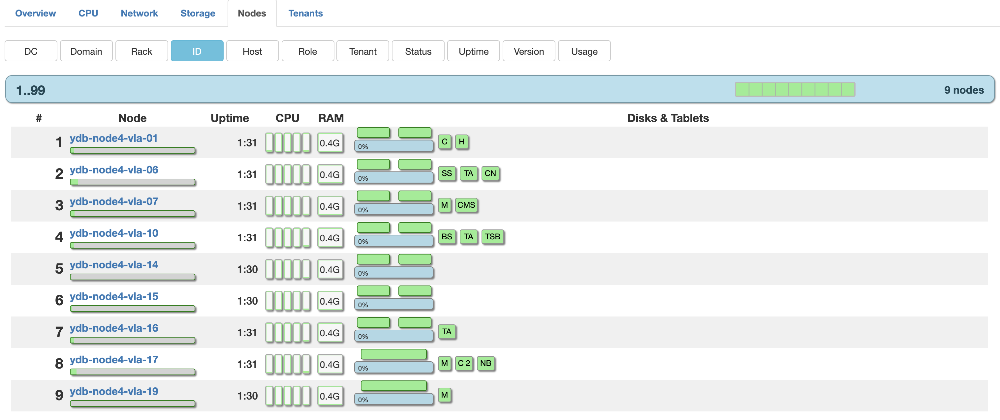
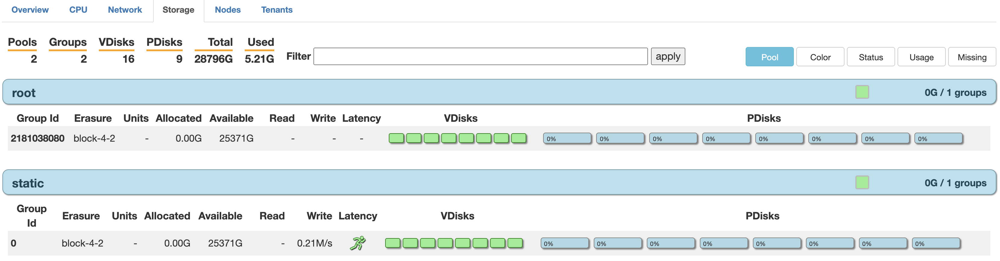
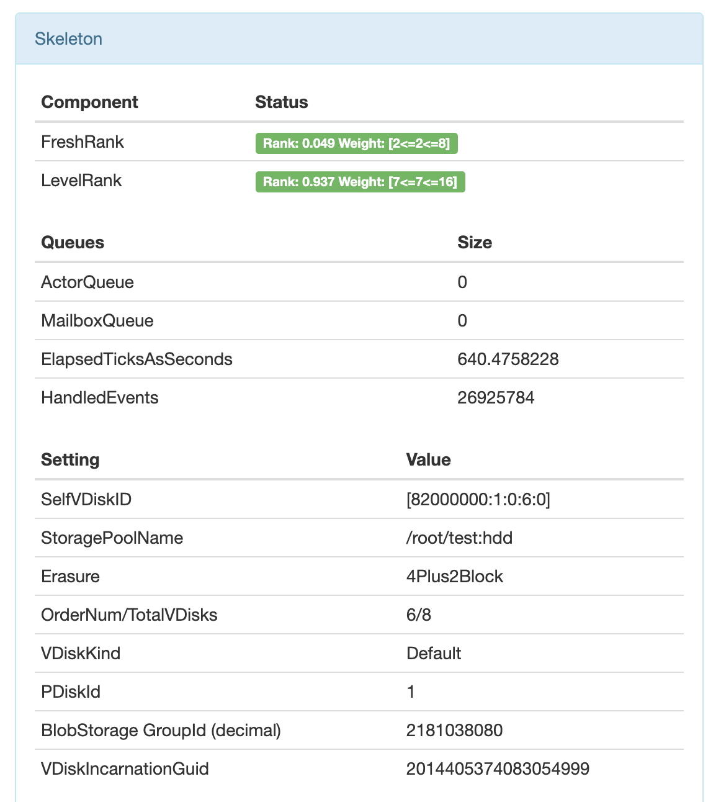

# Диагностика Кластера

Эксплуатация и реагирование на экстренные ситуации.

## Проблемы аутентификации {#auth_issues}

При запуске кластера в docker'е безо всего, база данных работает без авторизации и аутентификации.

## Проблемы синхронизации часов {#clock_issues}

При недостаточной синронизации часов на узлах можно наблюдать замедление выполнения транзакций на величину расхождения времени.
Так же могут происходить слишком раннее или позднее срабатывание дедлайнов.
При расхождении времени больше чем на 30 секунд перестают выполняться дата транзакции.

Чтобы увидеть на сколько сильно время расходится между узлами можно посмотреть в отчете соединений.

## Проблемы планирования мощностей {#capacity_planning_issues}

Здесь указаны несколько ввозможных проблем с которыми вы можете столкнуться во время планирования мощностей:

* Полная утилизация CPU может быть причиной ухудшения производительности

* Полная утилизация оперативной памяти на узле вызывает Linux ООM или использование swap, что в результате приводит к ухудшению производительности и работоспособности.

* Использование 100% памяти предоставляемым хранилищем может приводить к отказу работы системы в целом

* Упирание в операции чтения/записи на блочных устройствах приводит ухудшению времени обслуживания

* Работа с полностью загруженной сетью может приводит к плохому времени реакции между базой данных и клиентом

В Grafana можно смотреть на дашборд "General/sample dashboard" для планирования.

В нем отображены следующие метрики:

* **CPU Usage** - суммарное потребление CPU по всем пулам на всех узлах. (1'000'000 = 1CPU)

* **Memory Usage** - потребление оперативной памяти по узлам.

* **Disk Space Usage** - потребление дискового пространства по узлам.

* **SelfPing** - показывает насколько хорошо чувствует себя акторсистема.

    В случае резких изменений может показывать об остром голодании по cpu или вытесении с ядер другими процессами.

## Проблемы с дисковой подсистемой {#storage_issues}

При достижении лимита использования ресурсов база данных может начать отвечать ошибками на все запросы. В данном случае надо экстренно удалить не нужные данные либо расширить кластер блочными устрйоствами.

Ниже приведены инструкции которые помогут кратковременно освободить память и дать время для принятия решений.

### Wipe отдельного VDisk'а {#wipe_vdisk}

1. Убедиться что данный вдиск не находится в группе где уже есть -1

2. Зайти на любой узел кластера

3. Выполнить команду

    ```bash
    ./Berkanavt/kikimr/bin/kikimr admin blobstorage group reconfigure wipe --domain <Номер домена> --node <ID узла> --pdisk <ID ПДиска> --vslot <Номер слота>
    ```

### Неожиданно стало заканчиваться место (форматирование диска) {#obliterate_disk}

1. Определить диск с наибольшим заполнением места

2. Зайти на узел где находится этот диск

3. Проверить, разрешит ли cms перезапусить процесс

    ```bash
    /Berkanavt/kikimr/bin/kikimr cms request restart host {node_id} --user {user} --duration 60 --dry --reason 'format disk'
    ```

    При разрешение выведет `ALLOW`

4. Остановить процесс

    ```bash
    sudo systemctl stop kikimr
    ```

5. Форматировать диск

    ```bash
    sudo /Berkanavt/kikimr/bin/kikimr admin blobstorage disk obliterate <путь до партлейбла устройства>
    ```

6. Запустить процесс

    ```bash
    sudo systemctl start kikimr
    ```

### Неожиданно стало заканчиваться место и форматирование не помогло {#move_fat_vdisk}

1. Найти самые большие вдиски на пдисках с заканчивающейся памятью

2. Зайти на любой узел кластера

3. Выполнить перевоз диска

    ```bash
    ./Berkanavt/kikimr/bin/kikimr admin bs config invoke --proto 'Command { ReassignGroupDisk { GroupId: <ID группы хранения> GroupGeneration: <Поколение группы хранения> FailRealmIdx: <FailRealm> FailDomainIdx: <FailDomain> VDiskIdx: <Номер слота> } }'
    ```

## Проблемы с оперативной памятью {#memory_issues}

Если узел упал без сообщений об ошибках в логах, то возможно он упал из-за ООМ.

Чтобы проверить надо зайти на хост упавшего узла и посмотреть команду

```bash
sudo dmesg -Е | grep -iC 3 "kikimr"
```

Если предположение об ООМ верное то можно будет увидеть сообщение следующего вида.

```bash
[<Дата и время>] Out of memory: Kill process <Процесс> (kikimr) score <scope> or sacrifice child
```

Историю потребления памяти можно посмотреть на дашборде "General/sample dashboard" в "Memory Usage"

## Проблемы с репликацией {#replication_issues}

Репликация начинается во время старта вдиска.
Вдиск спрашивает соседей по группе о данных, которые должны были хранится у него.
Если вдиск не находит у себя каких-то данных, то он старается их восстановить.

В мониторинге узлов, вдиски с репликацией окрашиваются в синий цвет.

В некоторых случаях при отсутствии вдиска могут появиться фантомные блобы.
Это блобы которые могли бы быть восстановлены если в отсутствующем диске хранится недостающая часть данных.
Такие ситуации решаются возвращением диска, либо перевозом сломанного вдиска в случае если вы уверены в непревышении модели отказа.

## Проблемы работоспособности кластера {#cluster_liveness_issues}

### SelfHeal {#selfheal}

В процессе работы кластеров могут выходить из строя отдельные блочные устройства, на которых работает ydb, либо узлы целиком. Для сохранения работоспособности и отказоустойчивости кластера в условиях, когда оперативная починка вышедших из строя узлов или железок невозможна, используется механизм SelfHeal.

Механизм SelfHeal работает из двух частей. Детектирование неисправных дисков и перевоз их в щадящем режиме не допуская потери данных и развала групп хранения.

По умолчанию SelfHeal включен.  
Ниже инструкция по включению в случае если он выключен, аналогично SelfHeal можно выключить.

1. Включение детектирования

    Открыть сртраницу

    ```http://localhost:8765/cms#show=config-items-25```

    Можно включить через viewer -> Cluster Management System -> CmsConfigItems

    Поле Status: Enable

    Или через cli

    * Зайти на любой узел

    * Составить файл с измененными конфигами

        Пример файла config.txt

        ```
        Actions {
            AddConfigItem {
                ConfigItem {
                    UsageScope {
                        TenantAndNodeTypeFilter {
                            Tenant: "<Имя тенанта>"
                        }
                    }
                    Config {
                        CmsConfig {
                            SentinelConfig {
                                Enable: true
                            }
                        }
                    }
                }
            }
        }
        ```

    * Обновить конфиг на кластере

        ```bash
        kikimr admin console configs update config.txt
        ```

3. Включение перевоза

    ```bash
    kikimr -s <ендпоинт> admin bs config invoke --proto 'Command{EnableSelfHeal{Enable: true}}'
    ```

### Перевезти вдиски со сломанного/отсутствующего устройства {#removal_from_a_broken_device}

В случае если SelfHeal выключен или не перевозит вдиски, данную операцию придется выполнить вручную.

1. Убедиться в мониторинге, что диск действительно в нерабочем состоянии.  

    Записать fqdn узла, ic-port, путь до диска, pdiskId

2. Зайти на любой узел кластера

3. Выполнить перевоз диска

    ```bash
    ./Berkanavt/kikimr/bin/kikimr admin bs config invoke --proto 'Command { UpdateDriveStatus { HostKey: { Fqdn: "<Xост>" IcPort: <IC Порт>} Path: "<Путь до партлейбла устройства>" PDiskId: <ID ПДиска> Status: BROKEN } }'
    ```

### Заменили/починили диск, нужно его вернуть в работу {#return_a_device_to_work}

1. Убедиться в мониторинге, что диск в рабочем состоянии  

    Записать fqdn узла, ic-port, путь до диска, pdiskId

2. Зайти на любой узел кластера

3. Вернуть диск

    ```bash
    ./Berkanavt/kikimr/bin/kikimr admin bs config invoke --proto 'Command { UpdateDriveStatus { HostKey: { Fqdn: "<Xост>" IcPort: <IC Порт>} Path: "<Путь до партлейбла устройства>" PDiskId: <ID ПДиска> Status: ACTIVE } }'
    ```

### Отсутствует узел больше часа {#node_is_broken_too_long}

Выполнить перевоз каждого диска этого узла.

### Обноление кластера {#update_cluster}

(уточнить у Максима)

### Замена оборудования {#replace_hardware}

Так же убедится в возможности вывода узла через CMS.  
При длительном отсутствии стоит перед этим перевезти вдиски с данного узла и дождаться окончания репликации.  
После окончания репликации ноду можно безопасно выключать.

### В группе перестал работать 1 диск {#storage_group_lost_a_disk}

В основном такими ситуациями занимается SelfHeal.  
SelfHeal перевозит диски спустя 1 час неработоспособности.
В случае если SelfHeal не работает или выключен то стоит развести вдиски со сломанного диска.

### В группе перестали работать сразу 2 диска {#storage_group_lost_two_disk}

По моделе отказа потери данных не происходит при отсутствии 2 вдисков. Но любой следующий отказ уже угрожает потерей данных.

1. По возможности вернуть один из вдисков, и попытаться перевезти отсутствующий.

2. Если один из дисков может вернуться спустя час, а на другом данные навсегда потерены, то стоит начать перевозить вдиск без данных.

3. В случае если данные потеряны у двух дисков, то следует развести сначала один диск, дождаться окончания репликации и после этого перевозить другой.

### В группе перестали работать сразу 3 диска или больше {#storage_group_lost_three_disk}

Случилась катастрофа, произошла потеря данных. Нужно срочно возвращать диски для восстановления работоспособности.

## Использование мониторинга для диагностирования кластера {#monitoring}

### Страница всех узлов кластера {#node_list_page}

```
http://<ендпоинт>:8765/monitoring/cluster/nodes
```

На ней можно увидеть:

* nodeId
* адрес хоста
* прослушиваемые порты
* версия
* аптайм
* использование оперативной памяти
* загруженность пуллов в акторсистеме
* загруженность хоста по CPU

### Страница списка тенантов {#tenant_list_page}

```
http://<ендпоинт>:8765/monitoring/cluster/tenants
```

Кликнув на теннант можно перейти на его страницу в котором представлена подробная информация.

### Страница корневого тенанта {#root_tenant_page}

```
http://<ендпоинт>:8765/monitoring/tenant/healthcheck?name=/root
```

Страница корневого тенанта, показывает состояние всей системы

Имеет несколько основных вкладок:

1. **HealthCheck** - показывает сообщения о проблемах кластера в случае их наличия.
2. **Storage** - список групп хранения, показывает какие вдиски на каких узлах и устройствах работают.
3. **Compute** - список вычислительных ресурсов, показвает схожую информацию как и список всех узлов, но к дополнению к это показывает таблетки живущие на узлах.
4. **Schema** - схема базы, просмотр таблицы, выполнение YQL запросов, проосмотр самых медленных запросов.
5. **Network** - состояние сети кластера.

### Отчет об состояния соединений между нодами {#connection_report}

```
http://<ендпоинт>:8765/actors/interconnect/overview
```

Показывает для каждого другого узла:

* пинг
* разницу системных часов
* наличие соединения
* последняя зарегистрированная ошибка

### Вьювер состояния кластера

```
http://<ендпоинт>:8765/viewer/v2/nodes
```



Под блоками с нумерацией у нас распологаются следующие элементы:

1. Группировка узлов по признакам

    * **DC**/**Domain**/**Rack**/**Host** - по расположению
    * **Role** - по роли ноды (storage, tenant)
    * **Tenant** - по тенантам к которым узлы привязаны
    * **Status** - по состоянию узлов (Good, Bad)
    * **Uptime** - по времени работы ноды
    * **Version** - версии
    * **Usage** - по количеству занятого места у самого заполненного блочного устройства на узле

2. Информация об узле

    * ID узла
    * Хост на которой расположен узел
    * Под хостом расположен индикатор загруженности CPU хоста
    * Время работы узла
    * Индикаторы потребления CPU по пулам акторсистемы
    * Потребление оперативной памяти узлом

    При наведение на имя хоста во всплывающем окне так же появятся прослушиваемые порты данным узлом.

3. Сущности располагающиеся на данном узле
  
    * Блочные устройства на которых хранятся данные
    * Выше них вдиски, которые хранят данные на них
    * Таблетки которые выполняются на данном узле и поддерживают работу системы

    При наведение на  вдиск или блочное устройство появляется всплывающее окно с краткой информацией.

    При нажатии на вдиски или блочное устройство можно перейти на страницу с подрбной информацией о них.

### Вьювер состояния групп хранения

```
http://<ендпоинт>:8765/viewer/v2/storage
```



Под блоками с нумерацией у нас распологаются следующие элементы:
 
1. Общая статистика по количеству пулов групп хранения, групп, вдисков, блочных устройств и используемой памяти.

2. Строка поиска по которой можно фильтровать показываемые группы

3. Группировка групп хранения по признакам:

    * **Pool** - по пулам хранения
    * **Color** - по цвету, показывающий состояние группы хранения
    * **Status** - по состоянию (Good, Bad)
    * **Usage** - по количеству занятого места у самого заполненного блочного устройства в группе
    * **Missing** - по количеству потерянных вдисков

4. Основная информация о группе хранения

### Страница ВДиска

При использовании кубернетиса и переходе на страницу вдиска, ссылка на страницу будет содержать приватный адрес узла, где расположен вдиск.

Чтобы увидеть страницу надо прокинуть порт узла в кубернетисе на локальную машину, после замените адрес на localhost:<выбранный вами порт>.

Основная информацию о вдиске находится чуть ниже, в разделе Skeleton



Расшифровка VDiskID:

```
[<ID группы>:<Поколение группы>:<FailRealm>:<FailDomain>:<Номер слота>]
```

## Логи {#logs}

### Уровни логгирования {#log_levels}

Существуют следующие уровни логгирования

| Уровень | Числовое значение | Значение
|---|---|---|
| TRACE | 8 |Очень детальная отладочная информация
| DEBUG | 7 |Отладочная информация для разработчиков
| INFO | 6 |Отладочная информация для сбора статистики/информации
| NOTICE | 5 | Произошло существенное для системы или пользователя событие
| WARN | 4 | Предупреждение, если носит не временный характер то стоит реагировать и исправлять
| ERROR | 3 | Некритическая ошибка
| CRIT | 2 | Критическое состояние
| ALERT | 1 | Система как минимум деградировала. Возможно какой-то компонент вышел из строя
| EMERG | 0 | Системой пользоваться нельзя, кластер отказал |

### Изменение уровня логирования {#change_log_level}

Через cli

1. Зайти на любой узел

1. Подготовить config.txt

    ```
    Actions {
        AddConfigItem {
            ConfigItem {
                Config {
                    LogConfig {
                        DefaultLevel: <Числовое значение уровня логирования>
                        TTL: <Время применения настройки в микросекундах>
                    }
                }
            }
        }
    }
    ```

1. Обновить конфиг на кластере

    ```bash
    kikimr admin console configs update config.txt
    ```
