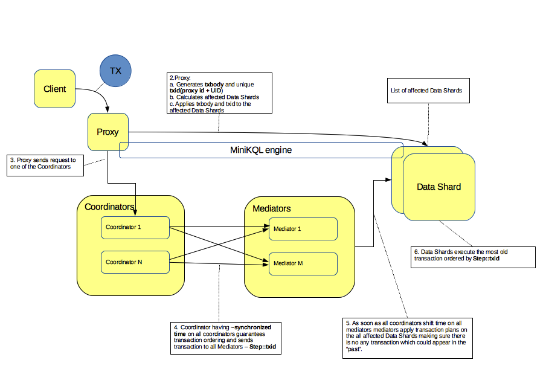

В выполнении пользовательской транзакции участвуют следующие шаги

  * в точке входа транзакции
    * получение запроса от пользователя - рекомендуемым является MsgBus интерфейс, возможно использование HTTP-интерфейса.
    * [опционально] компиляция текстовой MiniKQL программы и параметров. Для продуктовых решений рекомендуется использовать предкомпиляцию программы и передачу параметров в бинарном формате (protobuf).
    * [опционально] TVM тикет резолвится в список актуальных SIDов.
    * скомпилированная транзакция и параметры пересылаются на TxProxy для выполнения. Предпочтение отдаётся локально запущенной TxProxy, но возможна и удалённая отправка.
  * в TxProxy - первая фаза
    * назначается TxId транзакции.
    * в программу подставляются параметры, программа оптимизируется и выясняется набор затронутых ключей (точечных или диапазонов).
    * ключи резолвятся по схеме, проводится проверка типа и прав доступа, формируются списки шардов-участников
      * есть ограничения на количество шардов, транзакции с очень большим числом участников необходимо выполнять по альтернативной схеме.
    * проводится окончательная оптимизация программы и генерируются фрагменты для выполнения на участниках
    * фрагменты программы рассылаются на участников.
      * Для большинства одношардовых программ участник сразу же её и выполняет. Результат возвращается пользвателю
    * по получению подтверждения от шардов - формируется объединенное окно времени, в котором возможно запланировать транзакцию.
    * txid, read set, write set, окошко разрешённого времени планирования - отправляются на один (любой, фактически - выбираемый хешом от txid-а).
      * тело транзакции на координатор не пересылается, только информация необходимая для планирования.
  * В Coordinator
    * формируя очередной шаг координатор собирает транзакции, подходящие по своим ограничениям окна планирования к этому шагу и фиксирует сформированный план в своей локальной базе.
    * по успешному коммиту транзакции фиксации шага - формируются пакеты с описанием шага для каждого из медиаторов домена.
      * координатором параллельно могут коммититься много шагов, с этой точки зрения нет прямой зависимости между размером шага планирования и пропускной способностью координатора.
      * после коммита плана шага - запланированные транзакции не могут быть отменены и будут исполнены.
    * план шага рассылается на медиаторы.
  * В Mediator
    * получив план шага от всех координаторов - координатор формирует план выполнения для каждой из таблеток, затронутых хотя бы одной транзакцией.
  * В Datashard
    * получив план шага - даташард начинает последовательно выполнять транзакции в запланированном порядке
      * если входит в read-set - выполняет локальные чтение
        * при необходимости формирует исходящие пакеты для участников write-set-а и рассылает их
        * при необходимости отправляет результат на TxProxy.
      * при необходимости - дожидается входящих данных с участинков read-set-а
      * если входит в write-set - выполняет локальные модификации.

### Накладные расходы
#### CPU

  * тратится на компиляции программы (поэтому лучше использовать предкомпиляцию)
#### Disk latency
Для многошардовых транзакций (либо явно требующих фиксации шага выполнения) - в пайплайне присутствуют

  * ожидание фиксации подготовленного фрагмента программы в даташарде
  * ожидание фиксации шага на координаторе
