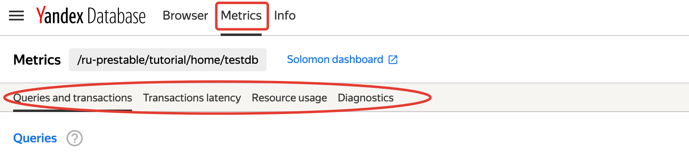
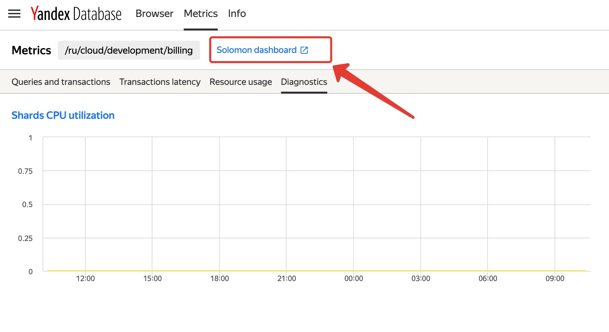

# Мониторинг

Мониторинг – важная задача в поддержке доступности и производительности базы данных. Для решения этой задачи в Соломоне настроены
графики с наиболее важными показателями, организованные в дашборды.

Дашборды доступны для просмотра в [веб-интерфейсе YDB](https://ydb.yandex-team.ru) и в [Соломоне](https://solomon.yandex-team.ru/),
в проекте kikimr в кластерах
* [ydb_ru](https://solomon.yandex-team.ru/?project=kikimr&cluster=ydb_ru);
* [ydb_eu](https://solomon.yandex-team.ru/?project=kikimr&cluster=ydb_eu);
* [ydb_ru_prestable](https://solomon.yandex-team.ru/?project=kikimr&cluster=ydb_eu).

## Мониторинг с помощью веб-интерфейса YDB {#ydb_ui_metrics}

В основном меню веб-интерфейса YDB на странице базы данных есть пункт [Metrics](https://ydb.yandex-team.ru/db/ydb-ru-prestable/tutorial/home/testdb/metrics).
На странице Metrics расположены ссылки на дашборды с графиками.

<small>Рисунок 1 — Пункт меню Metrics и ссылки на дашборды</small>

Нажатие на заголовок графика откроет соответствующий график в [Соломоне](https://wiki.yandex-team.ru/solomon/).

### Вкладка Queries and Transactions {#queries_and_transactions}

Ниже кратко описаны все графики, приведённые на вкладке Queries and Transactions

**Queries**

По вертикальной оси – количество запросов к базе в штуках, по горизонтали – время. График позволяет определить количество запросов в секунду, которые поступают в базу.
Запросы разложены по типам.

Ниже пояснены наиболее распространённые типы запросов.

* QueryExecPrepared – запрос на исполнение подготовленного запроса. У нормально работающего приложения почти все запросы должны быть именного этого типа;
* QueryExecute – запрос на исполнение запроса в текстом виде без предварительной подготовки. Отличается от QueryExecPrepared тем, что требует для каждого выполнения компиляции запроса, что приводит к повышенному потреблению CPU. Такой способ выполнения запросов допустим для разовых запросов. В production приложению следует использовать подготовленные запросы;
* QueryPrepare – запрос на подготовку (компиляцию) запроса;
* QueryCommitTx - запрос на явную фиксацию транзакции; в транзакциях YDB [рекомендуется](https://cloud.yandex.ru/docs/ydb/oss/public/develop/concepts/transaction) не отделять `COMMIT` от тела транзакции, по возможности стараться оформлять транзакцию в виде одного YQL-запроса с `COMMIT`.

**Responses**

По вертикальной оси – количество ответов от базы в штуках, по горизонтали – время. График позволяет определить количество ответов в секунду, которые возвращает база данных.
Ответы разложены по типам.

Ниже пояснены наиболее распространённые типы ответов.

* Success – успешное выполнение запроса, в нормальной ситуации почти все ответы должны быть этого типа;

Подробно типы статусов опасны в разделе [Статусы завершения YDB](../ydb-sdk/error_handling.md#termination-statuses).

**Queries size**

По вертикальной оси – размер запроса в байтах (текст + параметры), по горизонтали – время.

**Responses size**

По вертикальной оси – размер ответа в байтах (текст + параметры), по горизонтали – время.

**GRPC API Request size**

По вертикальной оси – размер запроса, пришедшего в GRPC - сервер в байтах, по горизонтали – время.

**GRPC API Response size**

По вертикальной оси – размер ответа, отправленного GRPC - сервером в байтах, по горизонтали – время.

### Вкладка Transactions Latency {#transactions_latency}

На вкладке девять графиков, отображающих времена исполнения транзакций в миллисекундах. Времена исполнения разложены по корзинам. Транзакции разделены на три типа:

* RO - только читающие;
* WO - только пишущие (например, `UPSERT`);
* RW - транзакции, читающие и пишущие данные.

Для каждого из типов показано время на разных уровнях:

* на уровне клиента;
* на уровне сервера;
* общее время исполнения транзакции.

### Вкладка Resource usage {#resource_usage}

**CPU usage**

По вертикальной оси – общее количество ядер, использованных базой, по горизонтали – время.
В отображении единиц измерения на вертикальной оси запятая используется в качестве разделителя целой и дробной частей.
Ядра, доступные базе, разделены на пулы. На графике показано потребление по пулам.

### Вкладка Diagnostics {#diagnostics}

Подробно графики диагностического дашборда описаны в разделе [{#T}](../troubleshooting/diag_dashboard.md).

## Мониторинг с помощью Соломона {#solomon}

На каждой вкладке в разделе Метрики веб-интерфейса YDB есть ссылка, нажатие на которую откроет соответствующий дашборд в Соломоне, на рисунке показан пример такой ссылки.

<small>Рисунок 1 — примерный вид графика использования CPU шардами таблиц базы</small>

Чтобы перейти на соответствующий дашборд в Соломоне, нужно выполнить следующие шаги:

1. Перейти на вкладку [Metrics](https://ydb.yandex-team.ru/db/ydb-ru-prestable/tutorial/home/testdb/browser) интересующей базы данных.
2. Перейти на один из интересующих дашбордов, например, [Resource Usage](https://ydb.yandex-team.ru/db/ydb-ru-prestable/tutorial/home/testdb/metrics/resource-usage).
3. Перейти в Соломон по ссылке [Solomon dashboard](https://solomon.yandex-team.ru/?project=kikimr&service=kqp&host=cluster&slot=cluster&dashboard=kikimr-mt-database-overall-public&b=1d&database=%2Fru-prestable%2Ftutorial%2Fhome%2Ftestdb&cluster=ydb_ru_prestable).

### Диагностический дашборд {#diagnostics}

Состав графиков на диагностическом дашборде в веб-интерфейсе YDB и в Соломоне отличаются. Подробно графики диагностического дашборда описаны в разделе [{#T}](../troubleshooting/diag_dashboard.md).
