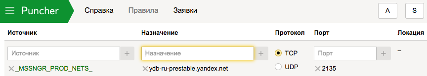

# Подключение к базе данных



Доступ к базам данных в {{ ydb-short-name }} осуществляется по протоколу gRPC. Сетевой адрес для соединения cо своей базой (database endpoint) можно узнать в [веб-интерфейсе](https://ydb.yandex-team.ru/) на вкладке **Info**.


Для получения доступа следует с помощью [Puncher](https://puncher.yandex-team.ru) создать заявки на правила доступа по TCP к серверам в кластерах {{ ydb-short-name }} и устройствам, балансирующим к ним сетевые соединения.

## Доступ к кластеру ydb-ru {#access-to-ydb-ru}

В отдельных заявках укажите:

* адрес балансировщика: ydb-ru.yandex.net, протокол TCP, порт 2135;


* макрос: ```_C_YDB_RU_``` для баз данных в кластере `ydb-ru`, протокол TCP, диапазон портов 31000-32000.


## Доступ к кластеру ydb-ru-prestable {#access-to-ydb-ru-prestable}

В отдельных заявках укажите:

* адрес балансировщика: ydb-ru-prestable.yandex.net, протокол TCP, порт 2135;



* макрос: ```_C_YDB_RU_PRESTABLE_``` для баз данных в кластере ydb-ru, протокол TCP, диапазон портов 31000-32000.




Доступ к базам данных {{ ydb-short-name }} осуществляется по протоколу gRPC. 



## Предварительные требования {#prerequisites}

Перед тем, как подключиться к базе:

1. [Создайте виртуальную машину](../../compute/operations/vm-create/create-linux-vm) в {{ yandex-cloud }}.
1. Сохраните публичный IP-адрес виртуальной машины. Для этого перейдите в свойства виртуальной машины или [воспользуйтесь интерфейсом командной строки](../../compute/operations/vm-info/get-info#outside-instance).
1. Для аутентификации в базе данных [создайте сервисный аккаунт](../../iam/operations/sa/create) и [назначьте](../../iam/operations/sa/assign-role-for-sa.md) ему роли `viewer` и `editor`.
1. Перейдите в раздел **Сервисные аккаунты** своего каталога и выберите необходимый сервисный аккаунт в списке. Сохраните идентификатор сервисного аккаунта.
1. [Создайте авторизованные ключи доступа](../../iam/operations/sa/create-access-key.md) к сервисному аккаунту и сохраните их.
1. Перейдите на страницу **Базы данных**, нажмите на имя базы данных и перейдите в раздел **Обзор**. Скопируйте эндпоинт базы.
1. Чтобы подключиться к серверу БД, необходим SSL-сертификат. Подготовить все нужные аутентификационные данные можно, например, так:

   ```
   $ mkdir ~/.ydb
   $ wget "https://storage.yandexcloud.net/cloud-certs/CA.pem" -O ~/.ydb/CA.pem
   ```
   

