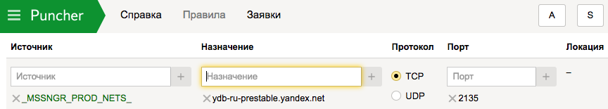
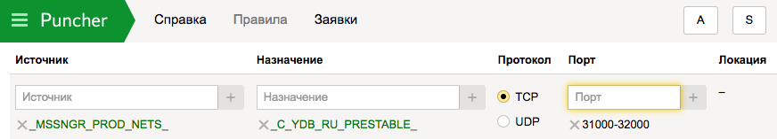

# Подключение к базе данных



Доступ к базам данных в {{ ydb-short-name }} осуществляется по протоколу gRPC. Сетевой адрес для соединения cо своей базой (database endpoint) можно узнать в [веб-интерфейсе](https://ydb.yandex-team.ru/) на вкладке **Info**.


Для получения доступа следует с помощью [Puncher](https://puncher.yandex-team.ru) создать заявки на правила доступа по TCP к серверам в кластерах {{ ydb-short-name }} и устройствам, балансирующим к ним сетевые соединения.

## Доступ к кластеру ydb-ru {#access-to-ydb-ru}

В отдельных заявках укажите:

* адрес балансировщика: ydb-ru.yandex.net, протокол TCP, порт 2135;


* макрос: ```_C_YDB_RU_``` для баз данных в кластере `ydb-ru`, протокол TCP, диапазон портов 31000-32000.


## Доступ к кластеру ydb-ru-prestable {#access-to-ydb-ru-prestable}

В отдельных заявках укажите:

* адрес балансировщика: ydb-ru-prestable.yandex.net, протокол TCP, порт 2135;



* макрос: ```_C_YDB_RU_PRESTABLE_``` для баз данных в кластере ydb-ru, протокол TCP, диапазон портов 31000-32000.





Доступ к базам данных {{ ydb-short-name }} осуществляется по протоколу gRPC поверх TLS.

## Предварительные требования {#prerequisites}

1. Создайте [сервисный аккаунт](../../iam/concepts/users/service-accounts.md).

   

   

   О других способах создания сервисного аккаунта читайте в [инструкции](../../iam/operations/sa/create.md).

   

1. Назначьте созданному сервисному аккаунту [роли](../../iam/concepts/access-control/roles.md) `viewer` и `editor`.

   

   

   О других способах назначения ролей читайте в [инструкции](../../_includes/iam/grant-role-for-sa.md).

   

1. [Получите идентификатор](../../iam/operations/sa/get-id.md) сервисного аккаунта.
1. Создайте [авторизованные ключи доступа](../../iam/concepts/authorization/key.md) к сервисному аккаунту и сохраните их.

   

   1. Перейдите в каталог, которому принадлежит сервисный аккаунт.
   1. Выберите вкладку **Сервисные аккаунты**.
   1. Выберите сервисный аккаунт и нажмите на строку с его именем.
   1. Нажмите кнопку **Создать новый ключ** на верхней панели.
   1. Выберите пункт **Создать ключ доступа**.
   1. Задайте описание ключа, чтобы потом было проще найти его в консоли управления.
   1. Сохраните идентификатор и секретный ключ.

      

      После закрытия диалога значение ключа будет недоступно.

      

   О других способах создания ключей читайте в [инструкции](../../iam/operations/sa/create-access-key.md).

   

1. Получите эндпоинт базы данных:

   1. Перейдите на страницу сервиса {{ ydb-name }}.
   1. Нажмите на имя нужной базы данных.
   1. Перейдите в раздел **Обзор**.
   1. Сохраните эндпоинт БД.

   

   База данных в бессерверной (**Serverless**) конфигурации всегда имеет публичный эндпоинт, доступный из интернета. Чтобы отправлять запросы из интернета к базе с выделенными серверами (**Dedicated**), настройте присвоение публичных IP-адресов при [создании БД](create_manage_database.md#create-db).

   

1. (опционально) Если ваша база данных не имеет публичного эндпоинта, создайте [виртуальную машину](../../compute/concepts/vm.md) для доступа к БД в {{ yandex-cloud }}.

   

   

   О других способах создания ВМ читайте в [инструкции](../../compute/operations/vm-create/create-linux-vm.md).

   

   

   Дальнейшую настройку выполняйте в созданной виртуальной машине.

   

   ```
   $ mkdir ~/.ydb
   $ wget "https://storage.yandexcloud.net/cloud-certs/CA.pem" -O ~/.ydb/CA.pem
   ```



