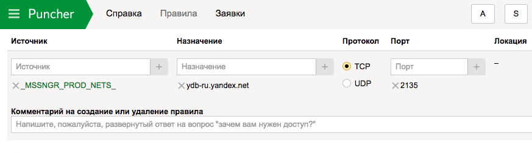
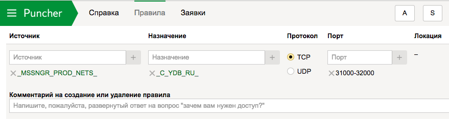

# Подключение к базе данных



Доступ к базам данных в {{ ydb-short-name }} осуществляется по протоколу gRPC. Сетевой адрес для соединения cо своей базой (database endpoint) можно узнать в [веб-интерфейсе](https://ydb.yandex-team.ru/) на вкладке **Info**.


Для получения доступа следует с помощью [Puncher](https://puncher.yandex-team.ru) создать заявки на правила доступа по TCP к серверам в кластерах {{ ydb-short-name }} и устройствам, балансирующим к ним сетевые соединения.

## Доступ к кластеру ydb-ru {#access-to-ydb-ru}

В отдельных заявках укажите:

* адрес балансировщика: ydb-ru.yandex.net, протокол TCP, порт 2135;



* макрос: ```_C_YDB_RU_``` для баз данных в кластере `ydb-ru`, протокол TCP, диапазон портов 31000-32000.



## Доступ к кластеру ydb-ru-prestable {#access-to-ydb-ru-prestable}

В отдельных заявках укажите:

* адрес балансировщика: ydb-ru-prestable.yandex.net, протокол TCP, порт 2135;


* макрос: ```_C_YDB_RU_PRESTABLE_``` для баз данных в кластере ydb-ru, протокол TCP, диапазон портов 31000-32000.




Доступ к базам данных {{ ydb-short-name }} осуществляется по протоколу gRPC поверх TLS.



Для подключения к базе данных {{ ydb-name }} выполните следующие настройки:

1.  [Создайте сервисный аккаунт](../../iam/operations/sa/create.md).  Создайте сервисный аккаунт. 
1.  [Назначьте](../../iam/operations/sa/assign-role-for-sa.md)  Назначьте  созданному сервисному аккаунту роли `viewer` и `editor`.
1. [Получите идентификатор](../../iam/operations/sa/get-id.md) сервисного аккаунта.
1.  [Создайте авторизованные ключи доступа](../../iam/operations/sa/create-access-key.md)  Создайте авторизованные ключи доступа  к сервисному аккаунту и сохраните их.
1. Перейдите на страницу сервиса {{ ydb-name }}, нажмите на имя нужной базы данных и перейдите в раздел **Обзор**. Сохраните эндпоинт БД.
1. (опционально) Если ваша база данных не имеет публичных IP-адресов, [создайте виртуальную машину](../../compute/operations/vm-create/create-linux-vm.md) для доступа к БД в {{ yandex-cloud }}.

   

   Дальнейшую настройку выполняйте в созданной виртуальной машине.

   

1. Подготовьте SSL-сертификат для подключения к базе данных:

   ```bash
   mkdir ~/.ydb
   wget "https://storage.yandexcloud.net/cloud-certs/CA.pem" -O ~/.ydb/CA.pem
   ```

1. 

#### Что дальше

* [Запустите тестовое приложение](../quickstart/launch-test-app.md#run-test).
