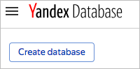
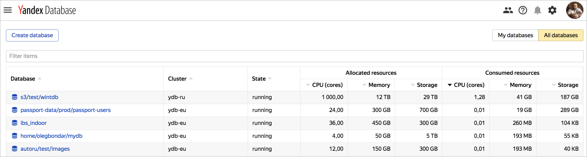

# Управление базами данных

В этом разделе описано, как:

* [{#T}](#create-db).
* [{#T}](#db-list).
* [{#T}](#change-db-params).
* [{#T}](#delete-db).



## Создать базу данных {#create-db}

1. Перейдите в [консоль управления](https://ydb.yandex-team.ru) и нажмите кнопку **Create database**.

    

1. Настройте параметры базы в диалоговом окне:

    1. Кластер (cluster). Доступен выбор однодатацентровых (`ydb-vla`, `ydb-sas`, `ydb-man`, `ydb-myt`) и многодатацетровых кластеров (`ydb-ru`, расположенный в датацентрах VLA-SAS-MYT, и `ydb-eu`, расположенный в датацентрах VLA-SAS-MAN).

    

    В текущей инсталляции {{ ydb-short-name }} доступен кластер `ydb-ru`, расположенный в датацентрах VLA-SAS-MYT.

    

    1. **Аккаунт**. Если вы только начинаете работать с сервисом {{ ydb-short-name }} и аккаунта вашего проекта еще нет, заполните, [форму](https://st.yandex-team.ru/createTicket?template=1911&queue=KIKIMR) для создания аккаунта. Если вы хотите попробовать создать личную БД для тестирования, воспользуйтесь аккаунтом *home*.

    1. **Директория**. Выберите директорию из списка существующих директорий выбранного аккаунта или создайте новую. Если вы выбрали аккаунт *home*, автоматически будет создана директория с вашим именем пользователя. Название директории регистрозависимое, должно начинаться с латинской буквы, дальше допустимы буквы латинского алфавита, цифры, подчеркивание '_' и дефис '-'.

    1. **Имя**. На имя базы данных накладываются те же ограничения, что и на название директории.

    1. **Вычислительные ресурсы**. Тип и количество вычислительных ресурсов (compute units).

    1. **Политика распределения**. Политику распределения вычислительных ресурсов между датацентрами (distribution policy) для многодатацентровых кластеров. Возможные варианты:

        * *auto* — вычислительные ресурсы будут расположены в доступных датацентрах, в случае выхода из строя датацентра переедут в оставшиеся доступные датацентры;
        * *in one DC* — вычислительные ресурсы будут расположены в одном датацентре, в случае его выхода из строя переедут в другой датацентр, но также будут располагаться в пределах одного датацентра;
        * *uniform distribution* — вычислительные ресурсы равномерно распределены по датацентрам, в случае выхода из строя одного из датацентров, переезжают в оставшиеся датацентры.

    1. **Группы хранения**. Тип и количество групп хранения. Каждой группе хранения соответствует определенная схема хранения, влияющая на количество используемых дисков, модель отказа и коэффициент избыточности. Для однодатацентровых кластеров обычно используется схема ``block4-2``, при которой группа хранения расположена на 8 дисках в 8 стойках, переживает отказ любых двух дисков и дает избыточность с коэффициентом 1.5. В мультидатацентровых кластерах используется схема ``mirror3dc``, где в группе хранения задействовано 9 дисков, расположенных по 3 в трех датацентрах, выдерживает отказ датацентра и диска в любом другом датацентре, дает избыточность с коэффициентом 3. Группа хранения может состоять из накопителей, относящихся к одному из следующих типов: SATA HDD, SATA SSD.

    

    В текущей инсталляции {{ ydb-short-name }} доступны только SATA SSD накопители.

    

1. Нажмите на кнопку **Create** для создания базы данных с указанными параметрами.

Пример формы создания базы данных:


## Посмотреть список баз данных {#db-list}

Для просмотра списка баз данных зайдите на главную страницу [вeб-интерфейса](https://ydb.yandex-team.ru).
На странице появится список созданных БД. Для каждой базы указаны полное имя БД, расположение (кластер), количество зарезервированных под БД ресурсов и количество используемых ресурсов.



## Создать базу данных требуемого размера {#create-custom-db}

В настоящее время создание БД отличающихся размером от доступного по умолчанию в интерфейсе, выполняется администратором системы.
Для изменения параметров создаваемой  БД следует заполнить [форму](https://st.yandex-team.ru/createTicket?template=2082&queue=YDBREQUESTS).

## Изменить параметры базы данных {#change-db-params}

В настоящее время изменение параметров БД выполняется администратором системы.
Для изменения параметров БД следует заполнить [форму](https://st.yandex-team.ru/createTicket?template=1918&queue=YDBREQUESTS).

## Удалить базу данных {#delete-db}

В настоящее время удаление БД выполняется администратором системы.
Для удаления БД следует заполнить [форму](https://st.yandex-team.ru/createTicket?template=1919&queue=YDBREQUESTS).



## Создать базу данных {#create-db}



## Посмотреть список баз данных {#db-list}



* Консоль управления

   1. В [консоли управления]({{ link-console-main }}) выберите каталог, для которого нужно получить список баз данных.
   1. В списке сервисов выберите **{{ ydb-name }}**.

* CLI

   

   

   
   
   

   1. Посмотрите описание команды CLI для получения списка БД:

      ```bash
      {{ yc-ydb }} database list --help
      ```

   1. Чтобы получить список баз данных в каталоге по умолчанию, выполните команду:

      ```bash
      {{ yc-ydb }} database list
      ```



## Изменить настройки базы данных {#change-db-params}



Вы можете изменить только настройки баз данных, которые работают в конфигурации с выделенными серверами.





* Консоль управления

   1. В [консоли управления]({{ link-console-main }}) выберите каталог, в котором нужно изменить настройки базы данных.
   1. В списке сервисов выберите **{{ ydb-name }}**.
   1. Нажмите значок  в строке нужной БД и выберите пункт **Изменить**.
   1. Настройте параметры БД:
      1. В блоке **Вычислительные ресурсы** выберите тип и количество [вычислительных ресурсов](../concepts/databases.md#compute-units).
      1. В блоке **Группы хранения** выберите тип диска и количество [групп хранения](../concepts/databases.md#storage-groups), определяющее суммарный объем хранилища.
   1. Нажмите кнопку **Изменить базу данных**.

* CLI

   

   

   
   
   

   Чтобы изменить параметры базы данных:

   1. Посмотрите описание команды CLI для изменения параметров БД:

      ```bash
      {{ yc-ydb }} database update --help
      ```

   1. Выполните команду вида:

      ```bash
      {{ yc-ydb }} database update <имя БД> \
                     --new-name <новое имя БД> \
                     --description <новое описание БД> \
                     --resource-preset <ID класса> \
                     --storage type=<ID типа накопителя>,groups=<число групп хранения>
                     ...
      ```



## Удалить базу данных {#delete-db}



* Консоль управления

   1. В [консоли управления]({{ link-console-main }}) выберите каталог, в котором нужно удалить базу данных.
   1. В списке сервисов выберите **{{ ydb-name }}**.
   1. Нажмите значок  в строке нужной БД и выберите пункт **Удалить**.
   1. Подтвердите удаление.

* CLI

   

   

   
   
   

   1. Посмотрите описание команды CLI для удаления БД:

      ```bash
      {{ yc-ydb }} database delete --help
      ```

   1. Чтобы удалить базу данных, выполните команду:

      ```bash
      {{ yc-ydb }} database delete <имя базы данных>
      ```




