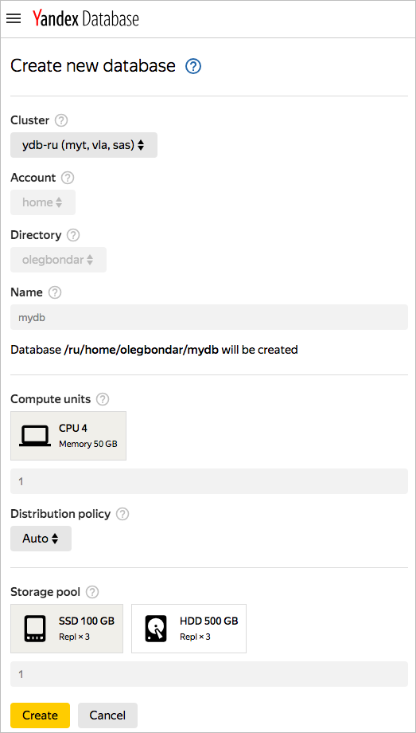
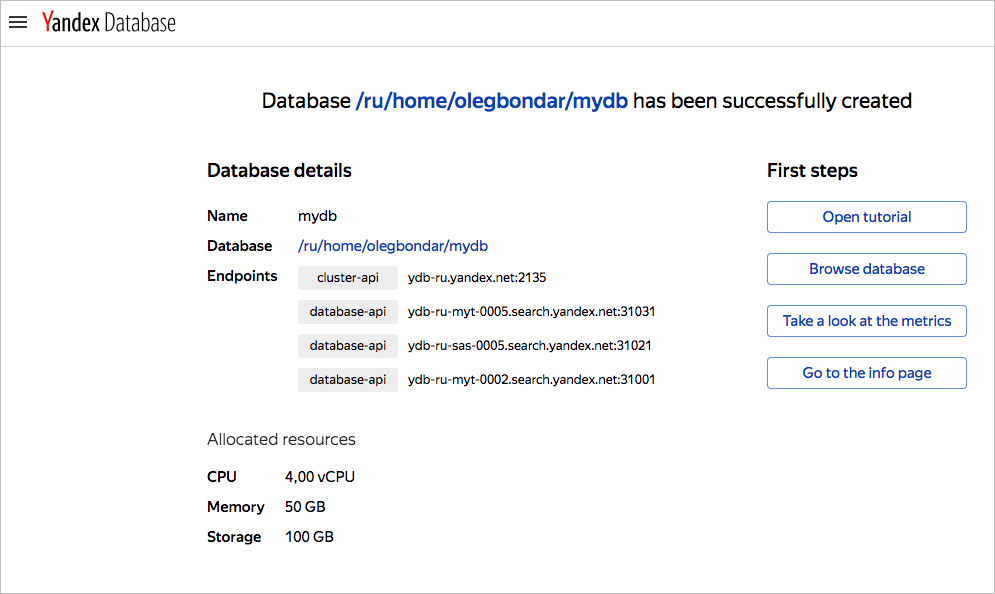
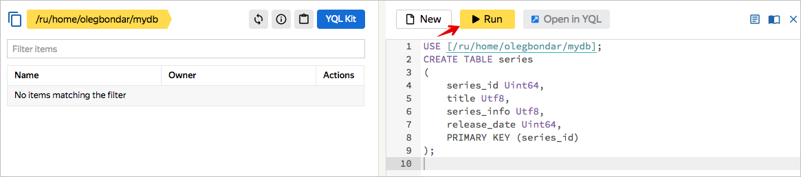
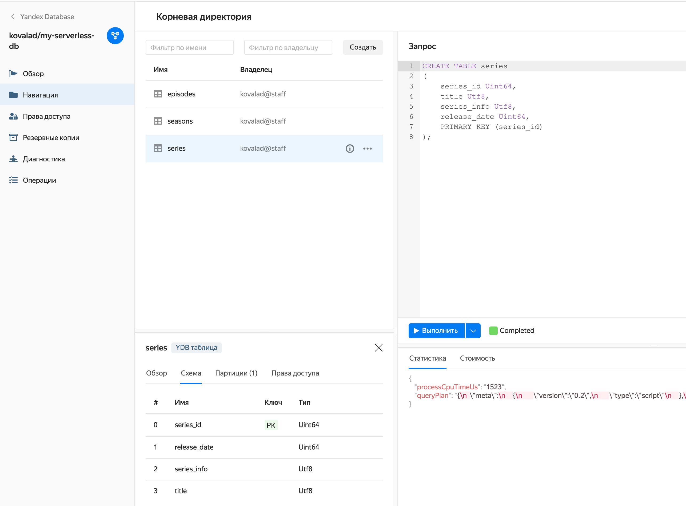
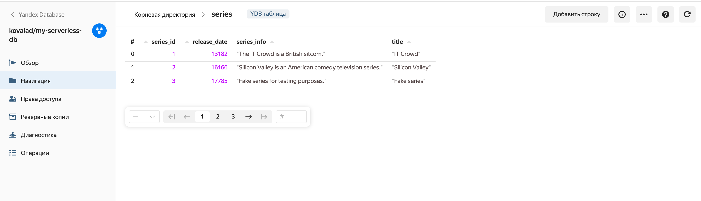
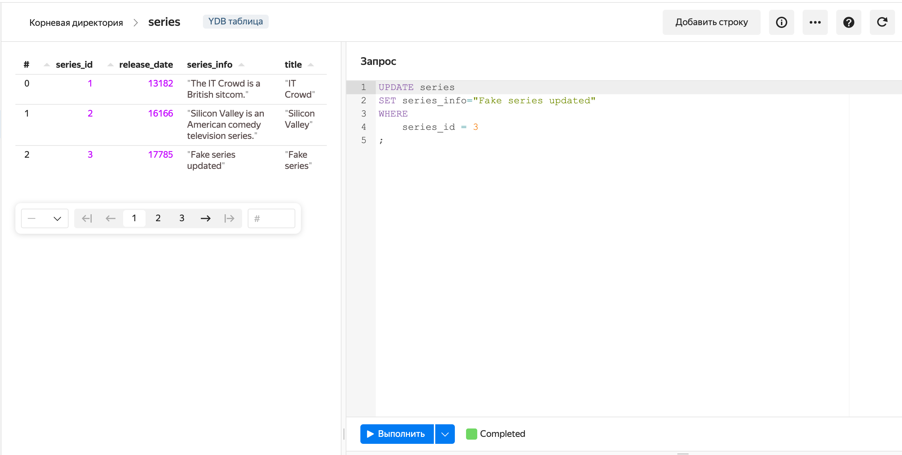
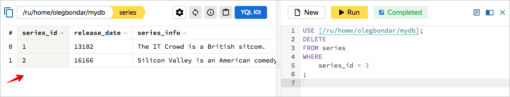
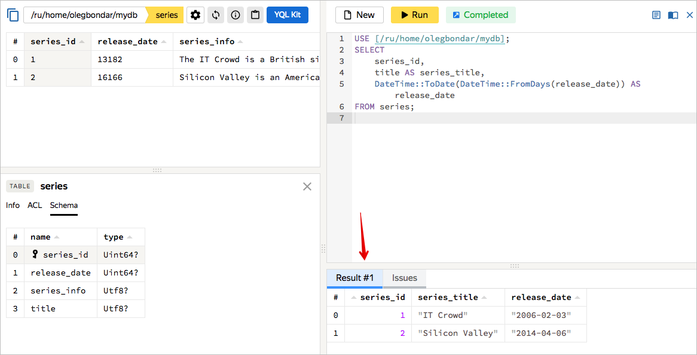

# Как попробовать

Работать с базой YDB можно как при помощи [веб-интерфейса](https://ydb.yandex-team.ru), так и используя [консольный клиент YDB](getting_started/ydb_cli.md).

В этом разделе описаны базовые действия в YDB при помощи [веб-интерфейса](https://ydb.yandex-team.ru).

Для того, чтобы посмотреть на YDB в действии, следует:

* зайти в [веб-интерфейс YDB](https://ydb.yandex-team.ru);
* создать базу данных;
* создать таблицу;
* записать и изменить данные в таблице;
* прочитать данные.

## Как создать свою БД



В разделе ниже приведена пошаговая инструкция создания пробной базы данных, предназначенной для ознакомления с возможностями Yandex Database. Порядок создания баз данных для разработки и запуска сервисов в продакшн описан в разделе [Базы данных — создание и управление](getting_started/create_manage_database.md#custom_database).



Для создания базы данных нужно выполнить следующие действия:

Зайдите в [веб-интерфейс YDB](https://ydb.yandex-team.ru)

Нажмите кнопку "Create database".


В диалоге создания БД выберите кластер ydb-ru.

Все остальные поля будут заполнены автоматически, в том числе будет автоматически выбран аккаунт "home", создана директория с вашим именем пользователя и база данных с именем "mydb".

На картинке ниже можно увидеть пример формы создания новой базы данных.



Нажмите кнопку "Create".

Появится страница с сообщением об успешном создании базы данных.



Для того, чтобы перейти в режим просмотра содержимого БД нажмите на кнопку "Browse database", или перейдите по ссылке с именем базы данных.

Чтобы задать первый запрос к БД, нажмите на кнопку "YQL Kit" и откроется окно веб-консоли, позволяющей задавать запросы к базе.


## Как создать таблицу в своей БД

Для создания таблицы в панели YQL Kit нажмите кнопку "New"


и добавьте команду создания таблицы:


```
CREATE TABLE series
(
    series_id Uint64,
    title Utf8,
    series_info Utf8,
    release_date Uint64,
    PRIMARY KEY (series_id)
);
```



В каждый запрос в YQL Kit автоматически подставляется команда ```USE [/ru/home/your_account/database_name];```.<br>Она необходима для того, чтобы не использовать указание БД в каждом запросе в именах таблиц.
Не удаляйте эту строчку.




Нажмите кнопку "Run"



После успешного выполнения запроса будет создана таблица series.

Для просмотра информации о таблице можно нажать кнопку <svg viewBox="0 0 24 24" width="18" height="18" fill="#26a"><path id="icon.info" d="M11,9H13V7H11M12,20C7.59,20 4,16.41 4,12C4,7.59 7.59,4 12,4C16.41,4 20,7.59 20,12C20,16.41 16.41,20 12,20M12,2A10,10 0 0,0 2,12A10,10 0 0,0 12,22A10,10 0 0,0 22,12A10,10 0 0,0 12,2M11,17H13V11H11V17Z"></path></svg>, в открывшейся панели на вкладке "Schema" представлена информация о схеме таблицы.



## Как записать данные в таблицу

Для записи данных в таблицу series можно использовать оператор REPLACE.

Для того, чтобы выполнить новый запрос, нажмите кнопку "New" на панели YQL Kit. Добавьте в окно следующий запрос:

```
REPLACE INTO series (series_id, title, release_date, series_info)
VALUES
    (
        1,
        "IT Crowd",
        CAST(Date("2006-02-03") AS Uint64),
        "The IT Crowd is a British sitcom."),
    (
        2,
        "Silicon Valley",
        CAST(Date("2014-04-06") AS Uint64),
        "Silicon Valley is an American comedy television series."
    ),
    (
        3,
        "Fake series",
        CAST(Date("2018-09-11") AS Uint64),
        "Fake series for testing purposes."
    )
    ;
```
и нажмите кнопку Run.


При нажатии на название таблицы в левой панели, вы попадете в режим превью данных таблицы. В превью вы увидите строки, вставленные после успешного выполнения предыдущего запроса.



## Как заменить строки в таблице

Теперь запишем изменения с помощью оператора UPDATE.
Для выполнения нового запроса, нажмите кнопку "New" на панели YQL Kit. Добавьте в окно следующий запрос:

```
UPDATE series
SET series_info="Fake series updated"
WHERE
    series_id = 3
;
```
и нажмите кнопку Run.

В превью панели слева автоматически будут отображаться изменения, вызванные выполнением предыдущего запроса.


## Как удалить строки в таблице

Удалим строку с фейковым сериалом.
Для выполнения нового запроса, нажмите кнопку "New" на панели YQL Kit. Добавьте в окно следующий запрос:

```
DELETE
FROM series
WHERE
    series_id = 3
;
```
и нажмите кнопку Run.

В превью панели слева автоматически будут отображаться изменения, вызванные выполнением предыдущего запроса.



## Как прочитать данные из таблицы

Для чтения данных из таблицы series используем оператор SELECT.
Для выполнения нового запроса, нажмите кнопку "New" на панели YQL Kit. Добавьте в окно следующий запрос:

```
SELECT
    series_id,
    title AS series_title,
    DateTime::ToDate(DateTime::FromDays(release_date)) AS release_date
FROM series;
```
и нажмите кнопку Run.

На панели должны отобразиться результаты, показанные на рисунке ниже:



## Как удалить таблицу

Тестовую таблицу можно удалить с помощью оператора DROP TABLE.
Для выполнения нового запроса, нажмите кнопку "New" на панели YQL Kit. Добавьте в окно следующий запрос:

```
DROP TABLE series;
```

и нажмите кнопку Run.



Tutorial по работе с данными YDB при помощи [YQL](https://yql.yandex-team.ru/docs/ydb/) можно пройти в веб-интерфейсе [https://yql.yandex-team.ru/Tutorial/](https://yql.yandex-team.ru/Tutorial/ydb_01_Create_demo_tables).


