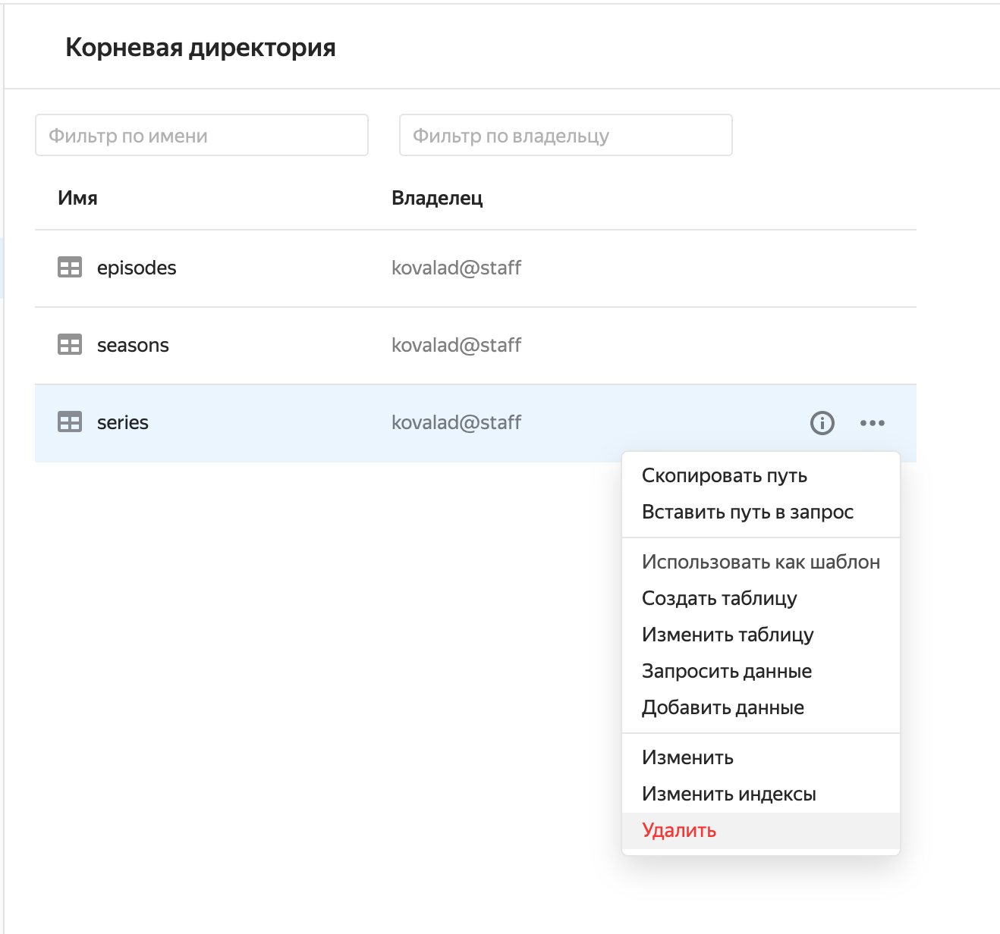

# Как попробовать

Работать с базой YDB можно как при помощи [веб-интерфейса](https://yc.yandex-team.ru), так и используя [консольный клиент YDB](getting_started/ydb_cli.md).

В этом разделе описаны базовые действия в YDB при помощи [веб-интерфейса](https://yc.yandex-team.ru).

Для того, чтобы посмотреть на YDB в действии, следует:

* зайти в [веб-интерфейс YDB](https://yc.yandex-team.ru);
* создать базу данных;
* создать таблицу;
* записать и изменить данные в таблице;
* прочитать данные.

## Как создать пробную базу данных {#how-to-create-db}



В разделе ниже приведена пошаговая инструкция создания пробной базы данных, предназначенной для ознакомления с возможностями Yandex Database. Порядок создания баз данных для разработки и запуска сервисов в продакшн описан в разделе [Базы данных — создание и управление](getting_started/create_manage_database.md#custom_database).



Для создания базы данных нужно перейти в [web-интерфейс YDB](https://yc.yandex-team.ru) и выбрать каталог `ydb_home` в выпадающем списке в правом верхнем углу экрана, как показано на рисунке 1.


<small>Рисунок 1 — Выбор каталога</small>

Нажать копку `Создать ресурс` и выбрать тип ресурса `База данных YDB`, как показано на рисунке 2.


<small>Рисунок 2 — Выбор создаваемого ресурса</small>

Выбрать тип базы данных `serverless`, указать подходящее имя для базы данных и нажать кнопку `Создать базу данных`, как показано на рисунке 3.



Пробные базы данных допускается создавать только в режиме `serverless`. Подробней о различиях двух режимов можно прочитать в [документации](https://cloud.yandex.ru/docs/ydb/concepts/serverless_and_dedicated).




<small>Рисунок 3 — Форма создания базы данных в режиме serverless</small>



Название базы данных регистрозависимое, должно начинаться с латинской буквы, дальше допустимы буквы латинского алфавита, цифры и дефис '-'.




База будет отображена в списке в статусе `Provisioning`, как показано на риснуке 4. После завершения операции выделения ресурсов для базы данных, она будет отображена в списке в статусе `Running`.


<small>Рисунок 4 — Список баз данных в каталоге</small>

Для того, чтобы перейти в режим просмотра содержимого БД, нажмите на имя базы данных в списке БД и выберите пункт `Навигация` в левом меню на странице базы данных.

Чтобы задать первый запрос к БД, нажмите на кнопку `SQL-Запрос`.


<small>Рисунок 5 — YQL Kit для выполнения YQL-запросов к базе данных</small>

## Как создать таблицу {#how-to-create-a-table}

Для создания таблицы откройте редактор запросов нажатием на кнопку `SQL-Запрос`, как в предыдущем разделе, введите команду создания таблицы, приведенную на листинге 1 и нажмите кнопку `Выполнить`.


```(sql)
CREATE TABLE series
(
    series_id Uint64,
    title Utf8,
    series_info Utf8,
    release_date Uint64,
    PRIMARY KEY (series_id)
);
```

<small>Листинг 1 — Команда создания таблицы</small>


После успешного выполнения запроса будет создана таблица `series`.

Для просмотра информации о таблице можно нажать кнопку <svg viewBox="0 0 24 24" width="18" height="18" fill="#26a"><path id="icon.info" d="M11,9H13V7H11M12,20C7.59,20 4,16.41 4,12C4,7.59 7.59,4 12,4C16.41,4 20,7.59 20,12C20,16.41 16.41,20 12,20M12,2A10,10 0 0,0 2,12A10,10 0 0,0 12,22A10,10 0 0,0 22,12A10,10 0 0,0 12,2M11,17H13V11H11V17Z"></path></svg>, в открывшейся панели на вкладке `Схема` представлена информация о схеме таблицы.


<small>Рисунок 6 — Просмотр информации о таблице</small>

## Как записать данные в таблицу {#how-to-replace}

Для записи данных в таблицу `series` можно использовать оператор `REPLACE`.

Чтобы выполнить новый запрос, откройте редактор запросов нажатием на кнопку `SQL-Запрос`, как в предыдущем разделе, введите текст запроса приведённый на листинге 2 и нажмите кнопку `Выполнить`.

```(sql)
REPLACE INTO series (series_id, title, release_date, series_info)
VALUES
    (
        1,
        "IT Crowd",
        CAST(Date("2006-02-03") AS Uint64),
        "The IT Crowd is a British sitcom."),
    (
        2,
        "Silicon Valley",
        CAST(Date("2014-04-06") AS Uint64),
        "Silicon Valley is an American comedy television series."
    ),
    (
        3,
        "Fake series",
        CAST(Date("2018-09-11") AS Uint64),
        "Fake series for testing purposes."
    )
    ;
```
<small>Листинг 2 — Команда для записи данных в таблицу</small>

Нажатие на название таблицы в списке таблиц, отображённом в левой панели, открывает режим предпросмотра данных таблицы, как показано на рисунке 7.


<small>Рисунок 7 — Просмотр добавленных в таблицу данных</small>

## Как обновить значения в таблице {#how-to-update}

Для замены значений в существующих строках таблицы следует использовать оператор `UPDATE`. Чтобы выполнить новый запрос, откройте редактор запросов нажатием на кнопку `(sql)-Запрос` как в предыдущем разделе, введите текст запроса, приведенный на листинге 3 и нажмите кнопку `Выполнить`:

```(sql)
UPDATE series
SET series_info="Fake series updated"
WHERE
    series_id = 3
;
```
<small>Листинг 3 — Команда для обновления данных</small>


В панели слева автоматически будут отображаться изменения, вызванные выполнением запроса.

<small>Рисунок 8 — Изменение данных</small>

## Как удалить строки в таблице {#how-to-delete}

Для удаленимя строк из таблиц следует использовать оператор `DELETE`. Чтобы выполнить новый запрос, откройте редактор запросов нажатием на кнопку `SQL-Запрос`, как в предыдущем разделе, введите текст запроса, приведенный на листинге 4 и нажмите кнопку `Выполнить`:

```(sql)
DELETE
FROM series
WHERE
    series_id = 3
;
```
<small>Листинг 4 — Команда для удаления данных</small>

В панели слева автоматически будут отображаться изменения, вызванные выполнением запроса.

<small>Рисунок 9 — Удаление данных</small>

## Как прочитать данные из таблицы {#how-to-select}

Для чтения данных из таблицы `series` следует использовать оператор `SELECT`. Чтобы выполнить новый запрос, откройте редактор запросов нажатием на кнопку `SQL-Запрос`, как в предыдущем разделе, введите текст запроса, приведенный на листинге 5 и нажмите кнопку `Выполнить`:

```(sql)
SELECT
    series_id,
    title AS series_title,
    DateTime::ToDate(DateTime::FromDays(release_date)) AS release_date
FROM series;
```
<small>Листинг 5 — Команда для удаления данных</small>

На панели должны отобразиться результаты, показанные на рисунке 10:


<small>Рисунок 10 — Выборка данных</small>

## Как удалить таблицу {#how-to-drop-a-table}

Таблицу можно удалить с помощью команды `Удалить таблицу` из контекстного меню, доступного по нажатию на три точки справа от имени таблицы, как показано на рисунке 11.


<small>Рисунок 11 — Удаление таблицы</small>




Tutorial по работе с данными YDB при помощи [YQL](https://yql.yandex-team.ru/docs/ydb/) можно пройти в веб-интерфейсе [https://yql.yandex-team.ru/Tutorial/](https://yql.yandex-team.ru/Tutorial/ydb_01_Create_demo_tables).


