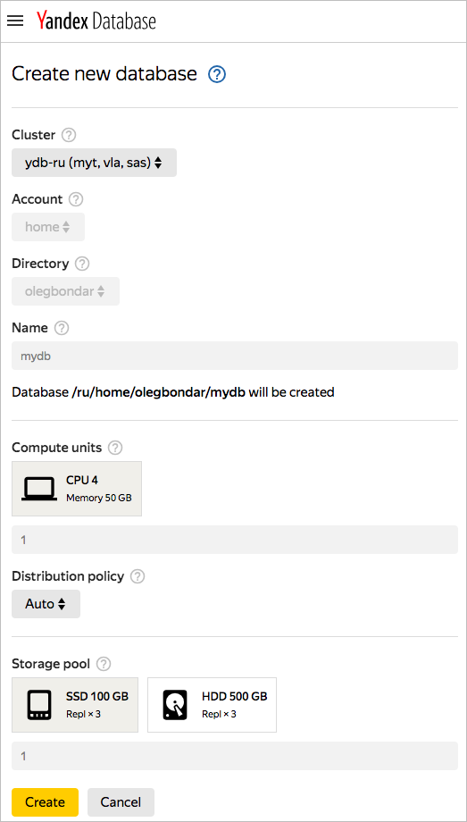
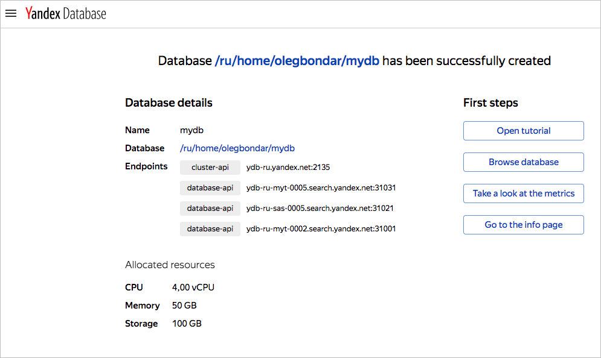

# Создание базы данных

Создайте [базу данных](../concepts/databases.md#database) с помощью сервиса {{ ydb-full-name }} в консоли управления {{ yandex-cloud }}.

## Перед началом работы {#before-you-begin}

Чтобы начать работать в {{ yandex-cloud }}:

1. Войдите в [консоль управления]({{ link-console-main }}). Если вы еще не зарегистрированы, перейдите в консоль управления и следуйте инструкциям.
1. [На странице биллинга]({{ link-console-billing }}) убедитесь, что у вас подключен [платежный аккаунт](../../billing/concepts/billing-account.md)платежный аккаунт, и он находится в статусе `ACTIVE` или `TRIAL_ACTIVE`. Если платежного аккаунта нет, [создайте его](../../billing/quickstart/index.md#create_billing_account)создайте его.
1. Если у вас еще нет каталога, [создайте его](../../resource-manager/operations/folder/create.md)создайте его.

## Создайте базу данных {#control-plane}



1. Чтобы создать базу данных, перейдите в [консоль управления](https://ydb.yandex-team.ru).

    

    

    

1. Нажмите кнопку **Create database**.

    

1. В поле **Cluster** выберите кластер *ydb-ru*.

    Остальные поля будут заполнены автоматически, в том числе будет автоматически выбран аккаунт *home*, создана директория с вашим именем пользователя и база данных с именем *mydb*.

    Пример создания новой базы данных:

    

1. Нажмите кнопку **Create**.

    Появится страница с сообщением об успешном создании базы данных.

    



Вы можете создать базу данных в бессерверной (Serverless) конфигурации или с выделенными серверами (Dedicated). Подробнее о различиях в конфигурациях читайте в разделе [{#T}](../concepts/serverless_and_dedicated.md).



Для работы в режиме совместимости с Amazon DynamoDB используйте бессерверную (Serverless) конфигурацию БД.






